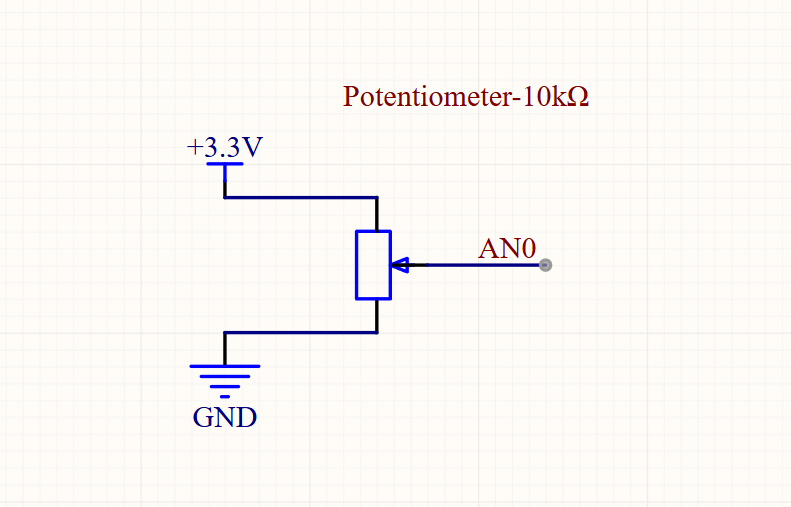
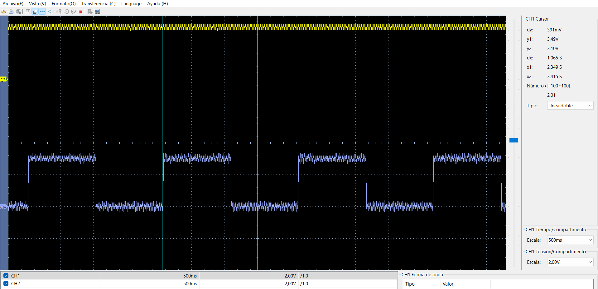
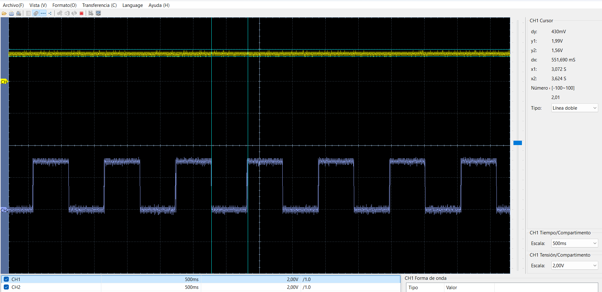
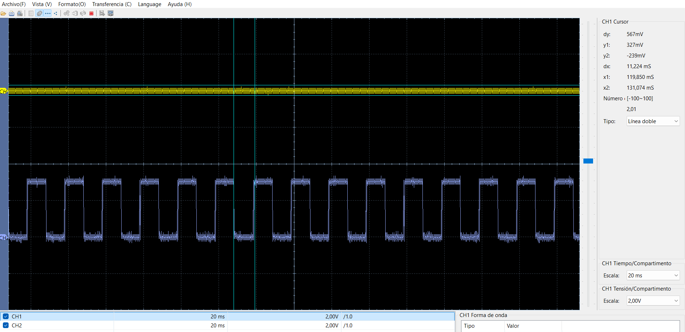

# DAR-CPU: Lectura de ADC con dsPIC33FJ32MC204

Este repositorio contiene el código de ejemplo y las pruebas para leer el ADC utilizando la tarjeta de desarrollo **DAR-CPU**.

## Hardware

* **MCU:** dsPIC33FJ32MC204 (40 MIPS)

* **Reloj:** Cristal externo de 8MHz (Modo XT + PLL)

* **Salida LED:** RB11 + resistencia 470 ohm

* **Potenciómetro:** 3.3V - ADC - GND (Tres pines)

## Guía

### Conexión Potenciómetro

 

### Pasos 
- Conecta el LED y varia el potenciometro. Verás los cambios en el LED!

## Resultados de Pruebas

### 1. Potenciómetro Minímo

Señal azul es salida al led que va cambiando conforme se varía el potenciómetro. 

### 2. Potenciómetro Medio

### 3. Potenciómetro Máximo

