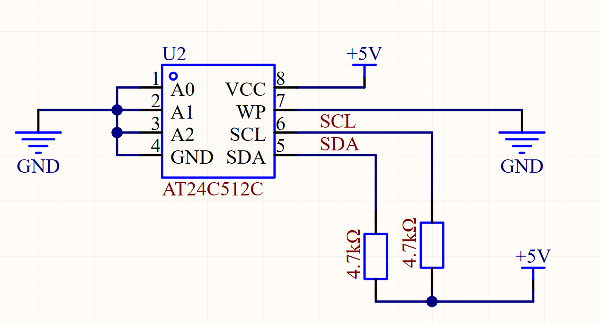
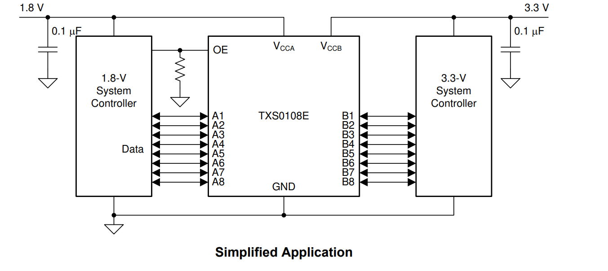
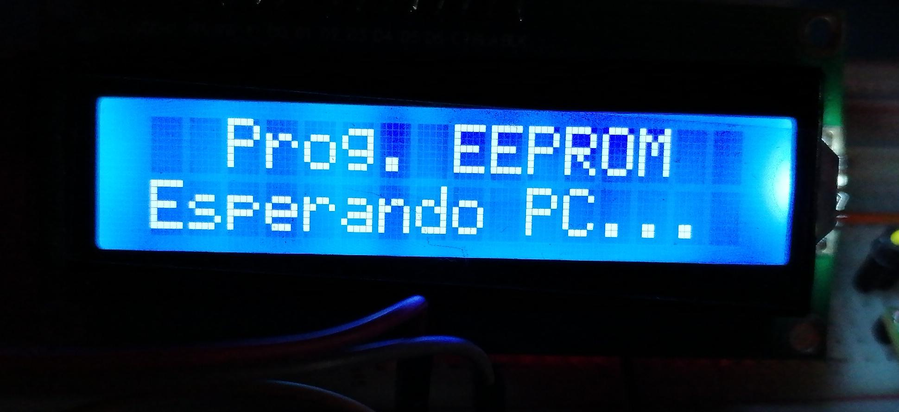
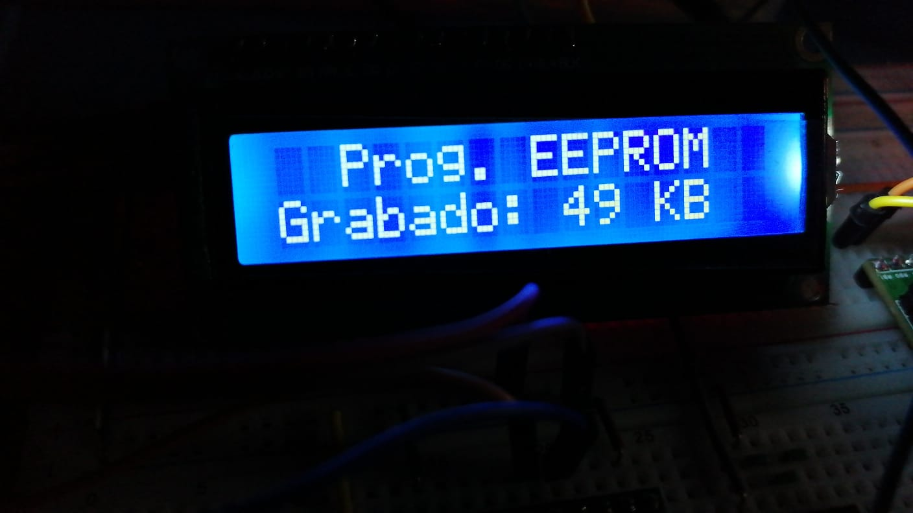
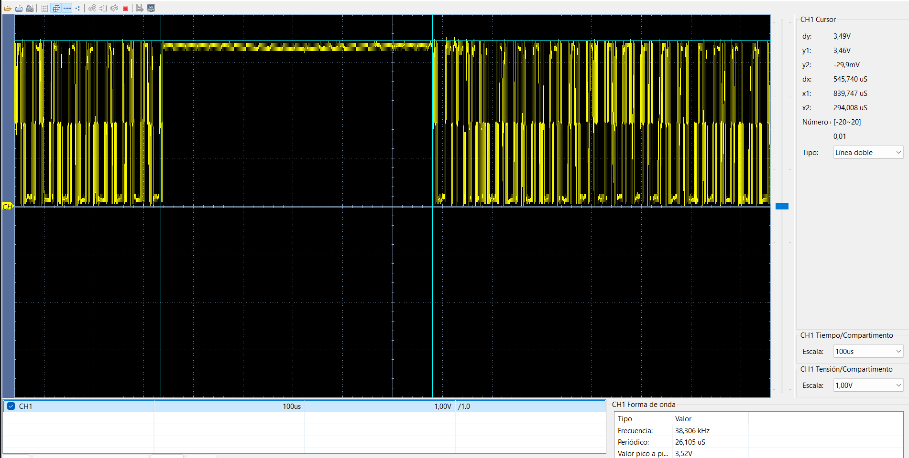
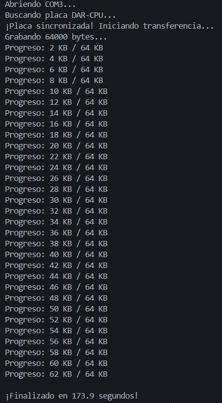

# Programación de EEPROM con dsPIC33FJ32MC204


Este repositorio contiene el código de ejemplo y las pruebas para programar una memoria EEPROM utilizando la tarjeta de desarrollo **DAR-CPU**.


## Hardware

* **MCU:** dsPIC33FJ32MC204 (40 MIPS)

* **Reloj:** Cristal externo de 8MHz (Modo XT + PLL)

* **Salidas PWM:** RB14 (PWM1H1) y RB15 (PWM1L1)

* **AT24C512C:** I2C SDA (RB9), SCL (RB8) (3.3V)

* **LCD 16X2 I2C:** *I2C SDA (RB9), SCL (RB8), (5V)*, uso de Level-Shifting 

* **TXS0108E:** *I2C SDA (RB9), SCL (RB8)*, Level-Shifting de 3.3V a 5V

* **FTDI:** Comunicación serial para programar EEPROM

## Guía

### Conexión mínima AT24C512C



### Conexión mínima TXS0108E



### Pasos (En este ejemplo se cargarán 4 segundos de una canción, esto es solo un ejemplo, los daton pueden cambiar)

- Convierte tu mp3 en raw con FFMEG: *"ffmpeg -i musica.mp3 -t 4 -af "lowpass=f=7000,acompressor,volume=0.5" -ac 1 -ar 16000 -f u8 audio.raw"*
- Esto es:
  
```
- i musica.mp3         → archivo de entrada
- t 4                  → duración: 4 segundos
- af "..."             → filtros de audio

  lowpass=f=7000      → corta frecuencias > 7 kHz
  acompresor          → reduce rango dinámico
  volume=0.5          → volumen al 50%

- ac 1                 → mono (1 canal)
- ar 16000             → 16 kHz (16000 muestras/s)
- f u8                 → 8 bits unsigned (0–255)
- audio.raw            → archivo RAW sin encabezado
```

- Carga el codigo a la la tarjeta de desarrollo **DAR-CPU** luego usa **grabar_audio.py**, la LCD mostrará el progreso.

## Resultados de Pruebas

### 1. Inicio, LCD 




### 2. Progreso, LCD




### 3. Trama, Osiloscopio





### 4. Final, Terminal
 

