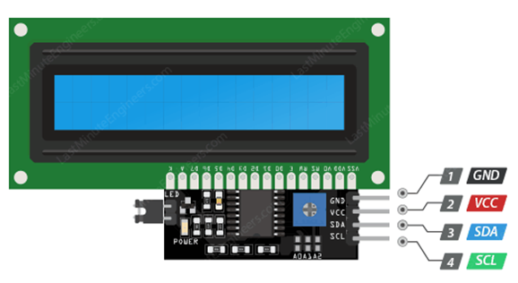
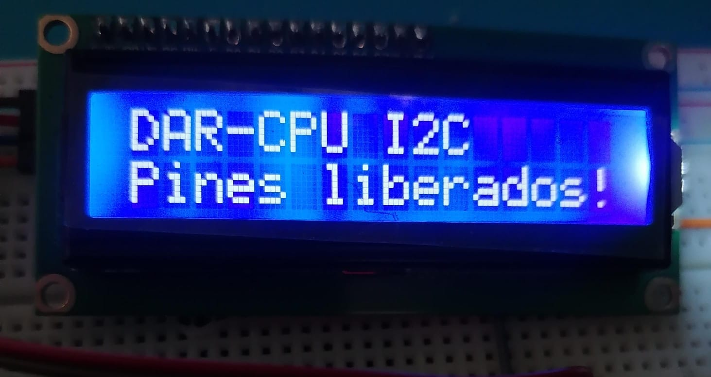

# LCD 16x2 I2C con dsPIC33FJ32MC204

Este repositorio contiene el código de ejemplo y las pruebas para usar la LCD 16x2 I2C utilizando la tarjeta de desarrollo **DAR-CPU**.

## Hardware

* **MCU:** dsPIC33FJ32MC204 (40 MIPS)

* **Reloj:** Cristal externo de 8MHz (Modo XT + PLL)

* **Salida LCD:** SDA a RB9 y SCL a RB8

## Guía

### Conexión LCD

 

### Pasos 
- Conecta el LCD. Verás el texto "DAR-CPU I2C Pines liberados!

## Resultados de Pruebas

### 1. LCD

Texto en LCD.

