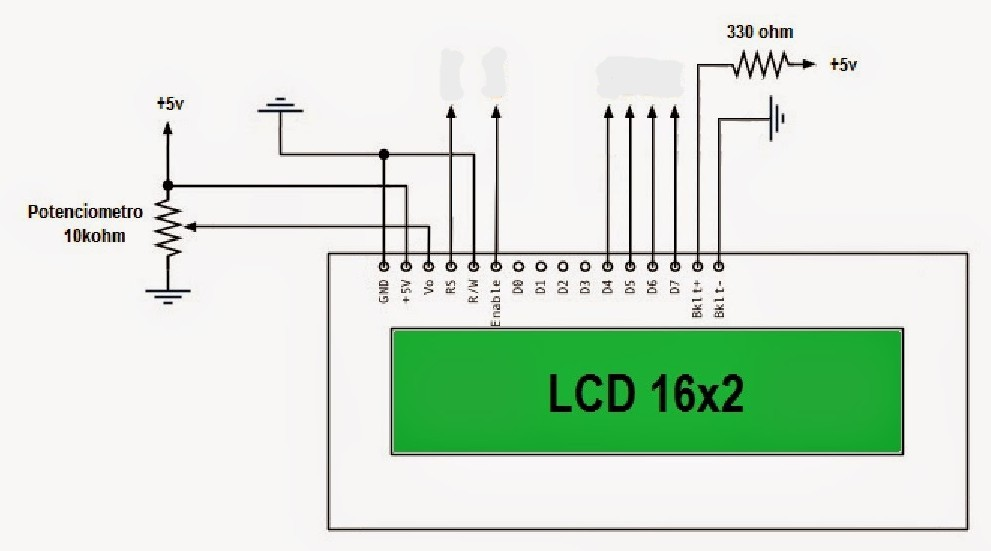
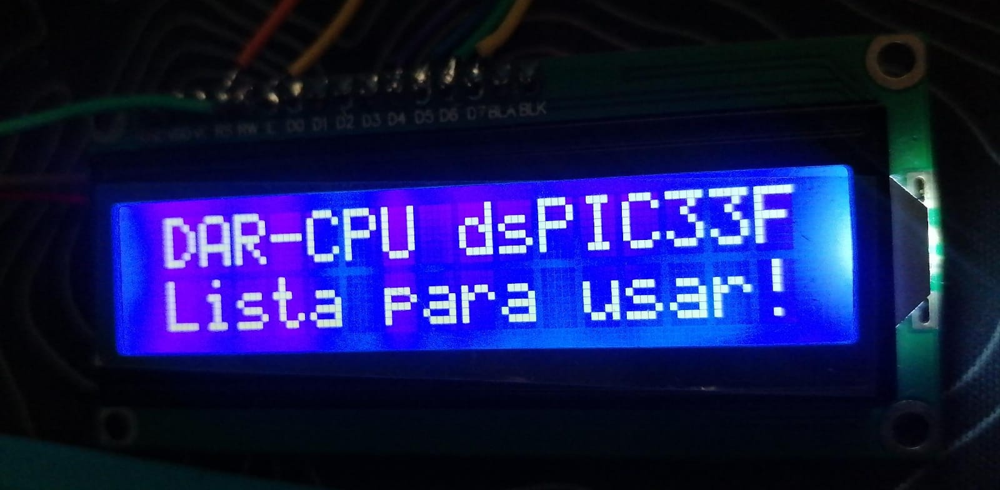

# DAR-CPU: LCD 16x2 sin I2C con dsPIC33FJ32MC204

Este repositorio contiene el código de ejemplo y las pruebas usar la LCD 16x2 sin I2C utilizando la tarjeta de desarrollo **DAR-CPU**.

## Hardware

* **MCU:** dsPIC33FJ32MC204 (40 MIPS)

* **Reloj:** Cristal externo de 8MHz (Modo XT + PLL)

* **Salida LCD:** RS a RB4, EN a RB5, D4 a D7 -> RB6 a RB9, RW a GND y VO a potenciometro 10k con extremos a VCC y a GND.

## Guía

### Conexión LCD

 

### Pasos 
- Conecta el LCD y varia el potenciometro. Verás el texto "DAR-CPU dsPIC33F Lista para usar!

## Resultados de Pruebas

### 1. LCD

Texto en LCD.

