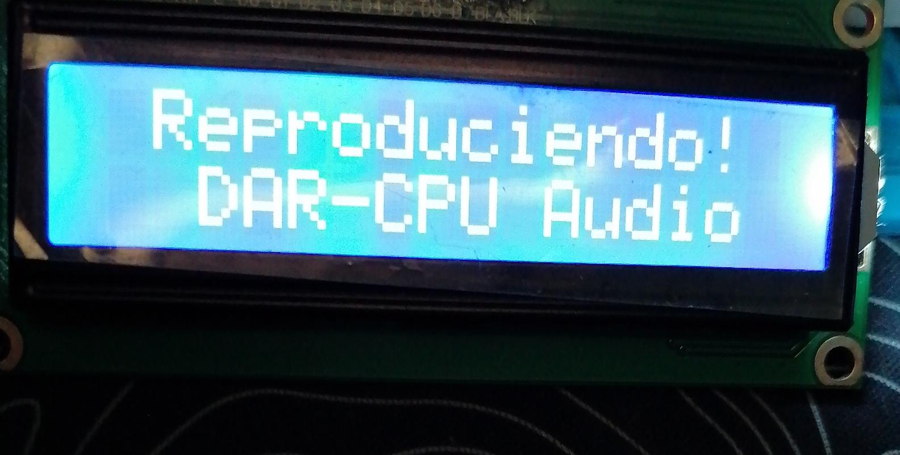
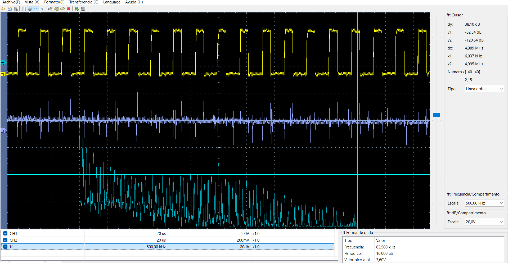
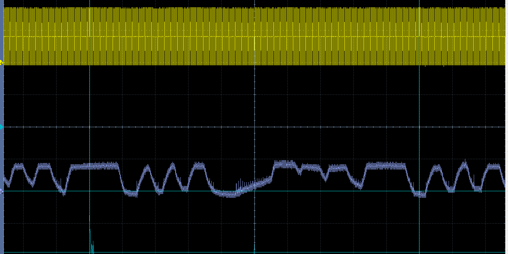

# Lectura de EEPROM con dsPIC33FJ32MC204

Este repositorio contiene el código de ejemplo y las pruebas para leer una memoria EEPROM utilizando la tarjeta de desarrollo **DAR-CPU**.

## Hardware

* **MCU:** dsPIC33FJ32MC204 (40 MIPS)

* **Reloj:** Cristal externo de 8MHz (Modo XT + PLL)

* **Salidas PWM:** RB14 (PWM1H1)

* **AT24C512C:** I2C SDA (RB9), SCL (RB8) (3.3V)

* **LCD 16X2 I2C:** *I2C SDA (RB9), SCL (RB8), (5V)*, uso de Level-Shifting 

* **TXS0108E:** *I2C SDA (RB9), SCL (RB8)*, Level-Shifting de 3.3V a 5V

* **Filtro:** Filtro RC - Filtro pasa bajos activo 

## Guía

### Conexión mínima AT24C512C

### Conexión mínima TXS0108E

### Pasos 
- Los datos que se cargaon a la EEPROM están en [Escribir EEPROM]([https://github.com/Dar-cpu/DAR-CPU-PROG-EEPROM-Demo](https://github.com/Dar-cpu/dsPIC-Basic-Examples/tree/main/Escribir%20EEPROM/Grabar%20audio)) 

- Carga el codigo a la la tarjeta de desarrollo **DAR-CPU** luego la LCD mostrará el texto *"Reproduciendo!, DAR-CPU Audio"*.

- Usa un filtro RC o filtro activo de 2do orden para obtener la señal limpia.

## Resultados de Pruebas

### 1. Reproducción, LCD 

### 2. Reproducción, Osiloscopio con filtro base RC simple

### 3. Reproducción, Osiloscopio con filtro activo

