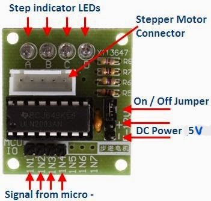
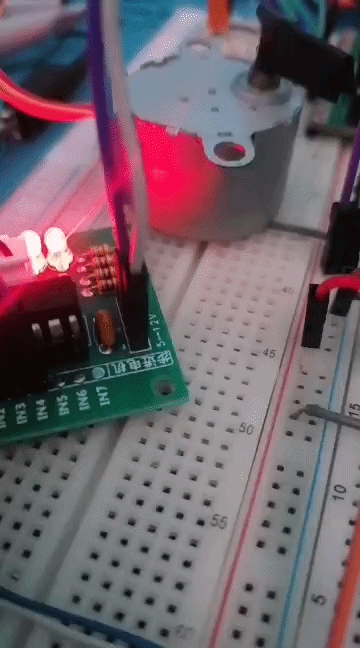
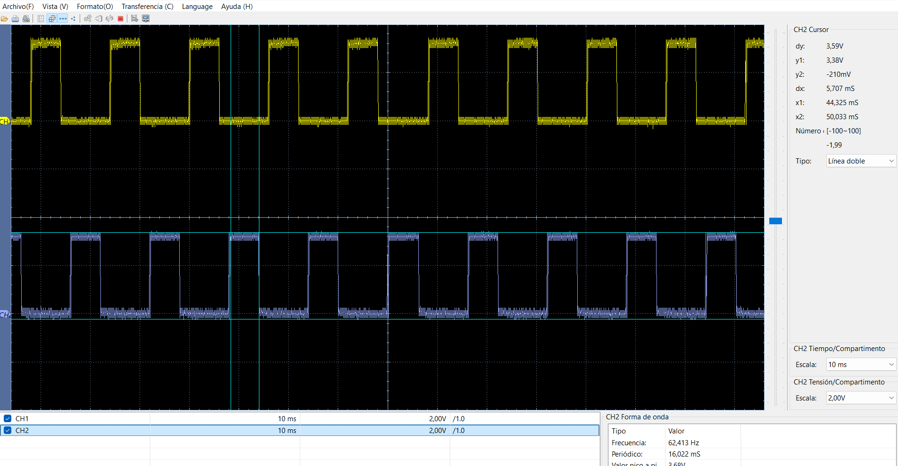

# Control Motor paso a paso con dsPIC33FJ32MC204

Este repositorio contiene el código de ejemplo y las pruebas para controlar un motor paso a paso utilizando la tarjeta de desarrollo **DAR-CPU**.

## Hardware

* **MCU:** dsPIC33FJ32MC204 (40 MIPS)

* **Reloj:** Cristal externo de 8MHz (Modo XT + PLL)

* **Salidas:** RB12, RB13, RB14 Y RB15

* **Modulo ULN2003:** GND - 5V, *IN1, IN2, IN3, IN4 a RB12, RB13, RB14 y RB15* respectivamente. 

## Guía

### Conexión Módulo ULN2003

 

### Pasos 
- Conecta el Módulo y carga el código!

## Resultados de Pruebas

### 1. Giro de motor

Motor Girando.  

### 2. Señal de RB12 Y RB14

