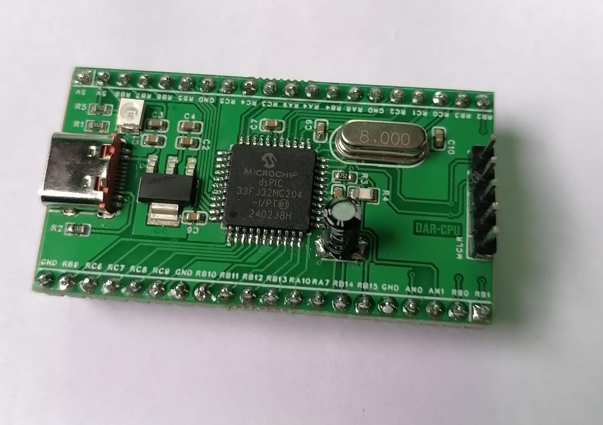
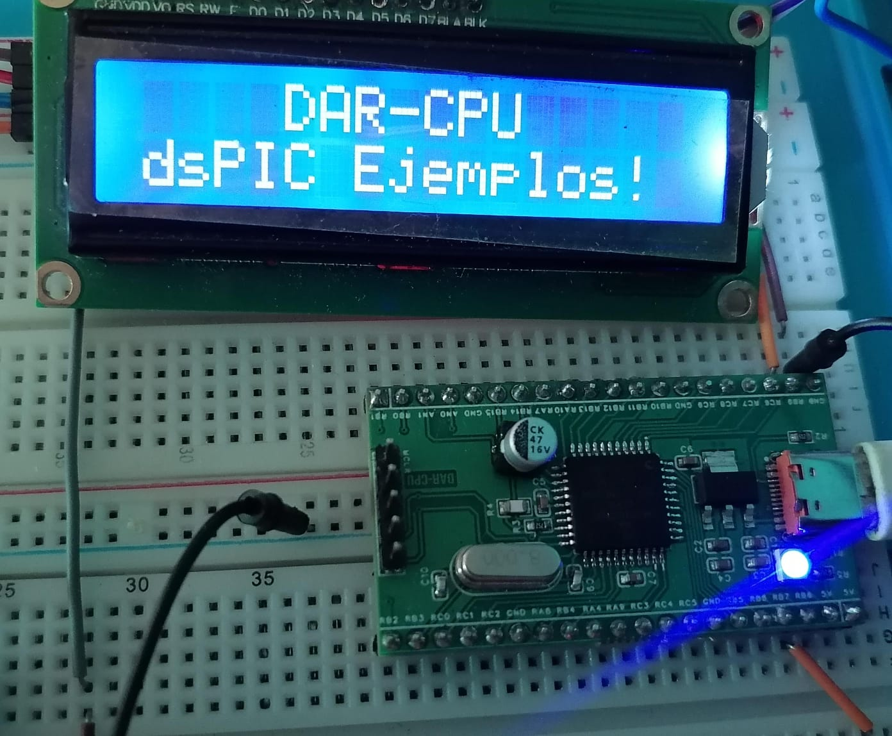

# dsPIC-Basic-Examples

Colección de ejemplos básicos y funcionales en **C** para microcontroladores **dsPIC** de Microchip.

Este repositorio está pensado para usarse con la tarjeta de desarrollo:   

---

## Contenido

Cada periférico tiene su propia carpeta con un ejemplo práctico completo:

| Periférico              | Carpeta                            | Descripción                              |
|-------------------------|------------------------------------|------------------------------------------|
| ADC                     | `ADC/Leer Potenciómetro`           | Lectura potenciómetro / valor analógico  |
| UART                    | `UART/Prueba UART`                 | Comunicación serial con PC               |
| Timers                  | `TIMERS/Ejemplo Timer1`            | Uso básico de Timer1                     |
| LCD (con I2C)           | `LCD I2C/Texto simple`             | Mostrar texto en LCD con adaptador I2C   |
| LCD (sin I2C)           | `LCD sin I2C/Texto simple`         | Control directo de LCD 16x2              |
| Teclado                 | `Teclado 4X4/Prueba teclado`       | Lectura de teclado matricial 4x4         |
| Motor Paso a Paso       | `Motor Paso a Paso/Módulo ULN2003` | Control de motor stepper                 |
| SPWM                    | `SPWM/Generación simple`           | Generación de señal SPWM                 |
| EEPROM (Lectura)        | `Leer EEPROM/Leer 24C512C`         | Lectura de memoria EEPROM externa        |
| EEPROM (Escritura)      | `Escribir EEPROM/Grabar audio`     | Escritura de EEPROM (ejemplo grabación)  |

---

## Cómo usar

1. Clona el repositorio:
   ```bash
   git clone https://github.com/Dar-cpu/dsPIC-Basic-Examples.git

2. Configura un proyecto y selecciona el microcontrolador dsPIC33fj32mc204 en tu MPLAB X IDE.
   
3. Abre el Cóodigo que te interese en el MPLAB X IDE.
   
4. Compila y programa en tu tarjeta de desarrollo.

- Cada carpeta contiene:Código fuente (main.c) para simplificar configuraciones
- README.md con explicación
- Imágenes de pruebas:
  


