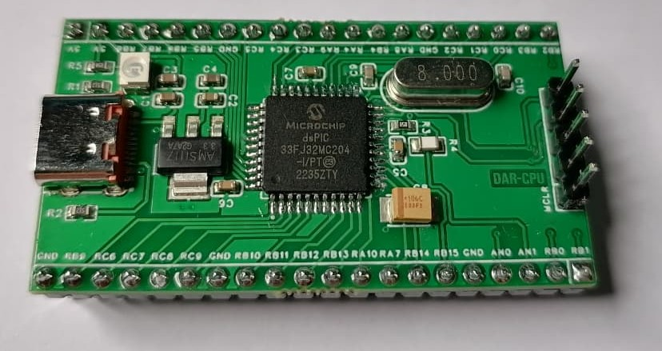

# dsPIC-Basic-Examples

Colección de ejemplos prácticos en C para los microcontroladores **Microchip dsPIC33FJ32MC204** y **dsPIC33EP32MC204**, desarrollados con MPLAB X IDE y XC16.

El repositorio acompaña a la tarjeta de desarrollo TECKIO dsPIC33 V1I2 y separa los ejemplos por dispositivo y por tipo de prueba.

## Tarjeta de desarrollo

### PCB V1I2 — versión actual

<p align="center">
  
</p>

### PCB V1I1 — descontinuada

<p align="center">
  
</p>

| Revisión | Estado | Uso recomendado |
| --- | --- | --- |
| V1I1 | Descontinuada | Referencia histórica |
| **V1I2** | **Actual** | Nuevos montajes, pruebas y ejemplos |

## Compatibilidad

| Microcontrolador | Estado | ICSP |
| --- | --- | --- |
| **dsPIC33FJ32MC204** | Ejemplos individuales y comunicaciones verificadas | PGD1 / PGC1 |
| **dsPIC33EP32MC204** | Comunicaciones multi-device verificadas; ejemplos individuales en desarrollo | PGD3 / PGC3 |

> Selecciona siempre en MPLAB X el dispositivo que está físicamente montado. Los Configuration Bits, registros analógicos, PPS y algunos periféricos cambian entre FJ y EP.

## Organización principal

| Carpeta | Contenido |
| --- | --- |
| [`universal-template/`](universal-template) | Plantilla mínima compatible con FJ y EP |
| [`dsPIC33FJ32MC204/`](dsPIC33FJ32MC204) | Ejemplos individuales verificados para el FJ |
| [`dsPIC33EP32MC204/`](dsPIC33EP32MC204) | Ejemplos individuales específicos del EP |
| [`multi-device/`](multi-device) | Comunicación entre dos microcontroladores |
| [`Images/`](Images) | Fotografías generales de la tarjeta |

## Multi-device

Se han validado dos combinaciones completas:

| Combinación | UART | I²C | SPI |
| --- | --- | --- | --- |
| [FJ ↔ EP](multi-device/fj-to-ep) | ✅ | ✅ | ✅ |
| [EP ↔ EP](multi-device/ep-to-ep) | ✅ UART1 | ✅ I²C1 | ✅ SPI1 |

Las pruebas utilizan `0xA5` como dato de ida y `0x5A` como respuesta, con `RB4` como indicador visual.

## Ejemplos disponibles para dsPIC33FJ32MC204

| Categoría | Ejemplo |
| --- | --- |
| GPIO | [LED Blink](dsPIC33FJ32MC204/gpio/led-blink) |
| Timer | [Timer1](dsPIC33FJ32MC204/timer/timer1) |
| ADC | [Lectura de potenciómetro](dsPIC33FJ32MC204/adc/leer-potenciometro) |
| UART | [Prueba UART](dsPIC33FJ32MC204/uart/prueba-uart) |
| LCD paralelo | [Texto simple](dsPIC33FJ32MC204/lcd-sin-i2c/texto-simple) |
| I²C | [LCD con PCF8574](dsPIC33FJ32MC204/lcd-i2c/texto-simple) |
| GPIO | [Teclado 4×4](dsPIC33FJ32MC204/teclado-4x4/prueba-teclado) |
| Motores | [Motor con ULN2003](dsPIC33FJ32MC204/motor-paso-a-paso/modulo-uln2003) |
| PWM | [Generación SPWM](dsPIC33FJ32MC204/pwm/generacion-simple) |
| EEPROM | [Grabar audio](dsPIC33FJ32MC204/eeprom-escritura/grabar-audio) |
| EEPROM | [Reproducir audio](dsPIC33FJ32MC204/eeprom-lectura/leer-24c512c) |
| SPI / TFT | [Mostrar imágenes](dsPIC33FJ32MC204/tft-st7735/mostrar-logo) |
| ADC / TFT | [Mini osciloscopio](dsPIC33FJ32MC204/tft-st7735/adc-tft) |
| Proyectos | [Proyectos integrados](dsPIC33FJ32MC204/projects) |

## Cómo utilizar el repositorio

1. Clona el repositorio:

   ```bash
   git clone https://github.com/Dar-cpu/dsPIC-Basic-Examples.git
   ```

2. Crea un **Standalone Project** en MPLAB X.
3. Selecciona el microcontrolador correcto.
4. Selecciona XC16.
5. Copia el `main.c` del ejemplo deseado.
6. Compila y programa usando el canal ICSP correspondiente.
7. Compara el resultado con las capturas y notas del README.

## Estructura resumida

```text
dsPIC-Basic-Examples/
├── Images/
├── universal-template/
├── dsPIC33FJ32MC204/
├── dsPIC33EP32MC204/
├── multi-device/
│   ├── fj-to-ep/
│   │   ├── uart/
│   │   ├── i2c/
│   │   └── spi/
│   └── ep-to-ep/
│       ├── uart1/
│       ├── i2c1/
│       └── spi1/
├── LICENSE
└── README.md
```

## Antes de conectar hardware externo

- Los GPIO trabajan con lógica de **3.3 V**.
- Mantén las entradas ADC entre `AVSS` y `AVDD`.
- Une GND entre tarjetas, módulos e instrumentos.
- No unas directamente las salidas de 3.3 V de dos tarjetas alimentadas independientemente.
- No conectes cargas de potencia directamente a un GPIO.

## Estado del proyecto

El repositorio está en desarrollo continuo. Los ejemplos se incorporan después de compilarse y verificarse en hardware.

## Licencia

El código se distribuye bajo la [licencia MIT](LICENSE).
