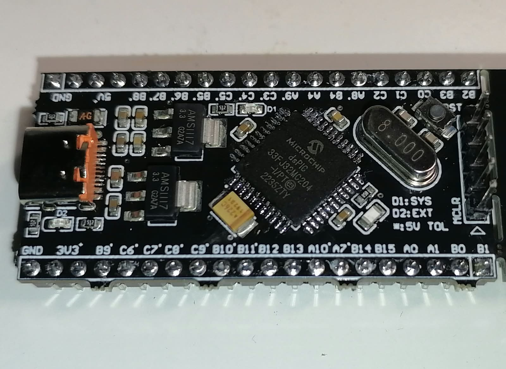

# dsPIC-Basic-Examples

Colección de ejemplos prácticos en C para los microcontroladores **Microchip dsPIC33FJ32MC204** y **dsPIC33EP32MC204**, desarrollados con MPLAB X IDE y el compilador XC16.

El repositorio acompaña a la tarjeta de desarrollo TECKIO dsPIC33 V1I2 y separa el código por dispositivo. De esta forma, cada ejemplo puede documentar correctamente sus Configuration Bits, registros, periféricos y canal ICSP sin asumir que las familias FJ y EP son idénticas.

## Tarjeta de desarrollo

La PCB V1I2 admite el montaje de cualquiera de los dos microcontroladores compatibles.

<p align="center">
  
</p>

| Microcontrolador | Estado del contenido | ICSP utilizado en la tarjeta |
| --- | --- | --- |
| **dsPIC33FJ32MC204** | Ejemplos disponibles y probados en hardware | PGD1 / PGC1 |
| **dsPIC33EP32MC204** | Plantilla base verificada; ejemplos específicos en desarrollo | PGD3 / PGC3 |

> Selecciona siempre en MPLAB X el mismo dispositivo que está montado en la tarjeta. Los Configuration Bits, registros analógicos y algunos periféricos cambian entre las familias FJ y EP.

## Organización principal

| Carpeta | Contenido |
| --- | --- |
| [`universal-template/`](universal-template) | Un único `main.c` compatible con FJ y EP para iniciar proyectos nuevos |
| [`dsPIC33FJ32MC204/`](dsPIC33FJ32MC204) | Ejemplos y proyectos verificados para el dsPIC33FJ32MC204 |
| [`dsPIC33EP32MC204/`](dsPIC33EP32MC204) | Espacio para ejemplos desarrollados y verificados específicamente para el EP |
| [`Images/`](Images) | Fotografías generales de la tarjeta |

## Ejemplos disponibles para dsPIC33FJ32MC204

| Categoría | Ejemplo | Resultado principal |
| --- | --- | --- |
| GPIO | [LED Blink](dsPIC33FJ32MC204/gpio/led-blink) | Parpadeo básico y cambio de frecuencia |
| Timer | [Timer1](dsPIC33FJ32MC204/timer/timer1) | Base de tiempo mediante interrupciones |
| ADC | [Lectura de potenciómetro](dsPIC33FJ32MC204/adc/leer-potenciometro) | Conversión ADC y control del periodo del LED |
| UART | [Prueba UART](dsPIC33FJ32MC204/uart/prueba-uart) | Comunicación serial con una PC |
| LCD paralelo | [Texto simple](dsPIC33FJ32MC204/lcd-sin-i2c/texto-simple) | Control directo de una pantalla 16×2 |
| I²C | [LCD con PCF8574](dsPIC33FJ32MC204/lcd-i2c/texto-simple) | Pantalla 16×2 utilizando dos señales |
| GPIO | [Teclado 4×4](dsPIC33FJ32MC204/teclado-4x4/prueba-teclado) | Escaneo de una matriz de 16 teclas |
| Motores | [Motor con ULN2003](dsPIC33FJ32MC204/motor-paso-a-paso/modulo-uln2003) | Secuencia de medio paso |
| PWM | [Generación SPWM](dsPIC33FJ32MC204/pwm/generacion-simple) | PWM complementaria y señal filtrada |
| EEPROM | [Grabar audio](dsPIC33FJ32MC204/eeprom-escritura/grabar-audio) | Transferencia por UART y almacenamiento I²C |
| EEPROM | [Reproducir audio](dsPIC33FJ32MC204/eeprom-lectura/leer-24c512c) | Lectura I²C y salida mediante PWM |
| SPI / TFT | [Mostrar imágenes](dsPIC33FJ32MC204/tft-st7735/mostrar-logo) | Gráficos compactados en una ST7735 |
| ADC / TFT | [Mini osciloscopio](dsPIC33FJ32MC204/tft-st7735/adc-tft) | Adquisición y visualización en tiempo real |
| Proyectos | [Proyectos integrados](dsPIC33FJ32MC204/projects) | Aplicaciones que combinan varios periféricos |

Consulta el [índice completo del dsPIC33FJ32MC204](dsPIC33FJ32MC204) para seguir la ruta de aprendizaje y revisar los requisitos de cada ejemplo.

## Cómo utilizar el repositorio

1. Clona el repositorio:

   ```bash
   git clone https://github.com/Dar-cpu/dsPIC-Basic-Examples.git
   ```

2. Abre MPLAB X IDE y crea un **Standalone Project**.
3. Selecciona el microcontrolador que realmente está instalado.
4. Selecciona el compilador XC16.
5. Abre la carpeta del dispositivo y el ejemplo que deseas utilizar.
6. Añade al proyecto los archivos indicados en su README.
7. Compila, programa mediante el canal ICSP correspondiente y compara el resultado con la documentación.

Para comenzar un desarrollo propio, copia [`universal-template/main.c`](universal-template/main.c) a un proyecto nuevo.

## Plantilla universal

La plantilla se mantiene deliberadamente pequeña:

```text
universal-template/
├── README.md
└── main.c
```

No se almacenan proyectos MPLAB X generados, archivos `.elf` ni firmware `.hex` dentro de la plantilla. Los binarios precompilados solo deberían publicarse junto a un ejemplo concreto y después de verificarlo en el hardware correspondiente.

## Estructura del repositorio

```text
dsPIC-Basic-Examples/
├── Images/
├── universal-template/
│   ├── README.md
│   └── main.c
├── dsPIC33FJ32MC204/
│   ├── README.md
│   ├── gpio/
│   ├── adc/
│   ├── uart/
│   ├── timer/
│   ├── pwm/
│   ├── lcd-i2c/
│   ├── lcd-sin-i2c/
│   ├── teclado-4x4/
│   ├── motor-paso-a-paso/
│   ├── eeprom-escritura/
│   ├── eeprom-lectura/
│   ├── tft-st7735/
│   └── projects/
├── dsPIC33EP32MC204/
│   └── README.md
├── LICENSE
└── README.md
```

Las categorías del EP se incorporarán cuando exista al menos un ejemplo específico probado. Esto evita carpetas vacías y mantiene una diferencia clara entre contenido planificado y contenido verificado.

## Antes de conectar hardware externo

- Los GPIO trabajan con lógica de **3.3 V**.
- Verifica la tolerancia del pin antes de aplicar una señal de 5 V.
- Mantén las entradas ADC entre `AVSS` y `AVDD`.
- Une GND entre la tarjeta y los módulos o instrumentos externos.
- No alimentes motores, altavoces ni cargas de potencia directamente desde un GPIO.
- Revisa las conexiones y advertencias incluidas en el README de cada ejemplo.

## Documentación de cada ejemplo

Los ejemplos básicos conservan una estructura independiente y reutilizable:

```text
nombre-del-ejemplo/
├── README.md
├── src/
│   └── main.c
└── docs/
```

Los ejemplos más completos pueden añadir drivers, headers, scripts de Python, imágenes y otros recursos necesarios.

## Estado del proyecto

El repositorio está en desarrollo continuo. Los ejemplos del dsPIC33FJ32MC204 se conservan bajo su carpeta específica y las adaptaciones para el dsPIC33EP32MC204 se añadirán únicamente después de ser compiladas y verificadas.

## Licencia

El código se distribuye bajo la [licencia MIT](LICENSE).
