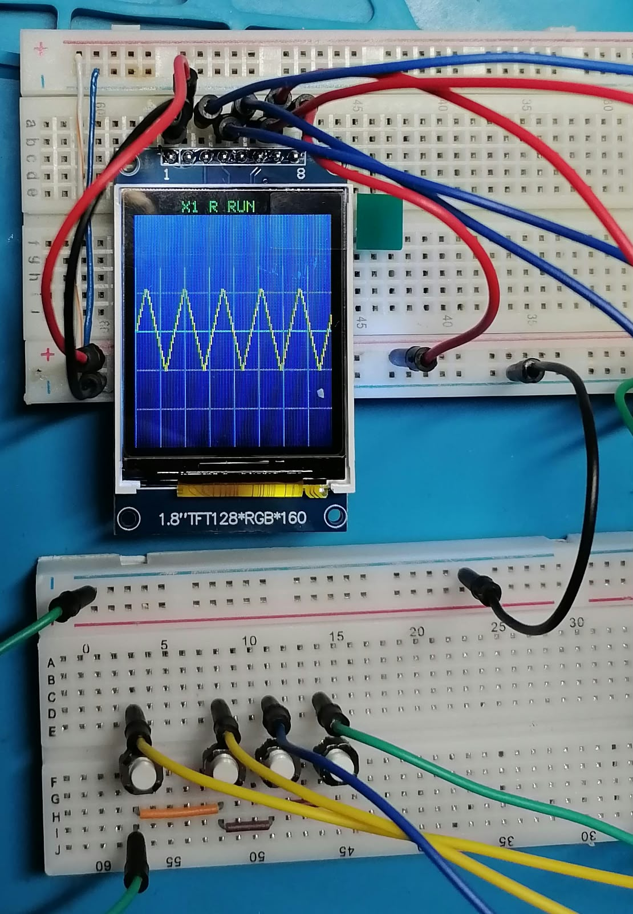

# dsPIC-Basic-Examples

Colección de ejemplos prácticos en C para aprender, probar y reutilizar los periféricos del **Microchip dsPIC33FJ32MC204** sobre hardware real.

El repositorio acompaña a la tarjeta de desarrollo dsPIC33 y funciona como una guía progresiva: comienza con GPIO y temporización, continúa con ADC, UART, I²C, pantallas y PWM, y llega a demostraciones integradas como reproducción de audio y un mini osciloscopio con TFT.

Los ejemplos están desarrollados principalmente con **MPLAB X IDE** y **XC16**, usando un cristal externo de 8 MHz y `FCY = 40 MHz`.

## Tarjeta de desarrollo

### PCB V1I2 — versión actual

La **V1I2** es la plataforma de referencia para las nuevas pruebas y ejemplos.

<p align="center">
  
</p>

Características disponibles en la tarjeta:

- Zócalo/plataforma para dsPIC33FJ32MC204 y alternativa de montaje dsPIC33EP32MC204.
- Cristal externo de 8 MHz.
- Conector ICSP para programación y depuración.
- Pulsador de reset.
- LED de sistema y LED de usuario.
- Pines de 5 V con protección PTC de 500 mA.
- Salida regulada de 3.3 V independiente.
- Múltiples puntos de GND para prototipado.

### PCB V1I1 — descontinuada

La primera revisión se conserva como referencia histórica, pero los ejemplos nuevos se validan sobre V1I2.

<p align="center">
  
</p>

| Revisión | Estado | Uso recomendado |
| --- | --- | --- |
| V1I1 | Descontinuada | Referencia de desarrollo |
| **V1I2** | **Actual** | Nuevos montajes, pruebas y ejemplos |

## Compatibilidad importante

La mayoría del firmware de este repositorio está escrito específicamente para **dsPIC33FJ32MC204**. La tarjeta admite también el dsPIC33EP32MC204, pero sus registros analógicos, Configuration Bits y algunas funciones periféricas no son idénticos.

| MCU | Uso en el repositorio | Puerto ICSP de la tarjeta |
| --- | --- | --- |
| dsPIC33FJ32MC204 | Objetivo principal de los ejemplos | PGD1 / PGC1 |
| dsPIC33EP32MC204 | Plantilla universal y adaptaciones específicas | PGD3 / PGC3 |

> No cambies el puerto ICSP sin comprobar primero qué microcontrolador está montado. Una configuración incorrecta puede impedir la siguiente conexión del programador.

## Antes de conectar hardware externo

- Los GPIO del dsPIC trabajan con lógica de **3.3 V**.
- No apliques 5 V a una entrada sin verificar tolerancia o añadir conversión de nivel.
- Las entradas ADC deben permanecer entre `AVSS` y `AVDD`.
- Une GND entre la tarjeta y los instrumentos o módulos externos.
- No alimentes motores, altavoces ni otras cargas de potencia directamente desde un GPIO.
- Comprueba el pinout en el README de cada ejemplo antes de energizar el montaje.

## Ruta de aprendizaje recomendada

| Orden | Ejemplo | Periféricos / concepto | Nivel |
| ---: | --- | --- | --- |
| 1 | [LED Blink](led-blink) | GPIO y retardos | Inicial |
| 2 | [Timer1](timers/timer1) | Timer e interrupciones | Inicial |
| 3 | [ADC + potenciómetro](adc/leer-potenciometro) | ADC de 10 bits | Inicial |
| 4 | [UART](uart/prueba-uart) | UART1 y PPS | Inicial |
| 5 | [LCD paralelo](lcd-sin-i2c/texto-simple) | GPIO y HD44780 | Inicial |
| 6 | [LCD por I²C](lcd-i2c/texto-simple) | I²C1 y PCF8574 | Intermedio |
| 7 | [Teclado 4×4](teclado-4x4/prueba-teclado) | Matriz y escaneo de GPIO | Intermedio |
| 8 | [Motor + ULN2003](motor-paso-a-paso/modulo-uln2003) | Secuencias de medio paso | Intermedio |
| 9 | [SPWM](spwm/generacion-simple) | Motor Control PWM e ISR | Intermedio |
| 10 | [Grabar audio en EEPROM](eeprom-escritura/grabar-audio) | UART, Python, I²C y EEPROM | Avanzado |
| 11 | [Reproducir audio](eeprom-lectura/leer-24c512c) | EEPROM, buffer, Timer y PWM | Avanzado |
| 12 | [Mostrar imágenes en TFT](tft-st7735/mostrar-logo) | SPI1, RGB565, Flash/PSV y Python | Avanzado |
| 13 | [Mini osciloscopio ADC + TFT](tft-st7735/adc-tft) | ADC de 12 bits, timers, SPI y UI | Avanzado |

## Ejemplos destacados

### Imágenes y logos en TFT ST7735

Controla una pantalla ST7735/ST7735S de 128×160 mediante SPI1. Incluye una herramienta gráfica en Python que convierte PNG, JPG, BMP, GIF o WEBP a una imagen compactada de **2 bits por píxel** con paleta RGB565, almacenada en Flash/PSV.

**[Abrir `tft-st7735/mostrar-logo`](tft-st7735/mostrar-logo)**

<p align="center">
  
</p>

### Mini osciloscopio ADC + TFT

Captura bloques de 256 muestras con el ADC de 12 bits, representa 128 puntos en pantalla y permite cambiar muestreo, escala, trigger y RUN/HOLD mediante cuatro pulsadores.

**[Abrir `tft-st7735/adc-tft`](tft-st7735/adc-tft)**

<p align="center">
  
</p>

## Índice por categoría

| Categoría | Carpeta | Resultado principal |
| --- | --- | --- |
| GPIO | [led-blink](led-blink) | LED alternando entre 1 Hz y 2 Hz |
| Timers | [timers/timer1](timers/timer1) | LED a 1 Hz con bucle principal libre |
| ADC | [adc/leer-potenciometro](adc/leer-potenciometro) | Potenciómetro controla velocidad del LED |
| UART | [uart/prueba-uart](uart/prueba-uart) | Mensaje a PC a 9600 8N1 |
| LCD paralelo | [lcd-sin-i2c/texto-simple](lcd-sin-i2c/texto-simple) | Texto en LCD 16×2 usando seis GPIO |
| LCD + I²C | [lcd-i2c/texto-simple](lcd-i2c/texto-simple) | Texto mediante PCF8574 y dos señales |
| Teclado | [teclado-4x4/prueba-teclado](teclado-4x4/prueba-teclado) | Detección de 16 teclas por matriz |
| Motor | [motor-paso-a-paso/modulo-uln2003](motor-paso-a-paso/modulo-uln2003) | Giro continuo con secuencia de medio paso |
| PWM | [spwm/generacion-simple](spwm/generacion-simple) | SPWM complementaria y señal filtrada |
| EEPROM escritura | [eeprom-escritura/grabar-audio](eeprom-escritura/grabar-audio) | 64 000 muestras cargadas desde Python |
| EEPROM lectura | [eeprom-lectura/leer-24c512c](eeprom-lectura/leer-24c512c) | Audio de 8 bits reproducido mediante PWM |
| TFT | [tft-st7735/mostrar-logo](tft-st7735/mostrar-logo) | Logo compactado en una ST7735 |
| Instrumentación | [tft-st7735/adc-tft](tft-st7735/adc-tft) | Forma de onda ADC en tiempo real |
| Base de proyecto | [universal-template](universal-template) | Proyectos FJ/EP y simulación Proteus |
| Proyectos integrados | [projects](projects) | Área para desarrollos completos |

## Herramientas

- Microchip MPLAB X IDE.
- Microchip XC16 Compiler.
- Programador/debugger compatible con ICSP.
- Python 3 en los ejemplos que incluyen herramientas de PC.
- Instrumentación opcional: multímetro, osciloscopio, generador de funciones y analizador lógico.

## Cómo usar un ejemplo básico

Los ejemplos básicos guardan el firmware en `src/main.c` e incluyen los Configuration Bits dentro del mismo archivo.

1. Clona el repositorio:

   ```bash
   git clone https://github.com/Dar-cpu/dsPIC-Basic-Examples.git
   ```

2. En MPLAB X crea un proyecto **Standalone Project**.
3. Selecciona `dsPIC33FJ32MC204` y el compilador XC16.
4. Añade el `src/main.c` del ejemplo.
5. Lee su `README.md` y realiza las conexiones con la alimentación apagada.
6. Compila y programa mediante ICSP.
7. Compara el resultado con las fotografías o capturas incluidas en `docs/` o `images/`.

Los ejemplos TFT contienen varios módulos `.c`/`.h`; añade todos los archivos indicados en su documentación. La carpeta `universal-template` ya contiene proyectos MPLAB X completos.

## Estructura de documentación

Cada ejemplo procura incluir:

```text
nombre-del-ejemplo/
├── README.md            # Objetivo, conexiones, funcionamiento y prueba
├── src/
│   └── main.c           # Firmware del ejemplo básico
└── docs/                # Fotos, diagramas y mediciones reales
```

Los ejemplos más completos pueden añadir drivers, headers, scripts de Python, dependencias y una carpeta `images/`.

## Organización del repositorio

```text
dsPIC-Basic-Examples/
├── Images/                  # Fotografías generales de la tarjeta
├── led-blink/
├── timers/
├── adc/
├── uart/
├── lcd-i2c/
├── lcd-sin-i2c/
├── teclado-4x4/
├── motor-paso-a-paso/
├── spwm/
├── eeprom-escritura/
├── eeprom-lectura/
├── tft-st7735/
│   ├── mostrar-logo/
│   └── adc-tft/
├── universal-template/
├── projects/
├── LICENSE
└── README.md
```

## Estado del proyecto

El repositorio está en desarrollo continuo. Se añadirán nuevos ejemplos de control, comunicaciones, adquisición de señales, instrumentación, electrónica de potencia y aplicaciones integradas.

La documentación diferencia entre:

- ejemplos implementados con código y pruebas reales;
- plantillas reutilizables;
- proyectos marcados explícitamente como **en preparación**.

## Licencia

El código se distribuye bajo la [licencia MIT](LICENSE). Puedes estudiarlo, modificarlo e integrarlo en tus propios proyectos respetando los términos de la licencia.
