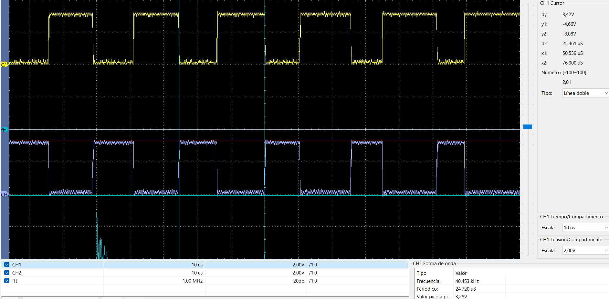
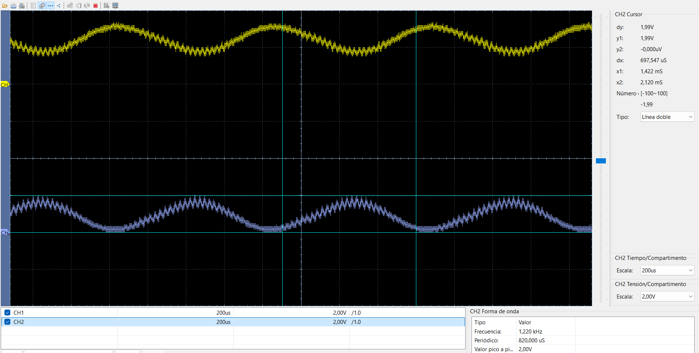
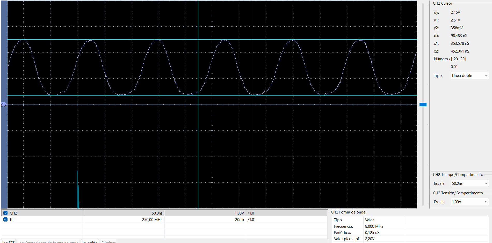

# DAR-CPU: Generación SPWM con dsPIC33FJ32MC204

Este repositorio contiene el código de ejemplo y las pruebas de hardware para generar una señal SPWM (Sinusoidal Pulse Width Modulation) utilizando la tarjeta de desarrollo **DAR-CPU**

## Hardware

* **MCU:** dsPIC33FJ32MC204 (40 MIPS)

* **Reloj:** Cristal externo de 8MHz (Modo XT + PLL)

* **Salidas PWM:** RB14 (PWM1H1) y RB15 (PWM1L1)

## Resultados de Pruebas

### 1. Señal SPWM Cruda (Antes del filtro)

### 2. Señal Filtrada (Filtro RC: 1kΩ + 100nF)

### 3. Verificación de Oscilador (8MHz)

