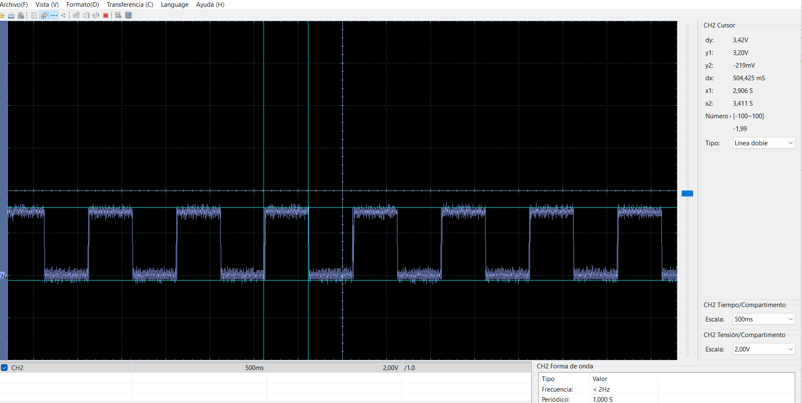

# Uso de Timer1 con dsPIC33FJ32MC204

Este repositorio contiene el código de ejemplo y las pruebas para usar el Timer1 utilizando la tarjeta de desarrollo **DAR-CPU**.

## Hardware

* **MCU:** dsPIC33FJ32MC204 (40 MIPS)

* **Reloj:** Cristal externo de 8MHz (Modo XT + PLL)

* **Salida LED:** RB11 + resistencia 470 ohm

## Guía

### Pasos 
- Conecta el LED. Verás los cambios en el LED cada 500ms!

## Resultados de Pruebas

### 1. Salida del LED

Señal azul es salida al led que va cambiando cada 500ms, tal cual se aprecia en las lecturas de la imagen. 

