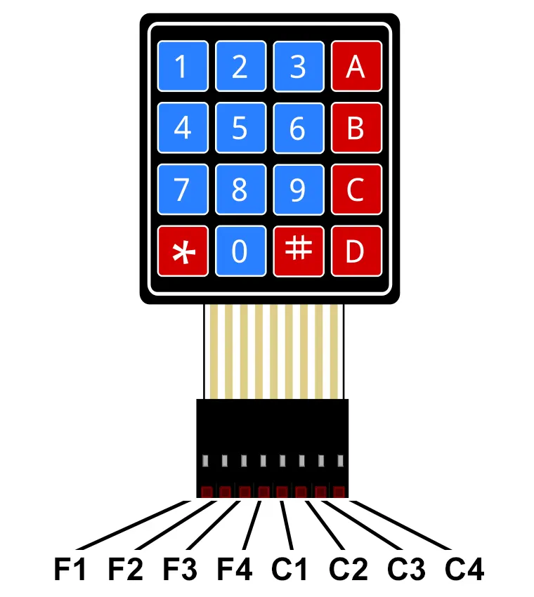
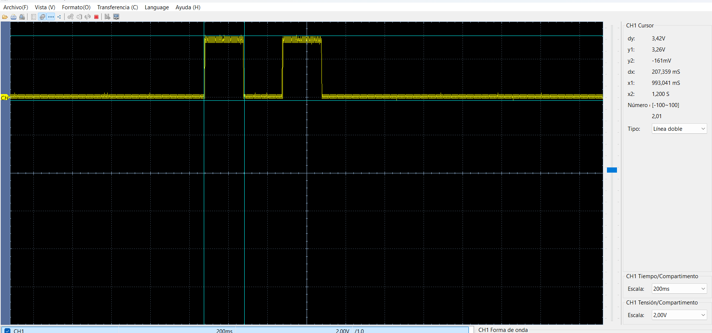
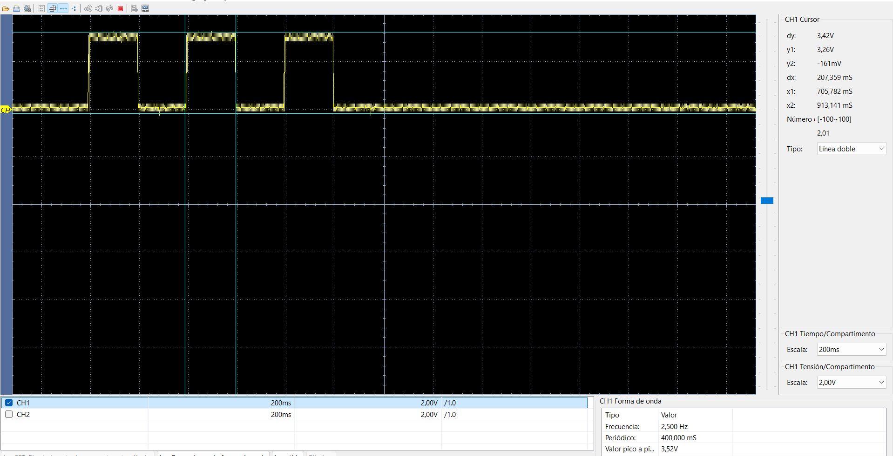

# DAR-CPU: Teclado 4x4 con dsPIC33FJ32MC204

Este repositorio contiene el código de ejemplo y las pruebas para un teclado 4x4 utilizando la tarjeta de desarrollo **DAR-CPU**.

## Hardware

* **MCU:** dsPIC33FJ32MC204 (40 MIPS)

* **Reloj:** Cristal externo de 8MHz (Modo XT + PLL)

* **Salidas:** RB12, RB13, RB14 Y RB15

* **Teclado 4x4:** *Fila 1, 2, 3 y 4 a RB0, RB1, RB2 y RB3* respectivamente, *Columna 1, 2, 3 y 4 a RB4, RB5, RB6 y RB7* respectivamente, las columnas deben ir con resistencias pulldown de 4,7k.

## Guía

### Conexión Teclado 4x4

 

### Pasos 
- Conecta el teclado con resistencias pulldown en las columnas y carga el código!

## Resultados de Pruebas

### 1. Encendido del LED
El led enciende según el número digitado en el teclado.

### 2. Señal al digitar número 2

### 2. Señal al digitar número 3

