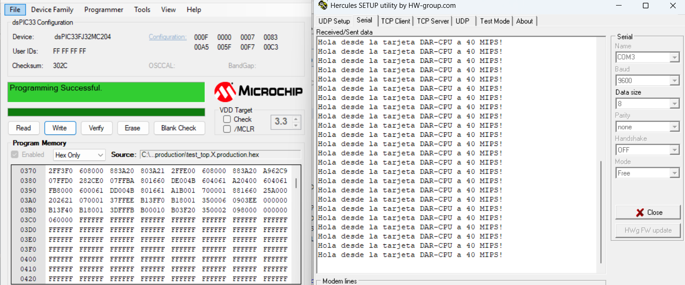

# DAR-CPU: Comunicación serial con dsPIC33FJ32MC204

Este repositorio contiene el código de ejemplo y las pruebas de hardware para enviar un texto simple por UART a la PC con FTDI utilizando la tarjeta de desarrollo **DAR-CPU**.

## Hardware

* **MCU:** dsPIC33FJ32MC204 (40 MIPS)

* **Reloj:** Cristal externo de 8MHz (Modo XT + PLL)

* **Salida:** RB1 (U1TX), RB0 (U1RX), RB11 (LED)

## Resultados de Pruebas

### 1. Mensaje visto en la PC

 

