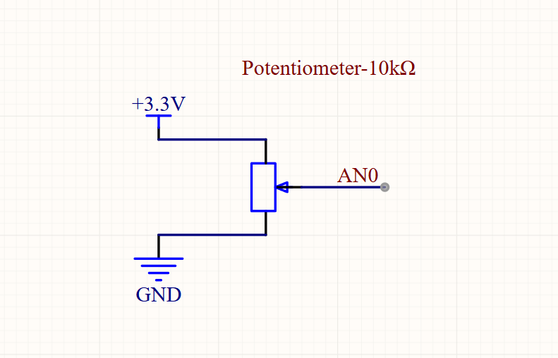
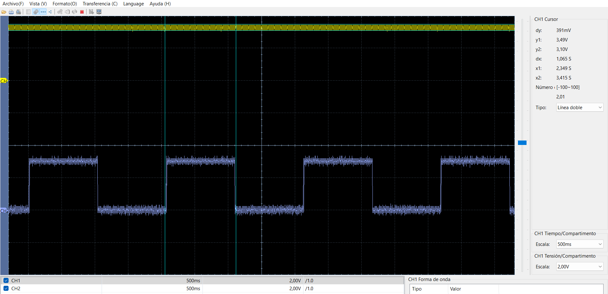
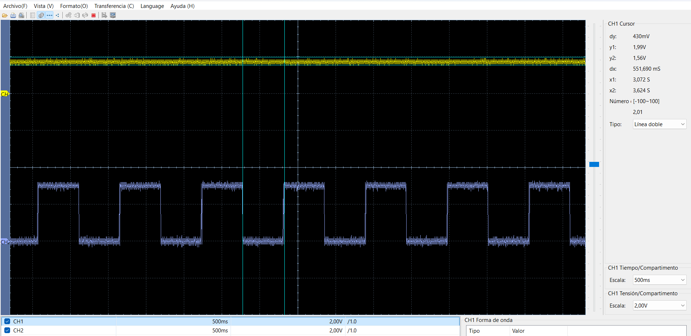
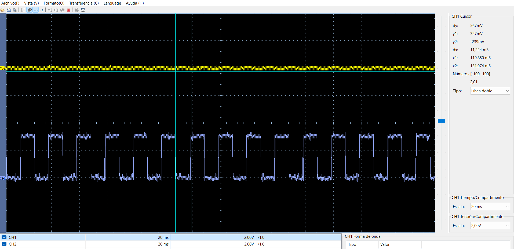

# Lectura de potenciómetro con el ADC del dsPIC33FJ32MC204

[← Volver al índice de ejemplos](../../README.md)

Este ejemplo lee la tensión de un potenciómetro mediante **AN0/RA0** y utiliza el resultado para cambiar la velocidad de parpadeo de un LED conectado a **RB11**. Permite comprobar de forma visual que el ADC responde a una señal comprendida entre 0 V y 3.3 V.

## Qué demuestra

- Configuración de AN0 como entrada analógica.
- Conversión ADC de 10 bits con referencias `AVDD/AVSS`.
- Lectura de `ADC1BUF0` en el rango 0 a 1023.
- Conversión de una medida analógica en un parámetro de la aplicación.
- Configuración del resto de pines como GPIO digitales cuando corresponde.

## Hardware necesario

- Tarjeta de desarrollo con dsPIC33FJ32MC204.
- Potenciómetro lineal de aproximadamente 10 kΩ.
- LED y resistencia de 330 Ω a 470 Ω.
- Programador/debugger ICSP.

## Conexiones

### Potenciómetro

| Terminal | Conexión |
| --- | --- |
| Extremo 1 | 3.3 V |
| Cursor central | AN0 / RA0 |
| Extremo 2 | GND |

```text
3.3 V ──┬───────────────┐
        │ potenciómetro │
AN0  ◄──┤ cursor        │
        │               │
GND  ───┴───────────────┘
```



### LED

```text
RB11 ── 330 Ω a 470 Ω ──►| ── GND
```

> **Protección del ADC:** no apliques a AN0 una tensión negativa ni superior a `AVDD`. En esta tarjeta la señal de prueba debe permanecer aproximadamente entre 0 V y 3.3 V y compartir GND con el dsPIC.

## Configuración del ADC

El firmware utiliza estas condiciones:

| Parámetro | Valor |
| --- | --- |
| Canal | AN0 |
| Resolución configurada | 10 bits |
| Rango digital | 0 a 1023 |
| Referencia positiva | AVDD |
| Referencia negativa | AVSS |
| Fin de muestreo / inicio de conversión | Automático (`SSRC = 7`) |
| Tiempo de muestreo | 15 TAD |

La relación ideal entre tensión y código es:

```text
ADC ≈ Vin × 1023 / AVDD
```

Con `AVDD = 3.3 V`, una entrada cercana a 1.65 V produce aproximadamente media escala: 511 o 512 cuentas.

## Cómo controla el LED

Después de cada lectura, el programa calcula el tiempo de encendido y apagado mediante:

```c
(valor_pot / 10) + 1
```

Cada unidad añade un retardo de 10 ms. Por tanto:

| Posición aproximada | Lectura ADC | Tiempo por estado | Comportamiento |
| --- | ---: | ---: | --- |
| Mínima | 0 | 10 ms | Parpadeo muy rápido |
| Media | 512 | 520 ms | Parpadeo claramente visible |
| Máxima | 1023 | 1030 ms | Parpadeo lento |

El ejemplo no regula el brillo mediante PWM: cambia la **frecuencia de parpadeo** manteniendo tiempos de encendido y apagado iguales.

## Cómo probarlo

1. Crea un proyecto standalone para `dsPIC33FJ32MC204` con XC16.
2. Añade [`src/main.c`](src/main.c).
3. Conecta el potenciómetro y el LED.
4. Comprueba con un multímetro que el cursor del potenciómetro recorra de 0 V a 3.3 V.
5. Compila y programa el dsPIC mediante ICSP.
6. Gira el potenciómetro y observa el cambio gradual en la velocidad del LED.

## Resultados de prueba

La señal azul corresponde a RB11. Su periodo aumenta conforme sube la lectura del potenciómetro.

### Potenciómetro en mínimo



### Potenciómetro en posición media



### Potenciómetro en máximo



## Si no funciona

| Síntoma | Comprobación |
| --- | --- |
| La velocidad no cambia | Mide el cursor del potenciómetro y confirma que llega a AN0/RA0. |
| Siempre se lee mínimo o máximo | Revisa los extremos de 3.3 V y GND y la continuidad del cursor. |
| Lectura inestable | Usa cables cortos, desacopla la alimentación y evita dejar AN0 flotante. |
| El LED no responde | Revisa RB11, la polaridad del LED y su resistencia serie. |

## Archivos

```text
leer-potenciometro/
├── README.md
├── src/
│   └── main.c
└── docs/
    ├── pote.png
    ├── pot_min.png
    ├── pot_med.png
    └── pot_max.png
```
