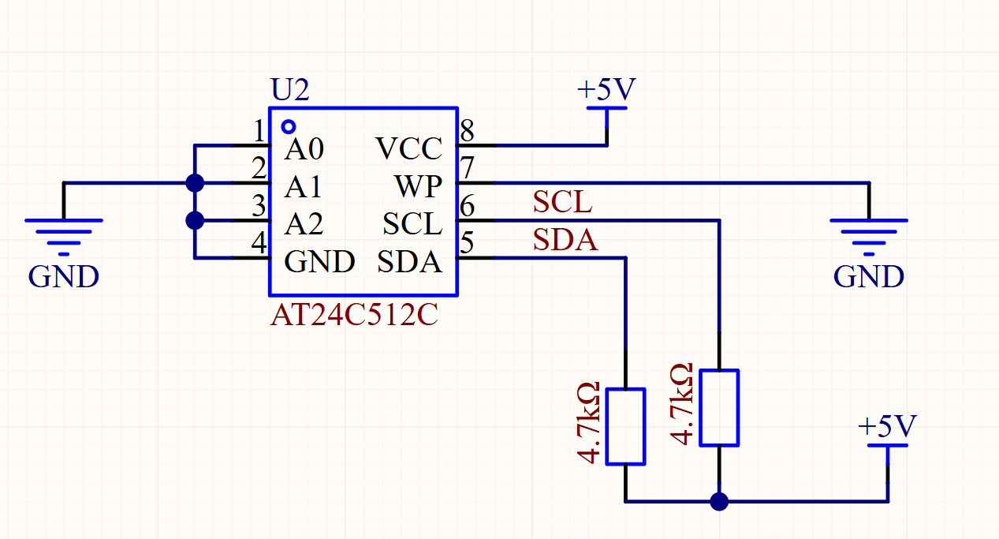
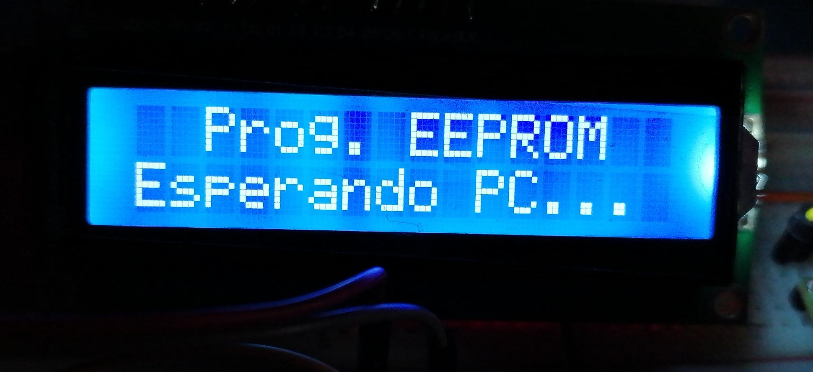
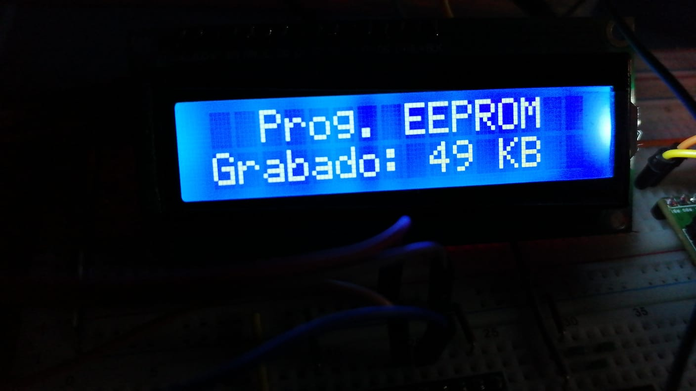
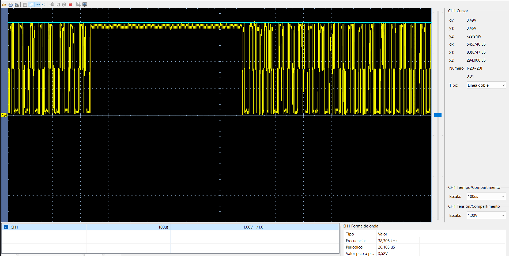
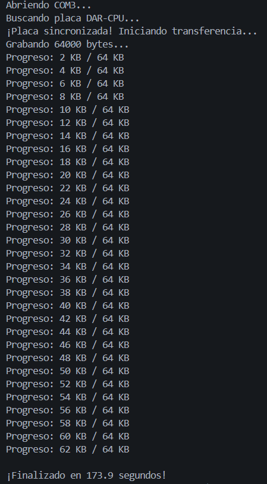

# Grabar audio PCM en una EEPROM AT24C512C

[← Volver al índice de ejemplos](../../README.md)

Este ejemplo convierte un archivo de audio a **PCM mono de 8 bits y 16 kHz**, lo envía desde una PC por UART y lo almacena byte a byte en una EEPROM **AT24C512C de 64 KiB** mediante I²C. Un LCD 16×2 muestra el estado y el progreso de la operación.

El archivo incluido, `audio/audio_16k.raw`, contiene **64 000 bytes**, equivalentes a 4 segundos de audio.

## Qué demuestra

- Recepción UART a 115200 bit/s.
- Protocolo simple de sincronización y confirmación por byte.
- Escritura con dirección de 16 bits en una AT24C512C.
- ACK polling para esperar el fin del ciclo interno de escritura.
- Uso compartido de I²C1 entre EEPROM y LCD.
- Conversión de audio en la PC mediante FFmpeg.
- Automatización de la transferencia con Python y PySerial.

## Hardware necesario

- Tarjeta con dsPIC33FJ32MC204.
- EEPROM AT24C512C.
- LCD 16×2 con backpack I²C PCF8574T.
- Adaptador USB–UART de lógica 3.3 V.
- Pull-ups para I²C y desacoplo de 100 nF cerca de la EEPROM.
- Level shifter bidireccional si el LCD trabaja con pull-ups a 5 V.

## Conexiones

### EEPROM AT24C512C

| AT24C512C | Conexión |
| --- | --- |
| VCC | 3.3 V |
| GND | GND |
| SDA | RB9 / SDA1 |
| SCL | RB8 / SCL1 |
| A0, A1, A2 | GND para dirección base `0x50` |
| WP | GND para permitir escritura |



El firmware usa la dirección de 7 bits `0x50`, transmitida como `0xA0` para escritura.

### LCD I²C

El LCD comparte SDA y SCL con la EEPROM, pero utiliza la dirección `0x27` (`0x4E` como byte de escritura), por lo que no existe conflicto de direcciones.

Si el backpack está alimentado a 5 V, las líneas se conectan mediante conversión bidireccional de nivel:


> Comprueba siempre la tensión real de las pull-ups. El lado conectado al dsPIC y a la EEPROM debe permanecer en 3.3 V.

### USB–UART

| dsPIC | Adaptador USB–UART |
| --- | --- |
| RB1 / U1TX | RXD |
| RB0 / U1RX | TXD |
| GND | GND |

Configuración: **115200 bit/s, 8 bits, sin paridad, 1 stop, sin control de flujo**.

## Preparar el audio

Instala FFmpeg y convierte el archivo de entrada a PCM unsigned de 8 bits, mono y 16 kHz:

```bash
ffmpeg -i musica.mp3 -t 4 -af "lowpass=f=7000,acompressor,volume=0.5" -ac 1 -ar 16000 -f u8 audio_16k.raw
```

| Opción | Función |
| --- | --- |
| `-i musica.mp3` | Archivo de entrada |
| `-t 4` | Limita la duración a 4 segundos |
| `lowpass=f=7000` | Limita el contenido por encima de 7 kHz |
| `acompressor` | Reduce el rango dinámico |
| `volume=0.5` | Reduce el nivel al 50 % |
| `-ac 1` | Convierte a mono |
| `-ar 16000` | Frecuencia de muestreo de 16 kHz |
| `-f u8` | PCM unsigned de 8 bits, sin cabecera |

La capacidad máxima es:

```text
65 536 bytes / 16 000 muestras/s = 4.096 s
```

El firmware de reproducción asociado utiliza los primeros **64 000 bytes**, es decir, 4.000 s. Mantener el archivo en 64 000 bytes hace coincidir ambos ejemplos.

## Preparar Python

El script requiere Python 3 y PySerial:

```bash
python -m pip install pyserial
```

En [`audio/grabar_audio.py`](audio/grabar_audio.py), ajusta:

```python
PUERTO_COM = 'COM3'
ARCHIVO_AUDIO = 'audio_16k.raw'
```

Ejecuta el script desde la carpeta `audio/` para que encuentre el RAW incluido.

## Protocolo de transferencia

La comunicación se realiza así:

1. Python abre el puerto a 115200 bit/s y envía `?` periódicamente.
2. El dsPIC responde `START` cuando está listo.
3. Python envía un byte de audio.
4. El dsPIC escribe el byte en la EEPROM y espera su ACK.
5. El dsPIC responde `K` si la escritura terminó o `E` si agotó el timeout.
6. Python envía el siguiente byte solo después de recibir `K`.

La confirmación por byte hace la transferencia sencilla y robusta, aunque más lenta que la escritura por páginas. En la prueba de 64 000 bytes el proceso terminó en aproximadamente **174 segundos**.

## Procedimiento completo

1. Conecta EEPROM, LCD, level shifter y USB–UART con la alimentación apagada.
2. Comprueba que `WP` esté en GND y que SDA/SCL tengan pull-ups a 3.3 V en el lado del dsPIC.
3. Crea un proyecto standalone para `dsPIC33FJ32MC204` con XC16.
4. Añade [`src/main.c`](src/main.c), compila y programa por ICSP.
5. Confirma que el LCD muestre `Esperando PC...`.
6. Coloca `audio_16k.raw` junto a `grabar_audio.py`.
7. Configura el puerto COM y ejecuta:

   ```bash
   python grabar_audio.py
   ```

8. Espera el mensaje final sin desconectar la alimentación.
9. Programa el ejemplo [de lectura y reproducción](../../eeprom-lectura/leer-24c512c).

## Resultados de prueba

### Estado inicial



### Progreso



### Actividad en el bus



### Transferencia finalizada



## Si falla la grabación

| Síntoma | Comprobación |
| --- | --- |
| Python no encuentra el puerto | Corrige `PUERTO_COM` y verifica el adaptador USB–UART. |
| Permanece en “Buscando placa” | Cruza TX/RX, une GND y confirma 115200 8N1. |
| Respuesta `E` | Revisa VCC, dirección, `WP`, pull-ups y continuidad de SDA/SCL. |
| Respuesta inesperada o timeout | Comprueba ruido, alimentación y que ningún otro programa use el COM. |
| LCD funciona, EEPROM no | Las direcciones son distintas; revisa específicamente A0–A2 y WP. |
| El archivo no aparece | Ejecuta Python desde `audio/` o usa una ruta completa en `ARCHIVO_AUDIO`. |

## Archivos

```text
grabar-audio/
├── README.md
├── src/
│   └── main.c
├── audio/
│   ├── audio_16k.raw
│   ├── grabar_audio.py
│   └── readme.txt
└── docs/
    ├── con_AT24C512C.png
    ├── con_TXS0108E.png
    ├── lcd_in.jpeg
    ├── lcd_prog.jpeg
    ├── trama.png
    └── term_ok.png
```
