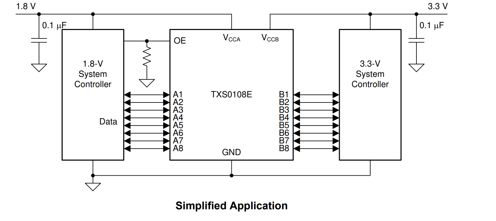
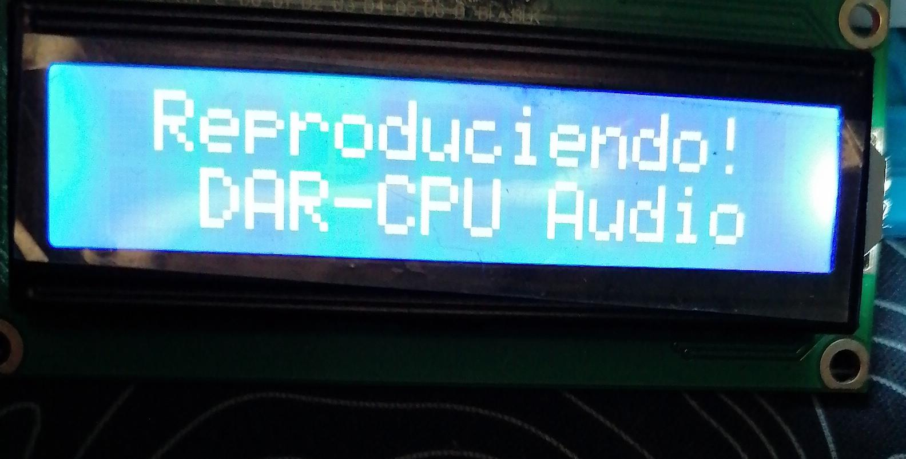
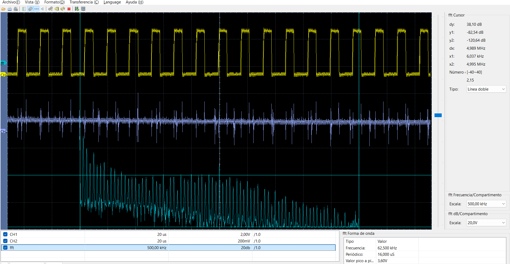
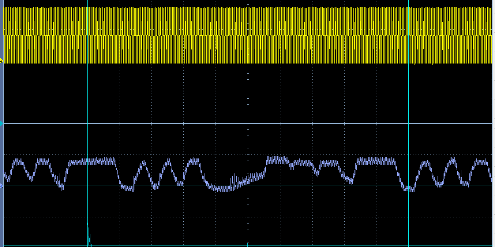

# Reproducir audio desde una EEPROM AT24C512C

[← Volver al índice de ejemplos](../../README.md)

Este ejemplo lee continuamente **64 000 muestras PCM de 8 bits a 16 kHz** desde una EEPROM AT24C512C y las convierte en una señal PWM sobre **RB14/PWM1H1**. Un buffer circular desacopla la lectura I²C de la interrupción de audio y un LCD 16×2 muestra el estado del sistema.

Antes de usarlo, la EEPROM debe programarse con el ejemplo [grabar-audio](../../eeprom-escritura/grabar-audio).

## Qué demuestra

- Lectura secuencial de una EEPROM I²C con dirección de 16 bits.
- Uso de un buffer circular de 256 bytes.
- Interrupción de Timer1 exactamente a 16 kHz.
- Conversión de muestras PCM de 8 bits a duty cycle PWM.
- Portadora PWM nominal de 62.5 kHz.
- Compartición de I²C1 entre EEPROM y LCD.
- Reconstrucción analógica mediante filtrado pasa-bajos.

## Formato del audio

| Parámetro | Valor |
| --- | --- |
| Codificación | PCM unsigned |
| Resolución | 8 bits |
| Canales | 1, mono |
| Frecuencia de muestreo | 16 000 muestras/s |
| Datos reproducidos | 64 000 bytes |
| Duración del bucle | 4.000 s |

El valor digital 128 representa aproximadamente el punto medio. Las muestras se reproducen de forma circular: al terminar el byte 63 999, la lectura regresa a la dirección 0.

## Hardware necesario

- Tarjeta con dsPIC33FJ32MC204.
- EEPROM AT24C512C previamente programada.
- LCD 16×2 con backpack I²C.
- Level shifter bidireccional si el LCD utiliza un bus de 5 V.
- Filtro pasa-bajos para la salida PWM.
- Amplificador de audio si se conectará un altavoz.

## Conexiones I²C

| Señal | dsPIC | EEPROM | LCD |
| --- | --- | --- | --- |
| SDA | RB9 / SDA1 | SDA | SDA, mediante level shifting si corresponde |
| SCL | RB8 / SCL1 | SCL | SCL, mediante level shifting si corresponde |
| Alimentación | 3.3 V | VCC = 3.3 V | Según el módulo |
| Referencia | GND | GND | GND común |

En la EEPROM, conecta `A0`, `A1` y `A2` a GND para seleccionar `0x50`. `WP` puede quedar en GND. Añade 100 nF de desacoplo junto al integrado.




## Salida de audio

| Señal | Pin |
| --- | --- |
| PWM de audio | RB14 / PWM1H1 |
| GND | GND común |

El firmware configura:

```c
PTPER = 639;
```

Por tanto:

```text
FPWM = 40 000 000 / (639 + 1)
     = 62.5 kHz
```

Cada muestra de 0 a 255 se escala y se escribe en `PDC1`. La señal de RB14 es PWM, no audio analógico directo.

> No conectes un altavoz directamente a RB14. El GPIO no está diseñado para entregar esa corriente. Utiliza un filtro, acoplamiento apropiado y un amplificador de audio.

## Temporización de 16 kHz

Timer1 trabaja sin prescaler y utiliza:

```c
PR1 = 2499;
```

```text
Fsample = FCY / (PR1 + 1)
        = 40 000 000 / 2500
        = 16 000 Hz
```

En cada `_T1Interrupt`, si existe un byte disponible en el buffer, la ISR lo retira y actualiza el duty cycle. El bucle principal continúa leyendo la EEPROM para mantener el buffer abastecido.

## Buffer circular

El array `audio_buffer[256]` usa índices de 8 bits que vuelven automáticamente a cero después de 255:

```text
EEPROM por I²C ──► head [ buffer circular ] tail ──► Timer1 ──► PDC1
```

- `head` indica dónde escribir la siguiente muestra leída.
- `tail` indica la próxima muestra que consumirá la ISR.
- Si el siguiente `head` coincide con `tail`, el buffer está lleno y la lectura espera.
- Si `head == tail`, el buffer está vacío y la ISR conserva el último duty cycle.

Este esquema evita realizar transacciones I²C dentro de la interrupción de audio.

## Filtrado de la salida

Para una primera prueba puede utilizarse un RC, pero su frecuencia de corte debe elegirse según la banda de audio y la atenuación requerida de la portadora de 62.5 kHz. Un filtro activo de segundo orden ofrece una reconstrucción mucho más limpia.

La salida filtrada normalmente debe acoplarse a un amplificador antes de alimentar auriculares o un altavoz.

## Cómo probarlo

1. Graba primero `audio_16k.raw` con el ejemplo [grabar-audio](../../eeprom-escritura/grabar-audio).
2. Apaga el sistema y realiza las conexiones de EEPROM, LCD y filtro.
3. Crea un proyecto standalone para `dsPIC33FJ32MC204` con XC16.
4. Añade [`src/main.c`](src/main.c).
5. Compila y programa mediante ICSP.
6. Comprueba que el LCD muestre `Reproduciendo!`.
7. Mide RB14: debe aparecer una portadora PWM de 62.5 kHz con duty variable.
8. Mide después del filtro y, si usarás un altavoz, conecta un amplificador apropiado.

## Resultados de prueba

### Estado en el LCD



### Filtro RC básico



### Filtro activo



## Si no se reproduce correctamente

| Síntoma | Comprobación |
| --- | --- |
| LCD activo, RB14 sin señal | Revisa la habilitación de PWM1H1 y `PTCONbits.PTEN`. |
| Portadora fija sin audio | La EEPROM puede estar vacía o la lectura I²C puede haber fallado. |
| Audio acelerado o lento | Verifica `FCY = 40 MHz` y `PR1 = 2499`. |
| Chasquidos o pausas | Revisa integridad del bus I²C, alimentación y pull-ups. |
| Mucho ruido de portadora | Mejora el filtro y el layout; evita cables largos. |
| Distorsión o volumen bajo | Ajusta el filtro y usa un amplificador; no cargues RB14 directamente. |

## Archivos

```text
leer-24c512c/
├── README.md
├── src/
│   └── main.c
└── docs/
    ├── con_AT24C512C.png
    ├── con_TXS0108E.png
    ├── lcd_rep.jpeg
    ├── fil_bas_rc.png
    └── fil_act.png
```
