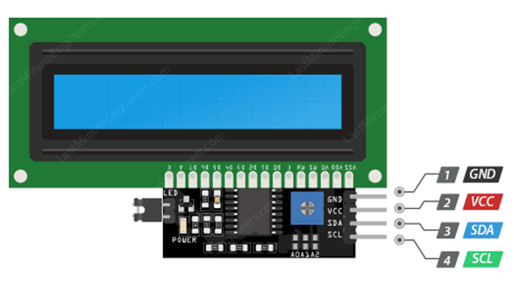
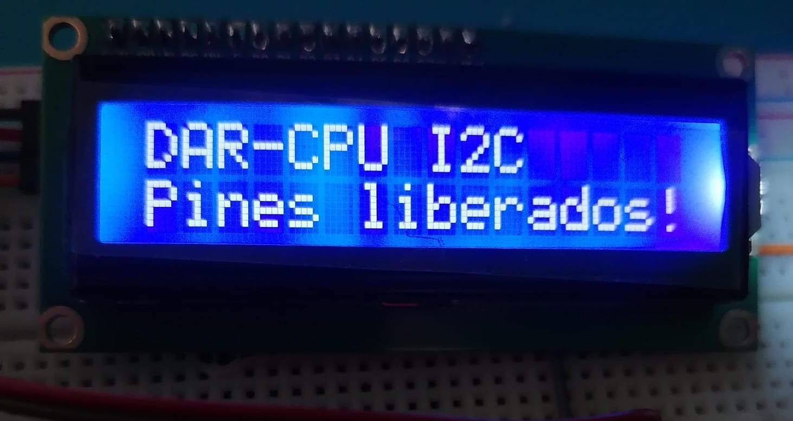

# LCD 16×2 por I²C con dsPIC33FJ32MC204

[← Volver al índice de ejemplos](../../README.md)

Ejemplo para controlar una pantalla alfanumérica **LCD 16×2 compatible con HD44780** mediante un backpack I²C basado en **PCF8574T**. El adaptador reduce la conexión del LCD a dos señales y deja libres los GPIO que requeriría el bus paralelo.

Al iniciar, la pantalla muestra:

```text
DAR-CPU I2C
Pines liberados!
```

## Qué demuestra

- Uso de I²C1 como maestro.
- Inicialización de un LCD HD44780 en modo de 4 bits a través de un expansor PCF8574.
- Envío de comandos y caracteres.
- Posicionamiento en las dos líneas del display.
- Compartición futura del bus I²C con otros dispositivos de distinta dirección.

## Hardware necesario

- Tarjeta con dsPIC33FJ32MC204.
- LCD 16×2 compatible con HD44780.
- Backpack I²C basado en PCF8574T.
- Pull-ups adecuadas para SDA y SCL.
- Conversión de nivel si el backpack mantiene el bus a 5 V.

## Conexiones

| Backpack LCD | dsPIC33FJ32MC204 | Función |
| --- | --- | --- |
| SDA | RB9 / SDA1 | Datos I²C |
| SCL | RB8 / SCL1 | Reloj I²C |
| GND | GND | Referencia común |
| VCC | Según el módulo | Alimentación del LCD/backpack |



> **Niveles lógicos:** muchos backpacks se alimentan a 5 V y llevan resistencias pull-up de SDA/SCL hacia 5 V. No conectes esas líneas directamente al dsPIC sin comprobar el módulo. Usa un level shifter bidireccional o conecta las pull-ups del bus a 3.3 V cuando el conjunto LCD/backpack lo permita.

## Dirección I²C

El firmware está preparado para un PCF8574T con dirección de 7 bits `0x27`. En el byte transmitido por el bus, esa dirección aparece desplazada un bit:

```text
Dirección de 7 bits: 0x27
Byte de escritura:   0x4E
```

Por eso el código define:

```c
#define LCD_ADDR 0x4E
```

Algunos backpacks utilizan `0x3F` u otra dirección, según el integrado y el estado de A0, A1 y A2. Si el display no responde, ejecuta un escáner I²C o revisa la serigrafía del expansor antes de cambiar `LCD_ADDR`.

## Configuración del bus

Con `FCY = 40 MHz`, el ejemplo utiliza:

```c
I2C1BRG = 95;
```

Esto configura el bus aproximadamente a **400 kHz**. El LCD no recibe directamente esa frecuencia: el PCF8574 convierte cada byte I²C en niveles para `D4…D7`, `RS`, `EN` y el backlight.

La asignación empleada por el driver es:

```text
PCF8574 P7..P4 -> LCD D7..D4
PCF8574 P3     -> Backlight
PCF8574 P2     -> EN
PCF8574 P1     -> RW
PCF8574 P0     -> RS
```

Esta distribución es común, pero no universal. Si el backlight funciona y no aparece texto, confirma que el backpack use el mismo mapeo.

## Secuencia de inicialización

El driver espera el encendido del LCD y envía la secuencia estándar para entrar en modo de 4 bits:

1. Tres nibbles `0x03` con los retardos de arranque.
2. Un nibble `0x02` para seleccionar 4 bits.
3. `0x28`: 4 bits, dos líneas y fuente 5×8.
4. `0x0C`: display encendido y cursor oculto.
5. `0x06`: incremento automático del cursor.
6. `0x01`: limpieza del display.

## Cómo probarlo

1. Crea un proyecto standalone para `dsPIC33FJ32MC204` con XC16.
2. Añade [`src/main.c`](src/main.c).
3. Verifica la tensión de las pull-ups de SDA y SCL.
4. Conecta SDA, SCL, alimentación y GND.
5. Ajusta el potenciómetro de contraste del backpack.
6. Compila y programa el dsPIC mediante ICSP.
7. Comprueba que aparezcan las dos líneas de texto.

## Resultado real



## Si no aparece texto

| Síntoma | Comprobación |
| --- | --- |
| Backlight encendido, sin caracteres | Ajusta contraste, revisa dirección y mapeo del PCF8574. |
| Bus sin actividad | Verifica RB8/SCL1, RB9/SDA1, GND y `I2C1CONbits.I2CEN`. |
| SDA o SCL permanecen en bajo | Busca un corto, un dispositivo mal alimentado o pull-ups incorrectas. |
| Caracteres extraños | Revisa alimentación, secuencia de inicialización y calidad de las conexiones. |
| El dsPIC se calienta | Desconecta y comprueba que ninguna señal esté forzada a 5 V. |

## Archivos

```text
texto-simple/
├── README.md
├── src/
│   └── main.c
└── docs/
    ├── lcd_con.png
    └── lcd_i2c.jpeg
```
