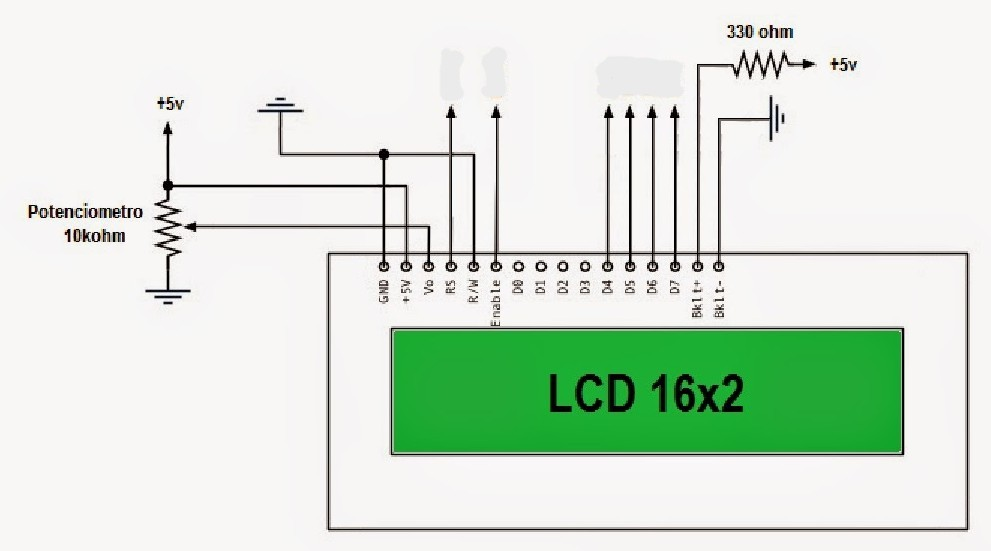
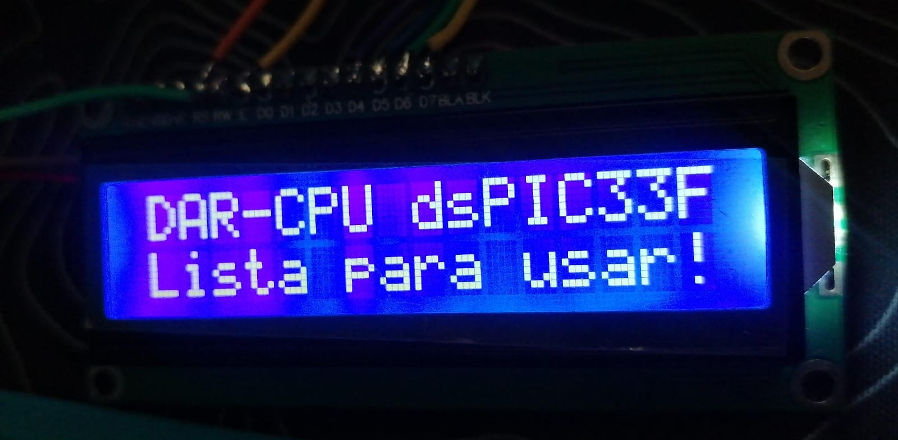

# LCD 16×2 en modo paralelo con dsPIC33FJ32MC204

[← Volver al índice de ejemplos](../../README.md)

Ejemplo de control directo de un LCD 16×2 compatible con HD44780, sin backpack I²C. El display trabaja en modo de **4 bits**, por lo que utiliza seis GPIO: `RS`, `EN` y las cuatro líneas de datos `D4…D7`.

Al iniciar, muestra:

```text
DAR-CPU dsPIC33F
Lista para usar!
```

## Qué demuestra

- Interfaz paralela de 4 bits para LCD HD44780.
- Escritura de nibbles, comandos y caracteres.
- Control directo de GPIO mediante `LATB`.
- Inicialización y direccionamiento de las dos filas del LCD.

## Hardware necesario

- Tarjeta con dsPIC33FJ32MC204.
- LCD 16×2 compatible con HD44780.
- Potenciómetro de 10 kΩ para contraste.
- Cableado entre la tarjeta y el display.

## Conexiones

| LCD | dsPIC / alimentación | Función |
| --- | --- | --- |
| VSS | GND | Tierra |
| VDD | Alimentación compatible con el módulo | Alimentación del LCD |
| VO | Cursor del potenciómetro de 10 kΩ | Contraste |
| RS | RB4 | Selección comando/dato |
| RW | GND | Solo escritura |
| EN | RB5 | Pulso de habilitación |
| D4 | RB6 | Dato bit 4 |
| D5 | RB7 | Dato bit 5 |
| D6 | RB8 | Dato bit 6 |
| D7 | RB9 | Dato bit 7 |

Los extremos del potenciómetro de contraste se conectan a VDD y GND.



> Si el LCD se alimenta a 5 V, verifica en la hoja de datos que reconozca correctamente niveles lógicos de 3.3 V. El ejemplo mantiene `RW` a GND, de modo que el LCD no conduce el bus de datos hacia el dsPIC. Para un diseño reproducible con módulos desconocidos, utiliza un LCD compatible con 3.3 V o conversión de nivel.

## Funcionamiento del driver

La función `LCD_Nibble()` coloca simultáneamente los cuatro bits en RB6…RB9 y genera un pulso en `EN`:

```c
LATB = (LATB & 0xFC3F) | ((data & 0x0F) << 6);
```

Cada byte se divide en dos partes:

```text
Byte 0x4D
  ├── nibble alto: 0x4
  └── nibble bajo: 0xD
```

Con `RS = 0`, el byte se interpreta como comando. Con `RS = 1`, se interpreta como carácter.

## Inicialización

La secuencia de arranque realiza:

1. Espera de 20 ms después de alimentar el LCD.
2. Secuencia `0x03, 0x03, 0x03, 0x02` para entrar en modo de 4 bits.
3. `0x28`: dos líneas y fuente 5×8.
4. `0x0C`: display encendido, cursor oculto.
5. `0x06`: autoincremento.
6. `0x01`: limpieza de pantalla.

Las direcciones `0x80` y `0xC0` sitúan el cursor al inicio de la primera y segunda línea, respectivamente.

## Cómo probarlo

1. Crea un proyecto standalone para `dsPIC33FJ32MC204` con XC16.
2. Añade [`src/main.c`](src/main.c).
3. Conecta las seis señales, alimentación, GND y el potenciómetro de contraste.
4. Mantén `RW` conectado permanentemente a GND.
5. Compila y programa mediante ICSP.
6. Ajusta lentamente el contraste hasta ver el texto.

## Resultado real



## Si no funciona

| Síntoma | Comprobación |
| --- | --- |
| Solo aparecen bloques oscuros | El LCD tiene alimentación, pero falta inicialización o el contraste está muy alto. |
| Pantalla completamente vacía | Ajusta VO y revisa VDD, VSS y backlight. |
| Texto corrupto | Revisa el orden D4–D7 y la conexión de RS/EN. |
| Funciona de manera intermitente | Acorta cables y comprueba la referencia GND común. |

## Archivos

```text
texto-simple/
├── README.md
├── src/
│   └── main.c
└── docs/
    ├── lcd_con.jpg
    └── lcd.jpeg
```
