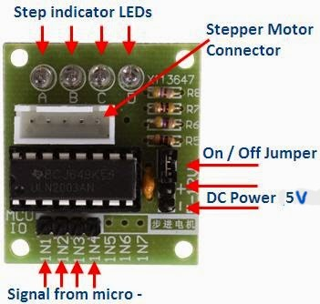
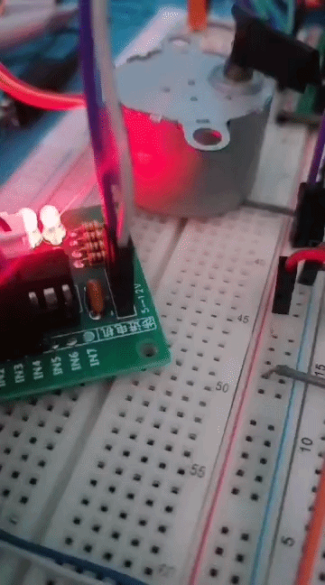
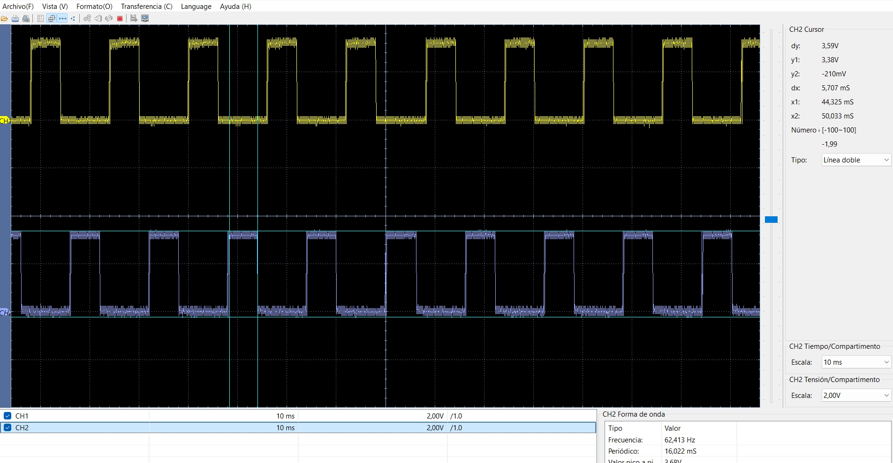

# Motor paso a paso con ULN2003 y dsPIC33FJ32MC204

[← Volver al índice de ejemplos](../../README.md)

Ejemplo para accionar continuamente un motor paso a paso unipolar mediante un módulo **ULN2003**. El dsPIC genera una secuencia de medio paso en RB12…RB15 y el ULN2003 proporciona la corriente necesaria para las bobinas del motor.

El montaje típico utiliza un motor 28BYJ-48 de 5 V con su módulo de cuatro entradas, aunque la secuencia puede adaptarse a otros motores unipolares compatibles.

## Qué demuestra

- Control de cuatro salidas digitales coordinadas.
- Secuencia de excitación de medio paso.
- Separación entre señales lógicas y corriente de las bobinas.
- Ajuste básico de velocidad mediante el intervalo entre pasos.

## Hardware necesario

- Tarjeta con dsPIC33FJ32MC204.
- Motor paso a paso unipolar compatible.
- Módulo ULN2003.
- Fuente de 5 V con corriente suficiente para el motor.
- GND común entre la fuente del motor y la tarjeta.

## Conexiones

| ULN2003 | dsPIC / fuente |
| --- | --- |
| IN1 | RB12 |
| IN2 | RB13 |
| IN3 | RB14 |
| IN4 | RB15 |
| VCC / `+` | 5 V del motor |
| GND / `-` | GND común |
| Conector del motor | Motor paso a paso compatible |



> No conectes las bobinas directamente a los GPIO del dsPIC. Alimenta el motor desde 5 V y une las tierras. Si utilizas la salida de 5 V de la tarjeta, confirma que el consumo del motor permanezca dentro de la capacidad disponible; una fuente externa es preferible para motores de mayor corriente.

## Secuencia de medio paso

El firmware recorre ocho estados:

| Paso | IN4 | IN3 | IN2 | IN1 | Patrón |
| ---: | ---: | ---: | ---: | ---: | --- |
| 1 | 0 | 0 | 0 | 1 | `0001` |
| 2 | 0 | 0 | 1 | 1 | `0011` |
| 3 | 0 | 0 | 1 | 0 | `0010` |
| 4 | 0 | 1 | 1 | 0 | `0110` |
| 5 | 0 | 1 | 0 | 0 | `0100` |
| 6 | 1 | 1 | 0 | 0 | `1100` |
| 7 | 1 | 0 | 0 | 0 | `1000` |
| 8 | 1 | 0 | 0 | 1 | `1001` |

La combinación alterna estados de una y dos bobinas energizadas. Esto duplica el número de posiciones respecto al paso completo y produce un movimiento más suave.

## Velocidad y sentido

Entre estados se aplica:

```c
__delay_ms(2);
```

Esto equivale a **500 medios pasos por segundo** en condiciones ideales. La velocidad mecánica final depende del motor y de su reductora. Si el motor pierde pasos, vibra o no arranca, aumenta el retardo a 3–10 ms.

Para invertir el sentido de giro, recorre la tabla desde el último estado hacia el primero.

## Cómo probarlo

1. Realiza las conexiones con la alimentación apagada.
2. Confirma 5 V en el módulo y continuidad de GND común.
3. Crea un proyecto standalone para `dsPIC33FJ32MC204` con XC16.
4. Añade [`src/main.c`](src/main.c).
5. Compila y programa mediante ICSP.
6. Energiza el módulo; el motor debe girar continuamente en un solo sentido.
7. Mide RB12…RB15 si necesitas verificar la secuencia.

## Resultados de prueba

### Giro del motor



### Señales de RB12 y RB14



## Si no gira correctamente

| Síntoma | Comprobación |
| --- | --- |
| El motor vibra y no gira | Revisa el orden IN1…IN4 y el conector del motor. |
| Gira pero pierde pasos | Aumenta el retardo y verifica la corriente de la fuente. |
| El módulo enciende, pero el motor no responde | Comprueba GND común y 5 V bajo carga. |
| El dsPIC se reinicia | Separa mejor la alimentación del motor, añade desacoplo y evita sobrecargar la salida de 5 V. |
| El giro es contrario al deseado | Invierte el orden de la secuencia. |

## Archivos

```text
modulo-uln2003/
├── README.md
├── src/
│   └── main.c
└── docs/
    ├── uln2003.jpg
    ├── mot.gif
    └── osc_b12_14.png
```
