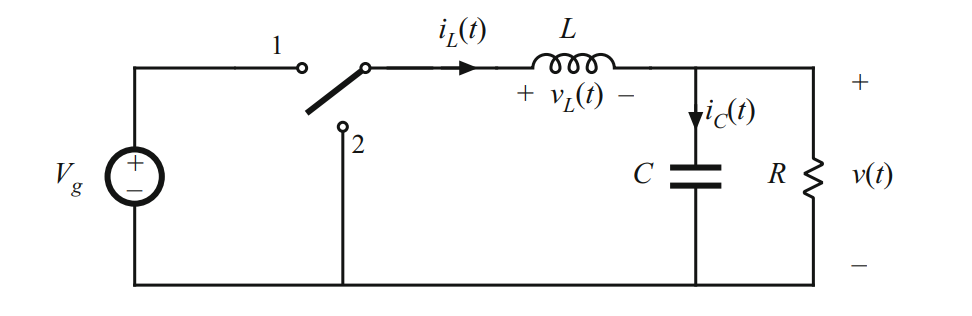

# Convertidores buck

[← Volver a proyectos](../../readme.md)

El convertidor buck es una topología DC–DC reductora. Regula una tensión de salida menor que la entrada controlando el tiempo de conducción del interruptor y transfiriendo energía mediante un inductor.



## Relación ideal

En conducción continua y bajo condiciones ideales:

```text
Vout = D × Vin
```

donde `D` es el ciclo de trabajo entre 0 y 1. En un diseño real también intervienen pérdidas de conducción y conmutación, ripple, dead time, resistencia del inductor y caída en los semiconductores.

## Variantes organizadas

| Proyecto | Enfoque | Estado |
| --- | --- | --- |
| [Buck con control analógico](buck-with-analog-control) | Regulación mediante compensación analógica | Planificado |
| [Buck con control digital](buck-with-digital-control) | Muestreo ADC y lazo ejecutado por el dsPIC | Planificado |

## Documentación prevista

Cada implementación deberá incluir:

- tensión de entrada y rango de salida;
- corriente y potencia nominal;
- frecuencia de conmutación;
- cálculo de L y C;
- ripple permitido;
- selección y pérdidas de semiconductores;
- sensado y compensación;
- protecciones y secuencia de arranque;
- mediciones de eficiencia y respuesta dinámica.

## Estado

Esta carpeta contiene por ahora documentación base y la organización de futuros proyectos. No existe todavía un diseño listo para construir.
