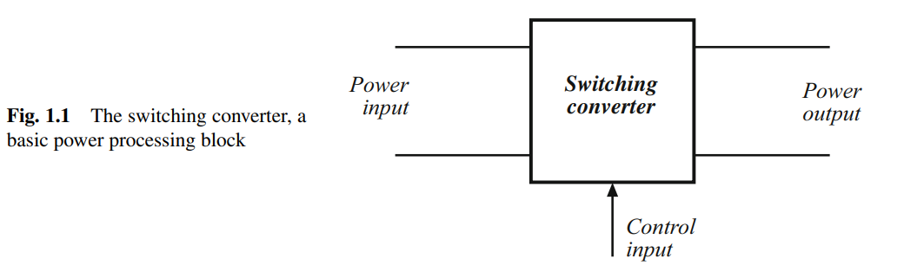

# Proyectos integrados con dsPIC33FJ32MC204

[← Volver al índice de ejemplos](../README.md)

Esta sección está reservada para proyectos completos que combinan varios periféricos, diseño electrónico, simulación, firmware y validación física. A diferencia de los ejemplos básicos del repositorio, aquí cada desarrollo podrá incluir cálculos, selección de componentes, esquemático, PCB, control y resultados de laboratorio.

## Plataforma de referencia

| Parámetro | Valor |
| --- | --- |
| MCU principal | dsPIC33FJ32MC204 |
| Rendimiento | 40 MIPS |
| Cristal | 8 MHz + PLL |
| Herramientas | MPLAB X, XC16, simulación y medición física |

## Estado actual

La estructura de proyectos está en preparación. Los directorios sin firmware o mediciones se identifican explícitamente como **planificados** para no confundirlos con ejemplos ya validados.

| Área | Sección | Estado |
| --- | --- | --- |
| Electrónica de potencia | [Convertidores buck](power-electronics/buck-converters) | Documentación base |
| Electrónica de potencia | [Convertidores boost](power-electronics/boost-converters) | Planificado |
| Control analógico | [Buck con control analógico](power-electronics/buck-converters/buck-with-analog-control) | Planificado |
| Control digital | [Buck con control digital](power-electronics/buck-converters/buck-with-digital-control) | Planificado |

## Electrónica de potencia

Esta área estudia conversión y control de energía mediante semiconductores en conmutación. Los futuros proyectos incluirán, según corresponda:

- definición de especificaciones eléctricas;
- análisis en régimen permanente y selección de topología;
- dimensionamiento de inductores y condensadores;
- selección de MOSFET, diodo o rectificación síncrona;
- cálculo de pérdidas y verificación térmica;
- sensado de corriente y tensión;
- lazos de control y compensación;
- protecciones de hardware y firmware;
- simulación y mediciones sobre prototipo.

> Los proyectos de potencia pueden manejar tensiones, corrientes y energía peligrosas. La documentación futura indicará condiciones de prueba, límites y protecciones; una carpeta marcada como planificada no debe considerarse un diseño listo para construcción.

## Criterio para considerar un proyecto completo

Un desarrollo pasará de “planificado” a “implementado” cuando incluya como mínimo:

1. objetivo y especificaciones;
2. diagrama de bloques y principio de operación;
3. archivos de firmware o simulación;
4. conexiones o esquemático reproducible;
5. procedimiento de puesta en marcha seguro;
6. resultados medidos y limitaciones conocidas.
