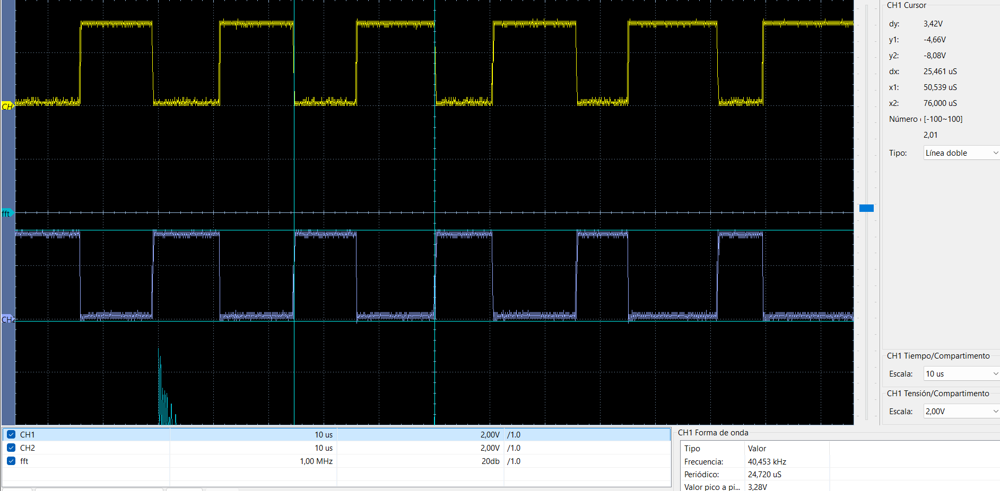
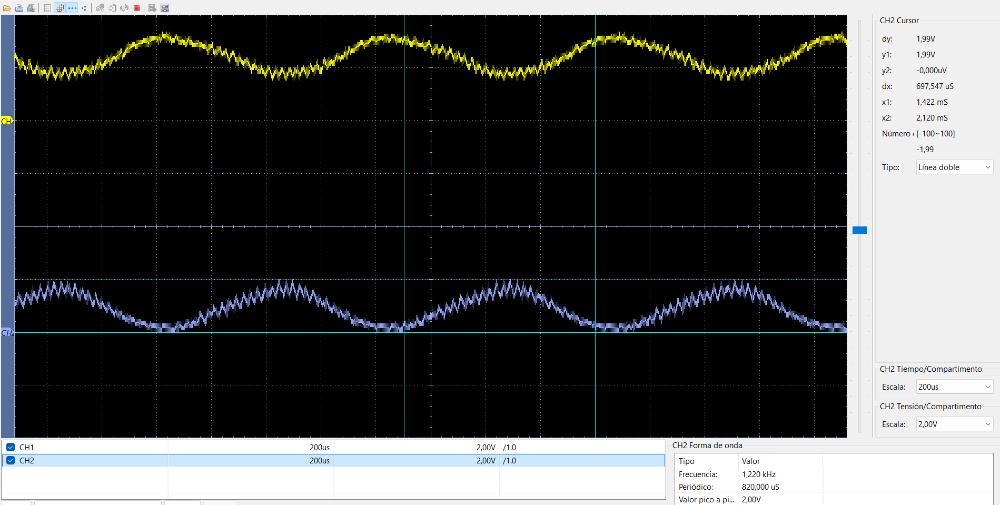
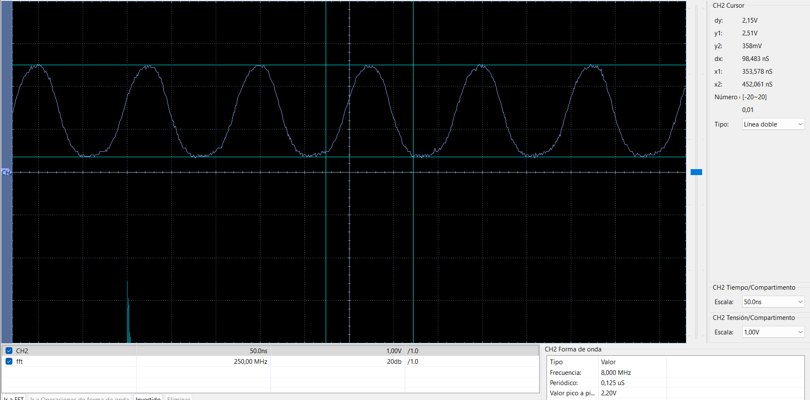

# Generación SPWM con dsPIC33FJ32MC204

[← Volver al índice de ejemplos](../../README.md)

Ejemplo de **modulación sinusoidal por ancho de pulso (SPWM)** usando el módulo PWM para control de motores del dsPIC33FJ32MC204. El duty cycle se actualiza con una tabla de 32 muestras y las salidas complementarias aparecen en **RB14/PWM1H1** y **RB15/PWM1L1**.

Después de un filtro pasa-bajos puede observarse la componente senoidal generada por la variación del duty cycle.

## Qué demuestra

- Configuración del módulo Motor Control PWM.
- Uso del par complementario PWM1H1/PWM1L1.
- Actualización periódica de `PDC1` desde una interrupción.
- Síntesis digital mediante una tabla de 32 muestras.
- Recuperación de la señal modulante con un filtro pasa-bajos.
- Verificación del cristal externo y de las frecuencias generadas.

## Hardware necesario

- Tarjeta con dsPIC33FJ32MC204 y cristal de 8 MHz.
- Osciloscopio o analizador lógico.
- Para observar la envolvente: filtro RC de prueba de 1 kΩ + 100 nF.
- Programador/debugger ICSP.

## Salidas

| Señal | Pin | Descripción |
| --- | --- | --- |
| PWM1H1 | RB14 | Salida SPWM principal |
| PWM1L1 | RB15 | Salida complementaria |
| LED de actividad | RB11 | Conmuta cada 50 ms |

Para una medición básica, conecta la punta del osciloscopio a RB14 o RB15 y la referencia a GND.

> Las salidas son señales lógicas de 3.3 V. No conectes una carga de potencia directamente a los GPIO. El firmware no configura tiempo muerto; por ello **no debe controlar directamente un medio puente de MOSFET** sin añadir un driver adecuado, dead time y protecciones contra conducción cruzada.

## Frecuencias generadas

El firmware usa:

```c
PTPER = 1023;
```

Con el PWM en modo free-running y `FCY = 40 MHz`, la portadora nominal es:

```text
FPWM = FCY / (PTPER + 1)
     = 40 000 000 / 1024
     = 39.0625 kHz
```

La captura de laboratorio muestra aproximadamente **40.45 kHz**, una diferencia razonable respecto al cálculo nominal por tolerancia de reloj y medición.

El duty cycle se actualiza una vez por periodo PWM y la tabla contiene 32 valores:

```text
FSPWM = FPWM / 32
      ≈ 1.2207 kHz
```

La medición después del filtro muestra aproximadamente **1.220 kHz**, coincidente con el valor esperado.

## Tabla senoidal

`sine_table[]` contiene 32 muestras escaladas para el registro de duty cycle. En cada interrupción `_MPWM1Interrupt` el firmware:

1. Copia la muestra actual a `PDC1`.
2. Incrementa `sine_index`.
3. Regresa al índice 0 después de la muestra 31.
4. Limpia el flag `_PWM1IF`.

```text
Tabla de 32 muestras
        │
        ▼
PDC1 actualizado cada periodo PWM
        │
        ▼
Duty cycle variable en RB14/RB15
        │
        ▼
Filtro pasa-bajos
        │
        ▼
Componente senoidal ≈ 1.22 kHz
```

## Filtro RC de demostración

La prueba básica utiliza:

```text
RB14 ── 1 kΩ ──┬── salida filtrada
                │
              100 nF
                │
               GND
```

Su frecuencia de corte aproximada es:

```text
fc = 1 / (2πRC)
   ≈ 1.59 kHz
```

El filtro atenúa la portadora de unos 39 kHz y deja visible la componente de 1.22 kHz. Es una demostración sencilla; para menor ripple o una banda útil específica se requiere diseñar un filtro de orden superior.

## Cómo probarlo

1. Crea un proyecto standalone para `dsPIC33FJ32MC204` con XC16.
2. Añade [`src/main.c`](src/main.c).
3. Compila y programa mediante ICSP.
4. Mide RB14 y RB15 sin carga; deben ser complementarias.
5. Verifica la portadora cercana a 39–40 kHz.
6. Conecta el filtro RC a una de las salidas.
7. Mide la salida filtrada y comprueba una frecuencia cercana a 1.22 kHz.

## Resultados medidos

### SPWM antes del filtro

La captura muestra las dos salidas complementarias y una medición próxima a 40.45 kHz.



### Señal después del filtro RC

La componente recuperada se mide cerca de 1.220 kHz.



### Verificación del cristal



## Cómo modificar el ejemplo

| Objetivo | Parámetro |
| --- | --- |
| Cambiar portadora | `PTPER` |
| Cambiar frecuencia senoidal sin cambiar portadora | Número de actualizaciones por muestra o longitud de tabla |
| Cambiar forma de onda | Valores de `sine_table[]` |
| Cambiar amplitud de modulación | Rango de valores cargados en `PDC1` |
| Usar una etapa de potencia | Añadir driver, dead time, protección y dimensionamiento del filtro |

## Si no funciona

| Síntoma | Comprobación |
| --- | --- |
| No hay PWM | Revisa `PTCONbits.PTEN`, `PEN1H/PEN1L` y la selección del dispositivo. |
| Frecuencia distinta | Verifica el PLL, `FCY` y `PTPER`. |
| No aparece la envolvente | Revisa el punto de medición y los valores R/C. |
| Mucho ripple | Utiliza un filtro de mayor orden o aumenta la separación entre portadora y modulante. |
| Las dos salidas no son opuestas | Confirma `PMOD1 = 0` y mide ambas respecto del mismo GND. |

## Archivos

```text
generacion-simple/
├── README.md
├── src/
│   └── main.c
└── docs/
    ├── spwm_raw.png
    ├── spwm_filtered.png
    └── osc_8mhz.png
```
