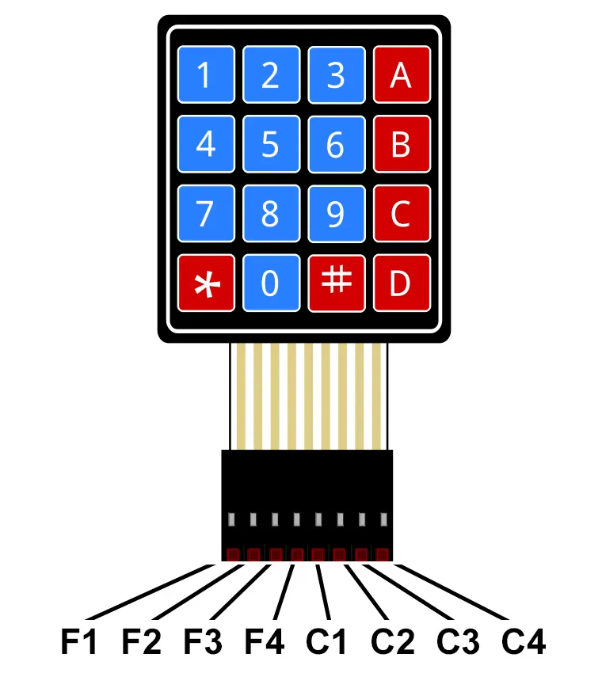
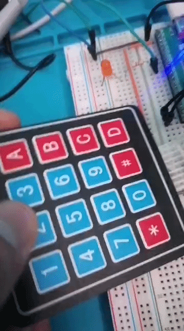
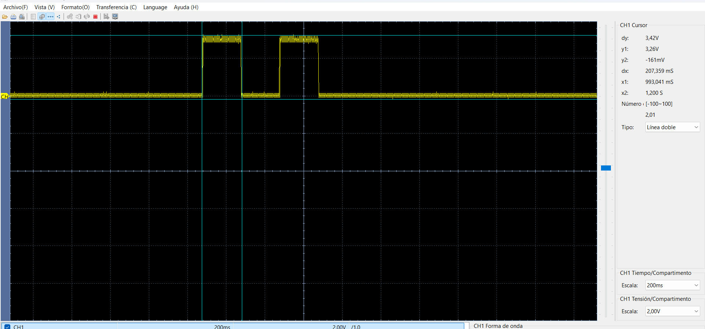
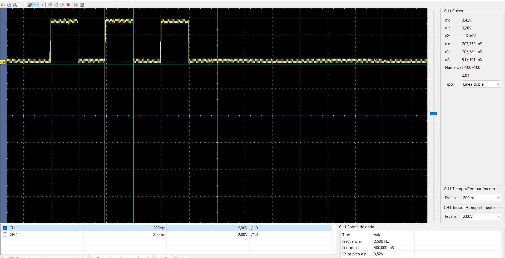

# Teclado matricial 4×4 con dsPIC33FJ32MC204

[← Volver al índice de ejemplos](../../README.md)

Este ejemplo escanea un teclado matricial de 16 teclas y representa la tecla detectada mediante parpadeos del LED conectado a RB11. Las filas se activan una por una y las columnas se leen como entradas digitales.

## Qué demuestra

- Escaneo de una matriz de 4 filas × 4 columnas usando ocho GPIO.
- Configuración combinada de entradas y salidas en PORTB.
- Detección de fila y columna sin un controlador externo.
- Mapeo de teclas numéricas y de función.
- Espera de liberación de tecla para evitar repeticiones continuas.

## Hardware necesario

- Tarjeta con dsPIC33FJ32MC204.
- Teclado matricial 4×4.
- Cuatro resistencias pull-down de 4.7 kΩ para las columnas.
- LED en RB11 con resistencia de 330 Ω a 470 Ω.

## Conexiones

| Teclado | dsPIC | Dirección en el firmware |
| --- | --- | --- |
| Fila 1 | RB0 | Salida |
| Fila 2 | RB1 | Salida |
| Fila 3 | RB2 | Salida |
| Fila 4 | RB3 | Salida |
| Columna 1 | RB4 | Entrada + 4.7 kΩ a GND |
| Columna 2 | RB5 | Entrada + 4.7 kΩ a GND |
| Columna 3 | RB6 | Entrada + 4.7 kΩ a GND |
| Columna 4 | RB7 | Entrada + 4.7 kΩ a GND |
| Indicador | RB11 | LED + resistencia |



> El orden físico de los ocho terminales no es idéntico en todos los teclados. Identifica filas y columnas con el datasheet o un multímetro antes de conectarlo. Las resistencias pull-down mantienen las columnas en 0 cuando no hay ninguna tecla presionada.

## Mapa de teclas

El firmware utiliza este orden:

| | Columna 1 | Columna 2 | Columna 3 | Columna 4 |
| --- | ---: | ---: | ---: | ---: |
| Fila 1 | 1 | 2 | 3 | A = 10 |
| Fila 2 | 4 | 5 | 6 | B = 11 |
| Fila 3 | 7 | 8 | 9 | C = 12 |
| Fila 4 | `*` = 14 | 0 | `#` = 15 | D = 13 |

Las teclas de función se codifican con valores de 10 a 15 para poder representarlas también como una cantidad de parpadeos.

## Cómo se realiza el escaneo

Para cada fila, el programa:

1. Pone RB0…RB3 en 0.
2. Activa una sola fila en nivel alto.
3. Espera 5 ms para estabilización.
4. Lee RB4…RB7.
5. Si encuentra una columna activa, espera a que se libere la tecla y devuelve su valor.

```text
Activa F1 ─► lee C1…C4
Activa F2 ─► lee C1…C4
Activa F3 ─► lee C1…C4
Activa F4 ─► lee C1…C4
```

Cuando se detecta un valor mayor que cero, RB11 parpadea esa cantidad de veces. Por ejemplo, la tecla 3 produce tres pulsos.

> En esta versión la tecla `0` se detecta, pero no genera parpadeos porque el bucle principal procesa únicamente valores mayores que cero.

## Cómo probarlo

1. Identifica el pinout real del teclado.
2. Conecta filas, columnas y resistencias pull-down.
3. Crea un proyecto standalone para `dsPIC33FJ32MC204` con XC16.
4. Añade [`src/main.c`](src/main.c).
5. Compila y programa mediante ICSP.
6. Presiona una tecla y cuenta los parpadeos de RB11.
7. Verifica varias filas y columnas para descartar un cableado permutado.

## Resultados de prueba

### Respuesta visual



### Tecla 2



### Tecla 3



## Si no funciona

| Síntoma | Comprobación |
| --- | --- |
| Ninguna tecla responde | Revisa el orden de filas/columnas y las resistencias a GND. |
| La tecla mostrada no coincide | El conector del teclado tiene un orden distinto; reordena el cableado. |
| Se detectan teclas sin presionar | Alguna columna está flotante o falta su pull-down. |
| Una pulsación se repite | Revisa rebote, falsos contactos o aumenta el tratamiento de debounce. |
| La tecla 0 no parpadea | Es el comportamiento actual del código; el valor 0 queda fuera de la condición `tecla > 0`. |

## Archivos

```text
prueba-teclado/
├── README.md
├── src/
│   └── main.c
└── docs/
    ├── teclado.webp
    ├── teclado.gif
    ├── num2.png
    └── num3.png
```
