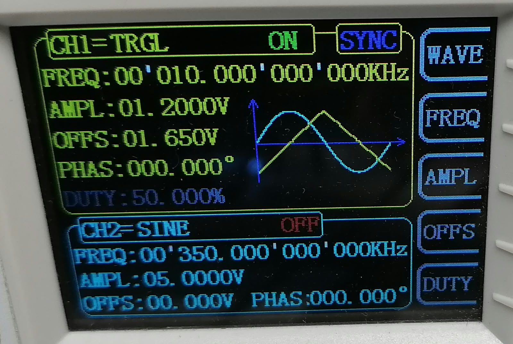
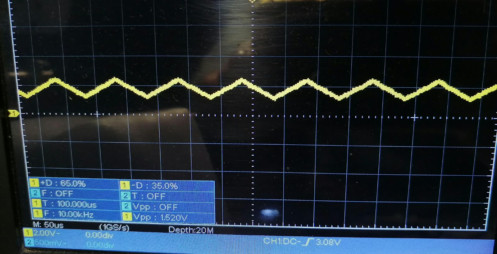

# dsPIC33FJ32MC204 — ADC + TFT Mini Oscilloscope

[← Volver al índice de ejemplos](../../README.md)

Ejemplo práctico de adquisición y visualización de una señal analógica utilizando el **ADC de 12 bits del dsPIC33FJ32MC204** y una pantalla **TFT ST7735/ST7735S de 128x160 píxeles**. El montaje fue validado sobre la tarjeta de desarrollo V1I2.

El firmware captura bloques de **256 muestras**, realiza un trigger básico por software y muestra **128 muestras** en pantalla. Además, cuatro pulsadores permiten modificar la frecuencia de muestreo, la escala vertical, el modo de trigger y alternar entre **RUN/HOLD**.

Este ejemplo está pensado como una demostración de adquisición ADC y visualización en tiempo real; no pretende sustituir un osciloscopio de laboratorio.

---

## Resultado de la prueba

La prueba se realizó con una señal periódica generada externamente y verificada antes de conectarla al ADC del dsPIC.

### Generador de funciones

<p align="center">
  
</p>

### Verificación con osciloscopio

<p align="center">
  
</p>

### Visualización en la TFT

<p align="center">
  
</p>

---

## Hardware utilizado

- **MCU:** dsPIC33FJ32MC204
- **Cristal externo:** 8 MHz
- **FOSC:** 80 MHz
- **FCY:** 40 MHz
- **ADC:** 12 bits
- **Entrada ADC:** AN6 / RC0 / pin físico 25
- **Referencia ADC:** AVDD / AVSS
- **Buffer de captura:** 256 muestras
- **Muestras mostradas:** 128
- **Trigger ADC:** Timer3
- **TFT:** ST7735 / ST7735S, 128x160
- **Interfaz TFT:** SPI1 a 10 MHz
- **Compilador:** XC16
- **IDE:** MPLAB X IDE

---

## Funcionamiento general

```text
Generador de funciones
        │
        │ señal analógica
        ▼
 AN6 / RC0
        │
        ▼
 ADC 12 bits
        │
        │ Trigger de conversión por Timer3
        ▼
 Buffer de 256 muestras
        │
        ▼
 Trigger por software
 RISING / FALLING / FREE
        │
        ▼
 128 muestras visibles
        │
        ▼
 Interfaz gráfica
        │
        ▼
 ST7735 128x160
      SPI1
```

Timer3 determina la frecuencia de adquisición. Cuando termina la captura, el firmware busca el punto de trigger seleccionado y dibuja la forma de onda junto con la grilla y la barra superior de estado.

---

## Conexión de la TFT

| TFT | Señal | dsPIC33FJ32MC204 | Pin físico | Función |
| --- | --- | --- | ---: | --- |
| 1 | GND | GND | — | Tierra |
| 2 | VCC | 3.3 V | — | Alimentación |
| 3 | SCL / SCK | RC5 / RP21 | 38 | SCK1 |
| 4 | SDA / MOSI | RC4 / RP20 | 37 | SDO1 |
| 5 | RES | RC3 / RP19 | 36 | Reset TFT |
| 6 | DC | RB12 / RP12 | 10 | Data / Command |
| 7 | CS | RB13 / RP13 | 11 | Chip Select |
| 8 | BL | 3.3 V | — | Backlight |

El backlight se conecta directamente a **3.3 V** en esta prueba.

---

## Entrada ADC

La señal se aplica a **AN6 / RC0 / pin físico 25**.

```text
Generador OUT ---- 1 kΩ ---- AN6 / RC0 / pin 25
Generador GND --------------- GND del dsPIC
```

La resistencia de 1 kΩ se utiliza en serie con la entrada durante la prueba.

> La señal aplicada al ADC debe permanecer siempre dentro de su rango analógico. Para esta tarjeta se debe comprobar la señal antes de conectarla y evitar que salga aproximadamente del intervalo **0 V a 3.3 V**.

### Señal utilizada en la prueba

```text
FREQ   = 10 kHz
AMPL   = 1.2 V configurados en FY6900
OFFSET = 1.65 V
VPP    ≈ 1.52 V medidos con osciloscopio
```

La lectura `AMPL` de un generador puede depender de si la salida está configurada para una carga de 50 Ω o de alta impedancia. Por eso, antes de conectar la salida al dsPIC se comprobó con un osciloscopio tanto la amplitud real como el offset.

---

## Frecuencias de muestreo

El botón **TIME** permite recorrer cuatro frecuencias de muestreo:

| Estado | Frecuencia | PR3 | Periodo por muestra |
| --- | ---: | ---: | ---: |
| 50K | 50 kS/s | 799 | 20 µs |
| 100K | 100 kS/s | 399 | 10 µs |
| 200K | 200 kS/s | 199 | 5 µs |
| 250K | 250 kS/s | 159 | 4 µs |

Con `FCY = 40 MHz` y Timer3 a 1:1:

```text
Fs = FCY / (PR3 + 1)
```

Por ejemplo, para 200 kS/s:

```text
PR3 = 199

Fs = 40 MHz / (199 + 1)
Fs = 200 kS/s
Ts = 5 µs
```

La aplicación inicia en **200 kS/s**.

---

## Configuración del ADC

El ADC trabaja en modo de **12 bits** con referencia AVDD/AVSS.

```text
ADCS = 5
TCY  = 25 ns

TAD = TCY × (ADCS + 1)
TAD = 25 ns × 6
TAD = 150 ns
```

Para una conversión de 12 bits:

```text
Tconv = 14 × TAD
Tconv = 2.10 µs
```

Timer3 finaliza el periodo de sample e inicia cada conversión ADC. La interrupción de ADC almacena cada resultado en el buffer hasta completar las **256 muestras**.

---

## Controles

El ejemplo utiliza cuatro pulsadores activos en nivel bajo. Cada pulsador se conecta entre el GPIO correspondiente y GND; el firmware habilita los **pull-ups internos**.

| Control | GPIO | Función |
| --- | --- | --- |
| **TIME** | RB4 / CN1 | Cambia 50K → 100K → 200K → 250K |
| **SCALE** | RB3 / CN7 | Cambia X1 → X2 → X4 → AUTO |
| **TRIGGER** | RC2 / CN10 | Cambia R → F → FREE |
| **RUN** | RB2 / CN6 | Alterna RUN ↔ HOLD |

```text
GPIO ---- pulsador ---- GND
```

Los botones utilizan debounce por software de **20 ms**. Timer1 genera un tick de 1 ms y registra los eventos de pulsación para evitar perderlos mientras la TFT se está actualizando.

---

## Escala vertical

El botón **SCALE** cambia entre cuatro modos:

### X1 — rango completo

```text
LOW  = 0
HIGH = 4095
```

Representa prácticamente todo el rango del ADC.

### X2

```text
LOW  = 1024
HIGH = 3072
```

Amplía la zona central del rango ADC.

### X4

```text
LOW  = 1536
HIGH = 2560
```

Amplía aún más la señal alrededor de media escala.

### AUTO

El firmware calcula el mínimo y máximo de las 128 muestras visibles y adapta automáticamente el rango vertical, añadiendo un pequeño margen.

Esto permite observar señales de menor amplitud sin cambiar el hardware de entrada.

---

## Trigger

Se capturan primero **256 muestras**. Para los modos RISING y FALLING el firmware obtiene el nivel de trigger mediante:

```text
threshold = (min + max) / 2
```

Después busca un cruce por ese nivel dentro del buffer.

### R — Rising

Busca un cruce ascendente:

```text
sample[n-1] < threshold
sample[n]  >= threshold
```

### F — Falling

Busca un cruce descendente:

```text
sample[n-1] > threshold
sample[n]  <= threshold
```

### FREE

No realiza búsqueda de trigger y comienza a mostrar desde el inicio del buffer.

Si no se encuentra un cruce válido, el firmware utiliza el comienzo de la captura.

El trigger por software ayuda a mantener visualmente estable una señal periódica sin utilizar una entrada de trigger externa.

---

## RUN y HOLD

### RUN

En `RUN` el sistema realiza continuamente:

```text
Captura ADC
   ↓
Búsqueda de trigger
   ↓
Actualización de la TFT
   ↓
Nueva captura
```

### HOLD

En `HOLD` se conserva la última captura recibida.

Los controles **SCALE** y **TRIGGER** siguen funcionando sobre esa captura congelada, permitiendo cambiar su presentación sin adquirir nuevas muestras.

---

## Interfaz en la TFT

La pantalla se divide en una barra superior de estado y el área de la forma de onda.

La barra muestra información como:

```text
200K X1 R RUN
```

Los campos representan:

| Campo | Valores |
| --- | --- |
| Muestreo | `50K`, `100K`, `200K`, `250K` |
| Escala | `X1`, `X2`, `X4`, `AUTO` |
| Trigger | `R`, `F`, `FREE` |
| Estado | `RUN`, `HOLD` |

La barra aparece en **verde durante RUN** y en **amarillo durante HOLD**.

En el área de gráfica:

- Fondo azul oscuro.
- Líneas de grilla verticales cada 16 píxeles.
- Líneas de grilla horizontales cada 25 píxeles.
- Línea horizontal azul en el centro de la ventana.
- Forma de onda dibujada en amarillo.

---

## Estructura del ejemplo

```text
adc-tft/
├── README.md
├── main.c
├── config_bits.c
├── adc_scope.c
├── adc_scope.h
├── buttons.c
├── buttons.h
├── scope_ui.c
├── scope_ui.h
├── st7735.c
├── st7735.h
└── images/
    ├── generator.jpeg
    ├── scope.jpeg
    └── tft.jpeg
```

### Archivos

| Archivo | Función |
| --- | --- |
| `main.c` | Máquina principal, modos RUN/HOLD, selección de escala, muestreo y trigger. |
| `config_bits.c` | Configuration Bits del dsPIC33FJ32MC204. |
| `adc_scope.c` | Configuración ADC, Timer3, ISR y captura de muestras. |
| `adc_scope.h` | Parámetros y API de adquisición ADC. |
| `buttons.c` | Lectura de los cuatro pulsadores, Timer1 y debounce. |
| `buttons.h` | Pines, eventos y configuración de botones. |
| `scope_ui.c` | Barra de estado, grilla, escalado y dibujo de la forma de onda. |
| `scope_ui.h` | Modos de escala y trigger de la interfaz. |
| `st7735.c` | Driver de la pantalla ST7735 mediante SPI1. |
| `st7735.h` | API, dimensiones y colores utilizados por el driver. |

A diferencia del ejemplo `mostrar-logo`, aquí **no se necesita `microchip.h`**, porque la pantalla se utiliza para representar datos adquiridos por el ADC en tiempo real.

---

## Cómo probar

1. Conecta la TFT según la tabla anterior.
2. Conecta los cuatro pulsadores entre sus GPIO y GND.
3. Configura el generador de funciones con una señal que permanezca dentro del rango permitido por el ADC.
4. Verifica primero la señal con un osciloscopio.
5. Conecta la salida del generador a AN6 mediante la resistencia serie de 1 kΩ.
6. Une la tierra del generador con la tierra de la tarjeta.
7. Añade todos los archivos `.c` y `.h` al proyecto MPLAB X.
8. Selecciona el **dsPIC33FJ32MC204** y el compilador **XC16**.
9. Compila y programa el dsPIC mediante ICSP.
10. Utiliza TIME, SCALE, TRIGGER y RUN para modificar la visualización.

## Si no funciona

| Síntoma | Comprobación |
| --- | --- |
| La TFT no muestra la interfaz | Revisa alimentación, CS, DC, RES y las señales SPI1. |
| La forma de onda queda arriba o abajo | Comprueba el offset y que AN6 permanezca entre 0 V y 3.3 V. |
| La señal aparece recortada | Reduce amplitud u offset; el ADC no admite tensiones fuera de AVSS–AVDD. |
| La lectura es muy ruidosa | Une tierras, usa cables cortos y revisa desacoplo y conexión analógica. |
| Un botón no responde | Confirma el GPIO indicado, conexión a GND y que no exista un puente a 3.3 V. |
| Los botones actúan varias veces | Revisa contactos y cableado; el firmware ya aplica 20 ms de debounce. |
| La imagen se desplaza horizontalmente | Selecciona trigger R/F o prueba otra frecuencia de muestreo. |
| HOLD no conserva la captura | Revisa el botón RUN en RB2/CN6 y su pull-up interno. |

---

## Objetivo del ejemplo

Este proyecto integra varios periféricos y conceptos del dsPIC33FJ32MC204 en una sola aplicación:

- ADC de 12 bits.
- Timers.
- Interrupciones.
- SPI1 y PPS.
- Pantalla TFT ST7735.
- GPIO con pull-ups internos.
- Debounce de pulsadores.
- Captura de buffers.
- Trigger por software.
- Escalado y representación gráfica de datos.

Sirve como base para futuros ejemplos de adquisición, instrumentación y visualización de señales con dsPIC.
