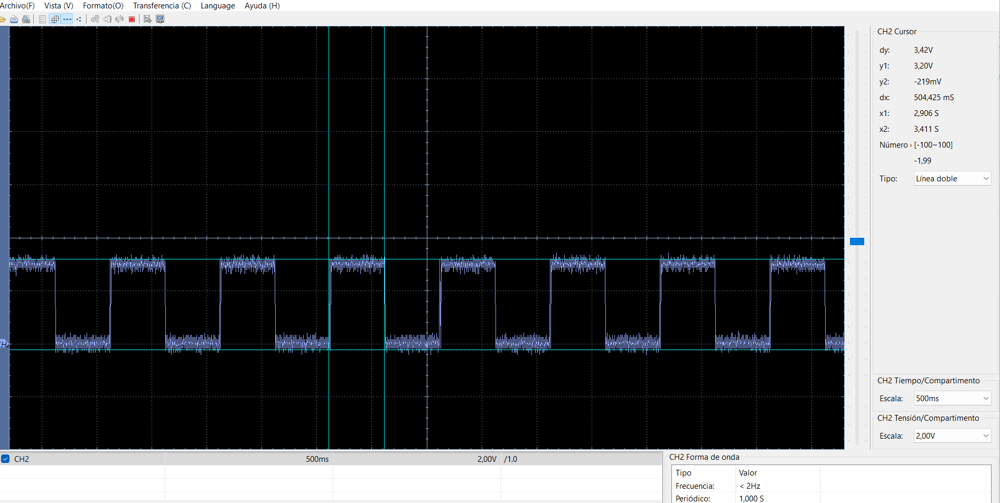

# Timer1 e interrupciones con dsPIC33FJ32MC204

[← Volver al índice de ejemplos](../../README.md)

Este ejemplo genera una base de tiempo periódica con **Timer1**. Una interrupción ocurre aproximadamente cada 100 ms y, después de cinco interrupciones, el firmware invierte RB11. El resultado es un LED con periodo cercano a 1 segundo sin utilizar `__delay_ms()` en el bucle principal.

## Qué demuestra

- Configuración de un timer de 16 bits.
- Selección del reloj interno y prescaler 1:256.
- Cálculo del registro de periodo `PR1`.
- Uso de la interrupción `_T1Interrupt`.
- Manejo de flags, habilitación y prioridad de interrupción.
- Separación entre tareas periódicas y el bucle principal.

## Hardware

- Tarjeta con dsPIC33FJ32MC204 y cristal externo de 8 MHz.
- LED conectado a RB11 mediante una resistencia de 330 Ω a 470 Ω.
- Programador/debugger ICSP.

```text
RB11 ── 330 Ω a 470 Ω ──►| ── GND
```

## Cálculo de Timer1

Con `FCY = 40 MHz` y prescaler 1:256:

```text
Frecuencia del timer = 40 000 000 / 256
                     = 156 250 Hz

Tick del timer       = 6.4 µs
```

El código carga:

```c
PR1 = 15625;
```

El periodo real del timer considera `PR1 + 1` cuentas:

```text
Tinterrupción = (15625 + 1) / 156250
              ≈ 100.006 ms
```

La pequeña diferencia frente a 100 ms es irrelevante para esta demostración visual. Para temporización de precisión puede utilizarse `PR1 = 15624` o compensarse el error según la aplicación.

## Funcionamiento

La ISR incrementa `contador_100ms`. Cada cinco eventos conmuta el LED y reinicia el contador:

```text
Timer1: 100 ms + 100 ms + 100 ms + 100 ms + 100 ms
                                             │
                                             └── conmuta RB11
```

RB11 cambia de estado aproximadamente cada 500 ms. Un ciclo completo encendido–apagado dura cerca de 1 s, equivalente a 1 Hz.

```c
void __attribute__((interrupt, no_auto_psv)) _T1Interrupt(void)
{
    /* contador y conmutación de RB11 */
    _T1IF = 0;
}
```

El flag `_T1IF` debe limpiarse antes de salir de la ISR; de lo contrario, la interrupción volvería a ejecutarse inmediatamente.

## Ventaja frente a un retardo bloqueante

El `while(1)` queda disponible para añadir otras tareas:

```c
while (1) {
    // El LED continúa temporizado por la interrupción.
    // Aquí pueden ejecutarse otras funciones.
}
```

La ISR debe mantenerse corta. Operaciones lentas como dibujar una pantalla, esperar por UART o ejecutar retardos largos deben realizarse fuera de ella.

## Cómo probarlo

1. Crea un proyecto standalone para `dsPIC33FJ32MC204` con XC16.
2. Añade [`src/main.c`](src/main.c).
3. Conecta el LED a RB11.
4. Compila y programa mediante ICSP.
5. Comprueba visualmente el parpadeo a 1 Hz.
6. Opcionalmente, mide RB11 con un osciloscopio o analizador lógico.

## Resultado medido

La captura muestra los cambios de estado separados aproximadamente 500 ms.



## Si no funciona

| Síntoma | Comprobación |
| --- | --- |
| RB11 no cambia | Revisa `_T1IE`, `_T1IF` y que Timer1 esté habilitado con `TON = 1`. |
| El periodo es incorrecto | Verifica `FCY`, el prescaler y `PR1`. |
| El programa queda atrapado en la ISR | Confirma que `_T1IF` se limpia al final de la interrupción. |
| MPLAB no reconoce la ISR | Comprueba el dispositivo seleccionado y la sintaxis compatible con XC16. |

## Archivos

```text
timer1/
├── README.md
├── src/
│   └── main.c
└── docs/
    └── led_tmr.png
```
