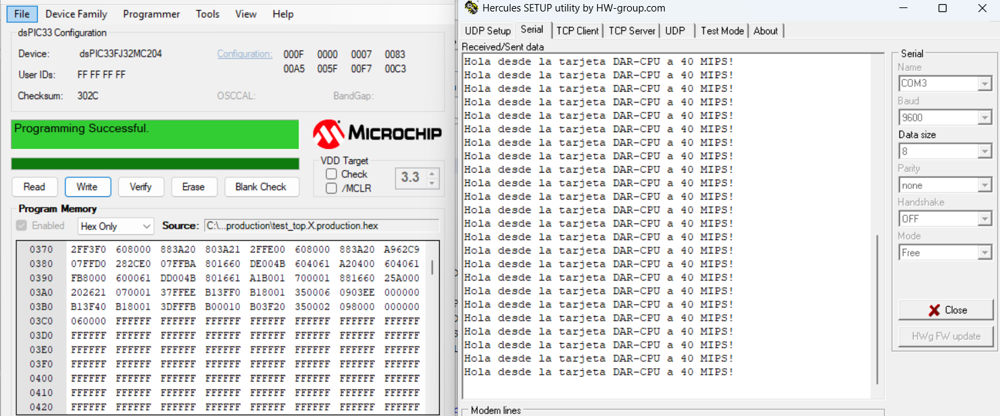

# Comunicación UART con dsPIC33FJ32MC204

[← Volver al índice de ejemplos](../../README.md)

Ejemplo de comunicación serial entre la tarjeta y una PC mediante un adaptador USB–UART. El dsPIC transmite un mensaje cada segundo a **9600 baudios** y conmuta el LED de RB11 como indicador de actividad.

## Qué demuestra

- Uso de UART1 en formato 8N1.
- Asignación de UART1 mediante Peripheral Pin Select (PPS).
- Transmisión de cadenas de texto sin interrupciones.
- Conexión correcta entre dos equipos UART de 3.3 V.
- Cálculo del generador de baudios a partir de `FCY = 40 MHz`.

## Configuración serial

| Parámetro | Valor |
| --- | --- |
| Puerto del dsPIC | UART1 |
| Velocidad | 9600 bit/s |
| Bits de datos | 8 |
| Paridad | Ninguna |
| Bits de parada | 1 |
| Control de flujo | Ninguno |
| TX | RP1 / RB1 |
| RX | RP0 / RB0 |

El firmware utiliza el modo estándar de 16 ciclos por bit:

```text
U1BRG = FCY / (16 × Baud) - 1
      = 40 000 000 / (16 × 9600) - 1
      ≈ 259
```

## Hardware necesario

- Tarjeta con dsPIC33FJ32MC204.
- Adaptador USB–UART con lógica de **3.3 V**.
- Tres cables: TX, RX y GND.
- Terminal serial, por ejemplo PuTTY, Tera Term o el terminal de MPLAB X.

## Conexión al adaptador USB–UART

Las señales TX y RX se conectan cruzadas:

| dsPIC33FJ32MC204 | Adaptador USB–UART |
| --- | --- |
| RB1 / U1TX | RXD |
| RB0 / U1RX | TXD |
| GND | GND |

```text
dsPIC RB1 / U1TX ─────────► RXD del adaptador
dsPIC RB0 / U1RX ◄───────── TXD del adaptador
dsPIC GND        ────────── GND del adaptador
```

> Usa un adaptador **TTL/UART de 3.3 V**. No conectes el dsPIC directamente a un puerto RS-232 real, cuyos niveles positivos y negativos pueden dañar el microcontrolador. No es necesario conectar el pin de alimentación del adaptador si la tarjeta ya está alimentada.

## Funcionamiento del firmware

El bloque PPS asigna las funciones UART a los pines remapeables:

```c
RPINR18bits.U1RXR = 0;  // U1RX <- RP0 / RB0
RPOR0bits.RP1R = 3;     // U1TX -> RP1 / RB1
```

Después, el bucle principal transmite una línea por segundo:

```text
Hola desde la tarjeta DAR-CPU a 40 MIPS!
```

La función `UART_Write_String()` espera espacio en el buffer de transmisión y envía la cadena carácter por carácter. Este ejemplo solo demuestra transmisión; RB0 queda preparado como recepción, pero el firmware no procesa datos entrantes.

## Cómo probarlo

1. Crea un proyecto standalone para `dsPIC33FJ32MC204` con XC16.
2. Añade [`src/main.c`](src/main.c).
3. Conecta TX, RX y GND según la tabla.
4. Programa el dsPIC mediante ICSP.
5. Identifica el puerto COM asignado al adaptador.
6. Abre el terminal a `9600 8N1`, sin control de flujo.
7. Reinicia la tarjeta; debe aparecer una nueva línea aproximadamente cada segundo.

## Resultado de prueba



## Si no aparece texto

| Síntoma | Comprobación |
| --- | --- |
| No llega ningún carácter | Cruza TX/RX y une las tierras. |
| Aparecen símbolos incorrectos | Revisa `9600 8N1` y la configuración del reloj a 40 MIPS. |
| El puerto COM no existe | Verifica el driver y la conexión USB del adaptador. |
| El dsPIC se reinicia o calienta | Desconecta de inmediato y confirma que el adaptador use lógica de 3.3 V. |
| Solo aparece parte del mensaje | Desactiva control de flujo y comprueba la estabilidad de la alimentación. |

## Archivos

```text
prueba-uart/
├── README.md
├── src/
│   └── main.c
└── docs/
    └── uart.png
```
