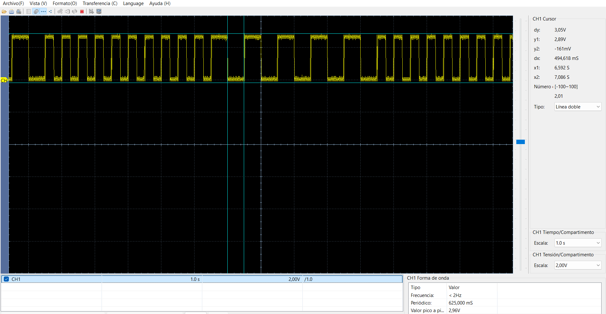
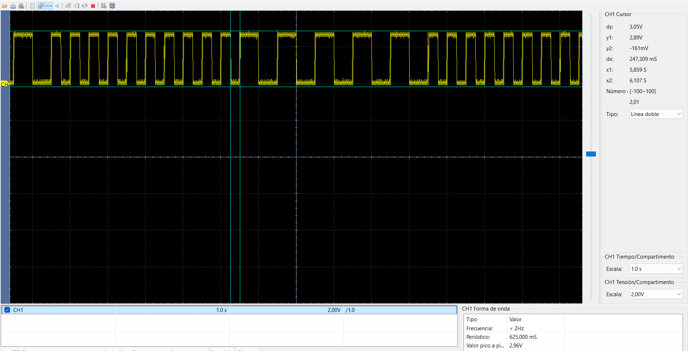

# Led Blink con dsPIC33FJ32MC204

Este repositorio contiene el código de ejemplo y las pruebas de hardware para conmutar un LED utilizando la tarjeta de desarrollo **DAR-CPU**

## Hardware

* **MCU:** dsPIC33FJ32MC204 (40 MIPS)

* **Reloj:** Cristal externo de 8MHz (Modo XT + PLL)

* **Salidas LED:** RB11
  
* **Led:** En serie con una resistencia entre 330 a 470 ohm

## Resultados de Pruebas

### 1. Señal de la conmutación de Led en osciloscopio para 1hz o 500ms

### 2. Señal de la conmutación de Led en osciloscopio para 2hz o 250ms

### 2. Gift del LED

