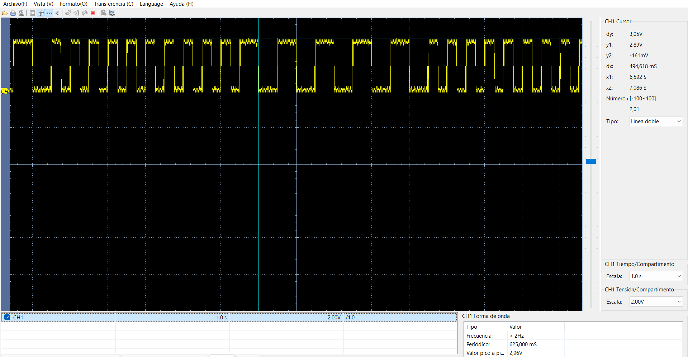
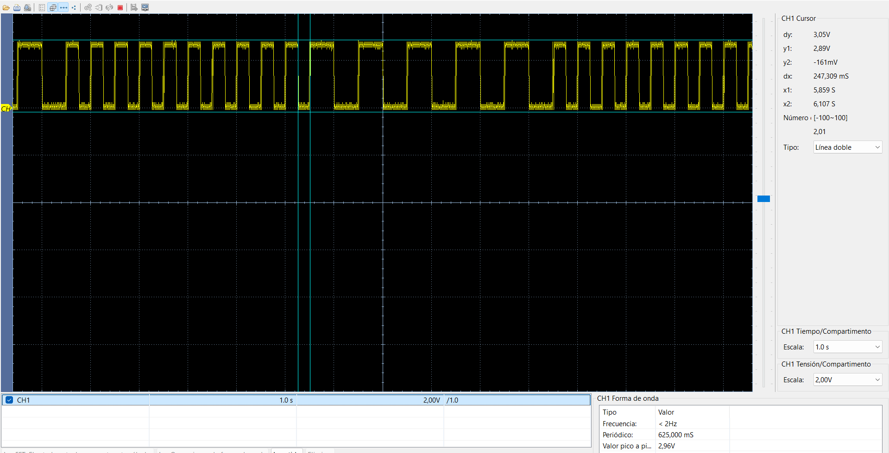

# LED Blink con dsPIC33FJ32MC204

[← Volver al índice de ejemplos](../README.md)

Ejemplo inicial para comprobar que la tarjeta, el reloj, el compilador y el programador ICSP funcionan correctamente. El firmware conmuta un LED conectado a **RB11** y alterna automáticamente entre dos velocidades: 1 Hz y 2 Hz.

Es el punto de partida recomendado antes de conectar pantallas, sensores u otros módulos externos.

## Qué demuestra

- Configuración del dsPIC33FJ32MC204 con cristal externo de 8 MHz y PLL.
- Operación a `FOSC = 80 MHz` y `FCY = 40 MHz` (40 MIPS).
- Configuración de un GPIO como salida digital.
- Conmutación de un pin mediante el registro `LATB`.
- Uso de retardos de `libpic30` con `__delay_ms()`.
- Programación por ICSP usando **PGD1/PGC1**.

## Hardware necesario

- Tarjeta de desarrollo con dsPIC33FJ32MC204.
- Programador/debugger compatible con ICSP.
- LED externo.
- Resistencia de 330 Ω a 470 Ω.
- Fuente y cableado para la tarjeta.

## Conexión

| Elemento | Conexión |
| --- | --- |
| Salida del dsPIC | RB11 |
| Ánodo del LED | RB11 a través de la resistencia |
| Cátodo del LED | GND |

```text
RB11 ── 330 Ω a 470 Ω ──►| ── GND
                          LED
```

> La resistencia limita la corriente del LED y no debe omitirse. Si se utiliza un LED ya integrado en una placa o módulo, comprueba primero que incluya su propia resistencia.

## Funcionamiento del firmware

El programa configura RB11 como salida y ejecuta continuamente dos fases:

| Fase | Tiempo por estado | Cambios de estado | Duración de la fase | Frecuencia visible |
| --- | ---: | ---: | ---: | ---: |
| Lenta | 500 ms | 10 | 5 s | 1 Hz |
| Rápida | 250 ms | 20 | 5 s | 2 Hz |

La instrucción central es:

```c
LATBbits.LATB11 ^= 1;
```

El operador XOR invierte el estado anterior del pin: si estaba en 0 pasa a 1 y viceversa.

Los retardos son bloqueantes; durante cada `__delay_ms()` el procesador no realiza otra tarea. Esto es adecuado para una primera prueba, mientras que el ejemplo [Timer1](../timers/timer1) muestra cómo temporizar mediante interrupciones y mantener libre el bucle principal.

## Cómo probarlo

1. Crea un proyecto standalone en MPLAB X para `dsPIC33FJ32MC204`.
2. Selecciona el compilador XC16.
3. Añade [`src/main.c`](src/main.c) al proyecto.
4. Conecta el LED y su resistencia según el diagrama.
5. Compila y programa mediante ICSP.
6. Comprueba que el LED trabaje 5 segundos a 1 Hz y luego 5 segundos a 2 Hz.

## Resultado medido

### Conmutación a 1 Hz

Cada nivel dura aproximadamente 500 ms, por lo que un ciclo completo dura 1 s.



### Conmutación a 2 Hz

Cada nivel dura aproximadamente 250 ms, por lo que un ciclo completo dura 500 ms.



### Prueba visual


## Si no funciona

| Síntoma | Comprobación |
| --- | --- |
| El LED no enciende | Revisa polaridad, resistencia, conexión a GND y continuidad de RB11. |
| El LED queda siempre encendido | Comprueba que el firmware se programó y que el reloj de 8 MHz está presente. |
| La velocidad es incorrecta | Verifica que `FCY` sea 40 MHz y que el PLL coincida con el cristal de 8 MHz. |
| MPLAB no detecta el MCU | Confirma alimentación, MCLR y las líneas ICSP PGD1/PGC1. |

## Archivos

```text
led-blink/
├── README.md
├── src/
│   └── main.c
└── docs/
    ├── led.gif
    ├── osc_led1.png
    └── osc_led2.png
```
