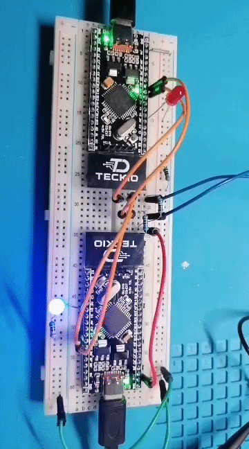

# I²C1 — dsPIC33EP32MC204 ↔ dsPIC33EP32MC204

[← Volver a EP ↔ EP](../README.md)

Prueba de comunicación **I²C1** entre dos dsPIC33EP32MC204, con EP1 como master y EP2 como slave, validada físicamente en hardware.

EP1 escribe `0xA5` en el slave con dirección `0x42`. EP2 valida el byte y conmuta su LED en `RB4`. Después, EP1 realiza una lectura y EP2 responde `0x5A`; si la respuesta es correcta, EP1 enciende su LED durante 100 ms.

## Configuración

| Parámetro | EP1 | EP2 |
| --- | --- | --- |
| Rol | Master | Slave |
| SDA1 | RC4 / pin 37 | RC4 / pin 37 |
| SCL1 | RC5 / pin 38 | RC5 / pin 38 |
| LED de prueba | RB4 / pin 33 | RB4 / pin 33 |
| Dirección slave | — | `0x42` |
| Frecuencia de bus | ~100 kHz | Sigue el reloj del master |
| Pull-up SDA/SCL | 4.7 kΩ a 3.3 V | Compartidas en el bus |

Ambos microcontroladores utilizan cristal externo de **8 MHz**, `FOSC = 80 MHz` y `FCY = 40 MHz`.

## Cableado

```text
EP1 MASTER                              EP2 SLAVE

RC4 / SDA1 / pin 37  ----------------- RC4 / SDA1 / pin 37
RC5 / SCL1 / pin 38  ----------------- RC5 / SCL1 / pin 38
GND                    ---------------- GND

SDA ---------------- 4.7 kΩ ---------------- 3.3 V
SCL ---------------- 4.7 kΩ ---------------- 3.3 V
```

> SDA y SCL son líneas de colector/drenador abierto y necesitan resistencias pull-up. Usa una sola referencia de 3.3 V para los pull-up y comparte GND entre ambas tarjetas.

## Funcionamiento

### Escritura EP1 → EP2

```text
START
  |
0x84      ACK
  |
0xA5      ACK
  |
STOP
```

`0x84` corresponde a `0x42 << 1` con `R/W = 0`.

### Lectura EP2 → EP1

```text
START
  |
0x85      ACK
  |
0x5A      NACK
  |
STOP
```

`0x85` corresponde a `(0x42 << 1) | 1`. EP1 finaliza la lectura de un solo byte enviando NACK antes del STOP.

## Código y firmware

```text
i2c1/
├── README.md
├── ep1/
│   ├── main.c
│   └── dsPIC33EP32MC204-ep1.hex
├── ep2/
│   ├── main.c
│   └── dsPIC33EP32MC204-ep2.hex
└── img/
```

- [`ep1/main.c`](ep1/main.c): master I²C1.
- [`ep2/main.c`](ep2/main.c): slave I²C1 con dirección `0x42`.
- [`ep1/dsPIC33EP32MC204-ep1.hex`](ep1/dsPIC33EP32MC204-ep1.hex): firmware precompilado para EP1.
- [`ep2/dsPIC33EP32MC204-ep2.hex`](ep2/dsPIC33EP32MC204-ep2.hex): firmware precompilado para EP2.

## Verificación con osciloscopio

En la captura:

- CH1 amarillo: `SDA1 = RC4`.
- CH2 azul: `SCL1 = RC5`.
- Escala real utilizada: **20 µs/div**.

<p align="center">
  
</p>

La captura muestra las ráfagas de reloj y las transiciones de SDA correspondientes a dirección, datos y bits de ACK/NACK.

## Prueba visual

El GIF muestra la respuesta de los LEDs durante las operaciones de escritura y lectura:

<p align="center">
  
</p>

## Estado

**Verificado en hardware.**
