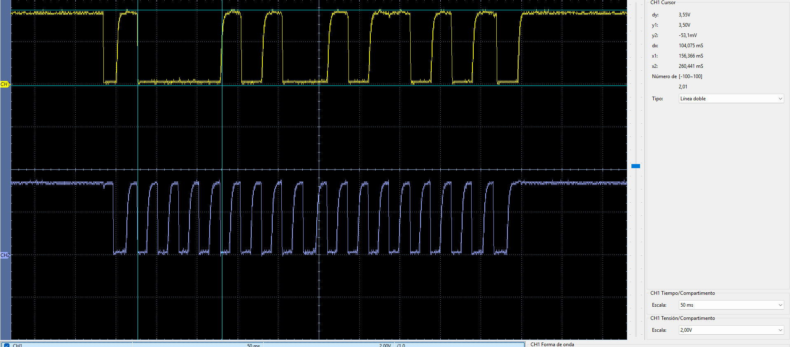

# I²C1 — dsPIC33EP32MC204 ↔ dsPIC33EP32MC204

Prueba I²C1 entre dos dsPIC33EP32MC204, con EP1 como master y EP2 como slave, validada en hardware.

## Configuración

| Parámetro | EP1 | EP2 |
| --- | --- | --- |
| Rol | Master | Slave |
| SDA1 | RC4 / pin 37 | RC4 / pin 37 |
| SCL1 | RC5 / pin 38 | RC5 / pin 38 |
| LED | RB4 | RB4 |
| Dirección slave | — | `0x42` |
| Frecuencia | ~100 kHz | Sigue el reloj del master |

## Cableado

```text
EP1 MASTER                       EP2 SLAVE

RC4 / SDA1  ------------------- RC4 / SDA1
RC5 / SCL1  ------------------- RC5 / SCL1
GND         ------------------- GND
```

SDA y SCL requieren resistencias pull-up externas. En la prueba se usaron **4.7 kΩ a 3.3 V** en ambas líneas.

## Funcionamiento

EP1 escribe `0xA5` en el slave `0x42`. EP2 valida el dato y conmuta su LED. A continuación EP1 realiza una lectura y EP2 responde `0x5A`. Si EP1 recibe el byte esperado, enciende su LED durante 100 ms.

### Escritura EP1 → EP2

```text
START
  |
0x84      ACK
  |
0xA5      ACK
  |
STOP
```

`0x84` corresponde a `0x42 << 1` con `R/W = 0`.

### Lectura EP2 → EP1

```text
START
  |
0x85      ACK
  |
0x5A      NACK
  |
STOP
```

`0x85` corresponde a la misma dirección con `R/W = 1`.

## Código y firmware

- [`ep1/main.c`](ep1/main.c): master I²C1.
- [`ep2/main.c`](ep2/main.c): slave I²C1 con dirección `0x42`.
- [`ep1/dsPIC33EP32MC204-ep1.hex`](ep1/dsPIC33EP32MC204-ep1.hex)
- [`ep2/dsPIC33EP32MC204-ep2.hex`](ep2/dsPIC33EP32MC204-ep2.hex)

## Verificación con osciloscopio

En la captura:

- CH1 amarillo: `SDA1 = RC4`.
- CH2 azul: `SCL1 = RC5`.
- Escala real utilizada: **20 µs/div**.

<p align="center">
  
</p>

Se observan las ráfagas de reloj y los cambios de SDA asociados a la dirección, datos y ACK/NACK.

## Prueba visual

[Ver prueba I²C1 EP ↔ EP](img/i2c1-ep-to-ep-led-test.mp4)

## Estado

**Verificado en hardware.**
