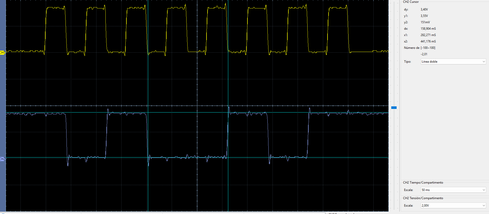
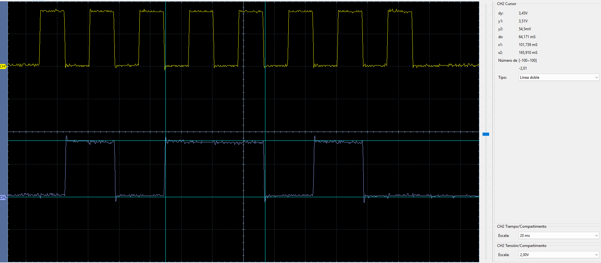
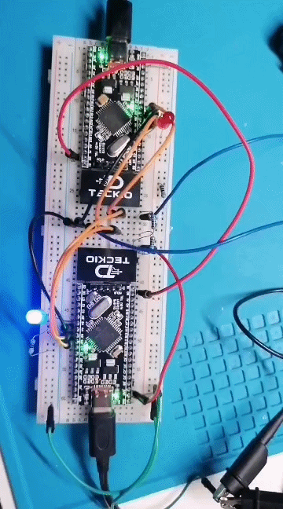

# SPI1 — dsPIC33EP32MC204 ↔ dsPIC33EP32MC204

[← Volver a EP ↔ EP](../README.md)

Prueba de comunicación **SPI1 full-duplex** entre dos dsPIC33EP32MC204, con EP1 como master y EP2 como slave, validada físicamente en hardware.

EP1 transmite `0xA5` por MOSI mientras EP2 transmite simultáneamente `0x5A` por MISO. EP2 conmuta su LED al recibir `0xA5`; EP1 enciende su LED durante 100 ms cuando recibe correctamente `0x5A`.

## Configuración

| Parámetro | EP1 | EP2 |
| --- | --- | --- |
| Rol | Master | Slave |
| SCK1 | RC3 / pin 36 | RC3 / pin 36 |
| SDO1 | RA4 / pin 34 | RA4 / pin 34 |
| SDI1 | RA9 / pin 35 | RA9 / pin 35 |
| SS / CS | RB0 / pin 21 | RB0 / pin 21 |
| LED de prueba | RB4 / pin 33 | RB4 / pin 33 |
| Frecuencia SCK | 625 kHz | Sigue SCK1 |
| Formato | 8 bits | 8 bits |
| CKP | 0 | 0 |
| CKE | 1 | 1 |

Ambos microcontroladores utilizan cristal externo de **8 MHz**, `FOSC = 80 MHz` y `FCY = 40 MHz`. En el master se usan `PPRE = 16:1` y `SPRE = 4:1`, obteniendo:

```text
40 MHz / 16 / 4 = 625 kHz
TCLK = 1 / 625 kHz = 1.6 µs
```

## Cableado

```text
EP1 MASTER                              EP2 SLAVE

RC3 / SCK1 / pin 36  ----------------> RC3 / SCK1 / pin 36
RA4 / SDO1 / pin 34  ----------------> RA9 / SDI1 / pin 35   MOSI
RA9 / SDI1 / pin 35  <---------------- RA4 / SDO1 / pin 34   MISO
RB0 / CS / pin 21     ----------------> RB0 / SS1 / pin 21
GND                    ---------------- GND
```

> SDO debe conectarse al SDI del otro dispositivo. Ambas tarjetas deben compartir GND.

## Funcionamiento

SPI1 intercambia los dos bytes durante los mismos ocho pulsos de reloj:

```text
                    8 clocks @ 625 kHz
              ┌───────────────────────┐
EP1 MOSI  --->│ 1 0 1 0 0 1 0 1      │---> EP2
              │       0xA5            │
              │                       │
EP1 MISO  <---│ 0 1 0 1 1 0 1 0      │<--- EP2
              │       0x5A            │
              └───────────────────────┘
```

Esto permite comprobar directamente el comportamiento full-duplex del periférico SPI.

## Código y firmware

```text
spi1/
├── README.md
├── ep1/
│   ├── main.c
│   └── dsPIC33EP32MC204-ep1.hex
├── ep2/
│   ├── main.c
│   └── dsPIC33EP32MC204-ep2.hex
└── img/
```

- [`ep1/main.c`](ep1/main.c): master SPI1.
- [`ep2/main.c`](ep2/main.c): slave SPI1.
- [`ep1/dsPIC33EP32MC204-ep1.hex`](ep1/dsPIC33EP32MC204-ep1.hex): firmware precompilado para EP1.
- [`ep2/dsPIC33EP32MC204-ep2.hex`](ep2/dsPIC33EP32MC204-ep2.hex): firmware precompilado para EP2.

## Verificación con osciloscopio

### SCK1 + MOSI

- CH1 amarillo: `SCK1 = RC3`.
- CH2 azul: `MOSI = RA4` de EP1.
- Escala real: **1 µs/div**.

<p align="center">
  
</p>

La señal MOSI corresponde a:

```text
D7 D6 D5 D4 D3 D2 D1 D0
 1  0  1  0  0  1  0  1

0xA5
```

### SCK1 + MISO

- CH1 amarillo: `SCK1 = RC3`.
- CH2 azul: `MISO = RA9` de EP1.
- Escala real: **1 µs/div**.

<p align="center">
  
</p>

La señal MISO corresponde a:

```text
D7 D6 D5 D4 D3 D2 D1 D0
 0  1  0  1  1  0  1  0

0x5A
```

El período observado es consistente con los **1.6 µs** esperados para 625 kHz.

## Prueba visual

El GIF muestra la respuesta de los LEDs durante los intercambios SPI1:

<p align="center">
  
</p>

## Estado

**Verificado en hardware.**
