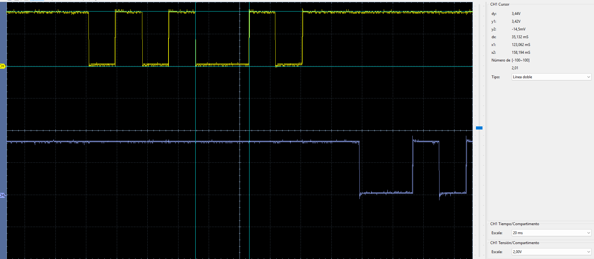
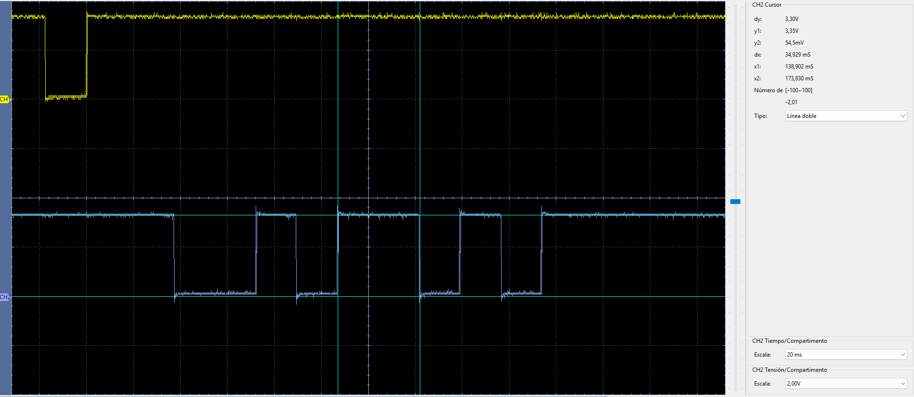
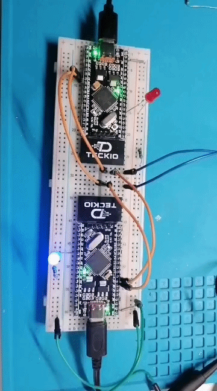

# UART1 — dsPIC33EP32MC204 ↔ dsPIC33EP32MC204

[← Volver a EP ↔ EP](../README.md)

Prueba de comunicación **UART1 bidireccional** entre dos dsPIC33EP32MC204, validada físicamente en hardware.

EP1 inicia el intercambio enviando `0xA5`. EP2 comprueba el byte, conmuta su LED en `RB4` y responde `0x5A`. Cuando EP1 recibe la respuesta correcta, enciende su LED durante 100 ms.

## Configuración

| Parámetro | EP1 | EP2 |
| --- | --- | --- |
| Rol | Iniciador | Respuesta |
| U1TX | RC8 / RP56 / pin 4 | RC8 / RP56 / pin 4 |
| U1RX | RC9 / RP57 / pin 5 | RC9 / RP57 / pin 5 |
| LED de prueba | RB4 / pin 33 | RB4 / pin 33 |
| Baudrate configurado | 115200 | 115200 |
| Baudrate real aprox. | 114943 | 114943 |
| Formato | 8N1 | 8N1 |

Ambos microcontroladores utilizan cristal externo de **8 MHz**, `FOSC = 80 MHz` y `FCY = 40 MHz`. UART1 se configura con `BRGH = 1` y `U1BRG = 86`.

## Cableado

```text
EP1                                      EP2

RC8 / RP56 / U1TX / pin 4  -----------> RC9 / RP57 / U1RX / pin 5
RC9 / RP57 / U1RX / pin 5  <----------- RC8 / RP56 / U1TX / pin 4
GND                          ----------- GND
```

> Las señales TX y RX deben cruzarse. Ambas tarjetas deben compartir GND.

## Funcionamiento

```text
EP1                                   EP2
 |                                     |
 |-------------- 0xA5 --------------->|
 |                                     |  RB4 ^= 1
 |<------------- 0x5A ----------------|
 |  RB4 = ON durante 100 ms             |
```

La prueba se repite periódicamente para que el intercambio pueda observarse tanto en los LEDs como en el osciloscopio.

## Código y firmware

```text
uart1/
├── README.md
├── ep1/
│   ├── main.c
│   └── dsPIC33EP32MC204-ep1.hex
├── ep2/
│   ├── main.c
│   └── dsPIC33EP32MC204-ep2.hex
└── img/
```

- [`ep1/main.c`](ep1/main.c): iniciador de la comunicación.
- [`ep2/main.c`](ep2/main.c): recibe `0xA5` y responde `0x5A`.
- [`ep1/dsPIC33EP32MC204-ep1.hex`](ep1/dsPIC33EP32MC204-ep1.hex): firmware precompilado para EP1.
- [`ep2/dsPIC33EP32MC204-ep2.hex`](ep2/dsPIC33EP32MC204-ep2.hex): firmware precompilado para EP2.

## Verificación con osciloscopio

Las capturas se realizaron con una escala real de **10 µs/div**.

### EP1 TX — `0xA5`

- CH1 amarillo: `RC8 / U1TX` de EP1.
- UART idle: HIGH.
- Start bit: LOW.
- 8 bits de datos, LSB primero.
- 1 stop bit: HIGH.

<p align="center">
  
</p>

`0xA5 = 1010 0101`, transmitido LSB primero:

```text
START D0 D1 D2 D3 D4 D5 D6 D7 STOP
  0    1  0  1  0  0  1  0  1   1
```

Con un baudrate real aproximado de 114943 baud:

```text
Tbit ≈ 8.70 µs
Trama 8N1 ≈ 87 µs
```

### EP1 RX — `0x5A`

- CH2 azul: `RC9 / U1RX` de EP1.
- La señal proviene del U1TX de EP2.

<p align="center">
  
</p>

`0x5A = 0101 1010`, también transmitido LSB primero:

```text
START D0 D1 D2 D3 D4 D5 D6 D7 STOP
  0    0  1  0  1  1  0  1  0   1
```

## Prueba visual

El GIF muestra la respuesta de los LEDs durante el intercambio UART1:

<p align="center">
  
</p>

## Estado

**Verificado en hardware.**
