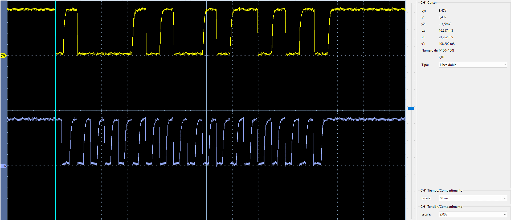
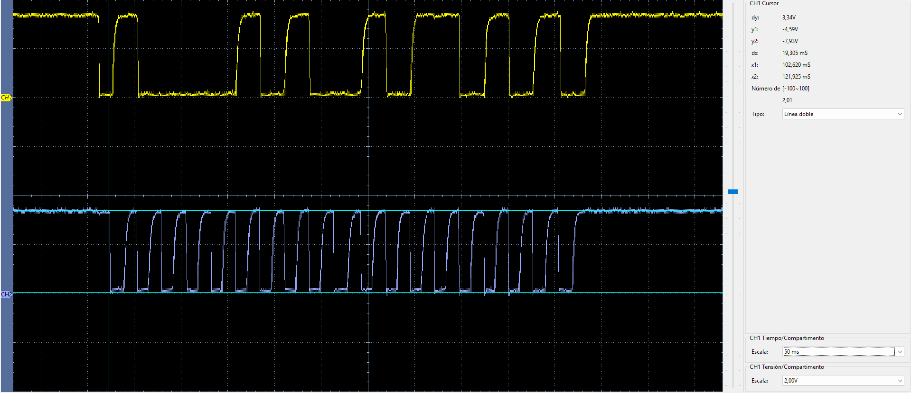
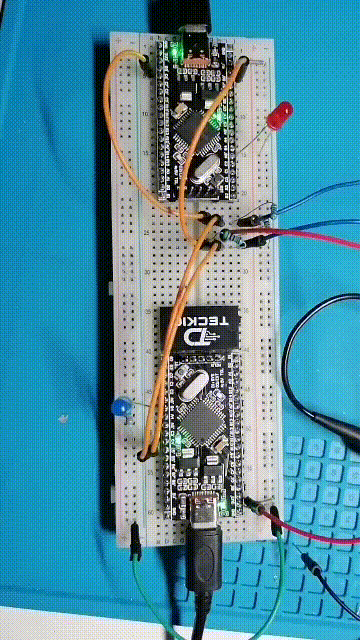

# I²C — dsPIC33FJ32MC204 ↔ dsPIC33EP32MC204

Prueba I²C entre un dsPIC33FJ32MC204 como master y un dsPIC33EP32MC204 como slave, verificada físicamente.

## Configuración

| Parámetro | FJ | EP |
| --- | --- | --- |
| Rol | Master | Slave |
| SDA | RB9 / pin 1 | RC4 / pin 37 |
| SCL | RB8 / pin 44 | RC5 / pin 38 |
| LED | RB4 / pin 33 | RB4 / pin 33 |
| Dirección slave | — | `0x42` |
| Frecuencia | ~100 kHz | Sigue el reloj del master |

## Conexiones

```text
dsPIC33FJ32MC204                  dsPIC33EP32MC204

RB9 / SDA1  -------------------- RC4 / SDA1
RB8 / SCL1  -------------------- RC5 / SCL1
GND         -------------------- GND
```

I²C utiliza salidas open-drain, por lo que SDA y SCL requieren pull-ups externos:

```text
                 3.3 V
                   |
                 4.7 kΩ
                   |
SDA ---------------+---------------- SDA

                 3.3 V
                   |
                 4.7 kΩ
                   |
SCL ---------------+---------------- SCL
```

## Funcionamiento

La prueba se divide en dos transacciones.

### 1. Escritura FJ → EP

```text
START
  |
0x84      ACK
  |
0xA5      ACK
  |
STOP
```

`0x84` corresponde a la dirección de 7 bits `0x42` desplazada una posición con `R/W = 0`.

Cuando el EP recibe `0xA5`, conmuta su LED.

### 2. Lectura EP → FJ

```text
START
  |
0x85      ACK
  |
0x5A      NACK
  |
STOP
```

`0x85` corresponde a `0x42` con `R/W = 1`. El FJ lee un único byte y finaliza con NACK. Si recibe exactamente `0x5A`, genera un pulso de 100 ms en su LED.

## Código

- [`fj/main.c`](fj/main.c): master I²C.
- [`ep/main.c`](ep/main.c): slave con dirección `0x42`.
- [`fj/dsPIC33FJ32MC204.hex`](fj/dsPIC33FJ32MC204.hex): firmware FJ verificado.
- [`ep/dsPIC33EP32MC204.hex`](ep/dsPIC33EP32MC204.hex): firmware EP verificado.

## Verificación con osciloscopio

En las capturas:

- CH1 amarillo: SDA, medido en RB9 del FJ.
- CH2 azul: SCL, medido en RB8 del FJ.

### Transacción de escritura

<p align="center">
  
</p>

### Transacción de lectura

<p align="center">
  
</p>

## Prueba visual

<p align="center">
  
</p>

## Resultado

**Verificado en hardware.** Se comprobó direccionamiento, ACK, escritura desde el master, lectura desde el slave y respuesta visual en ambas tarjetas.
