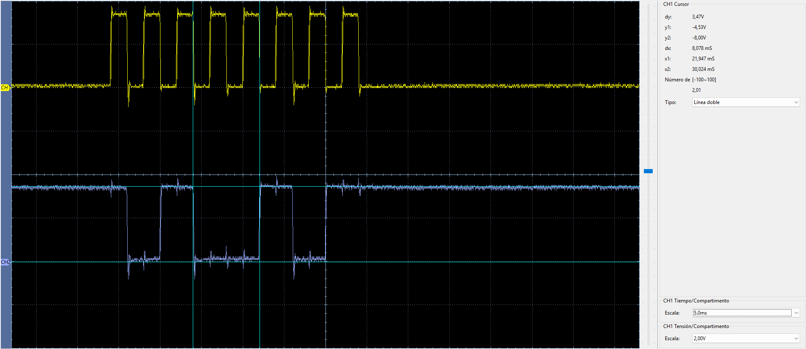
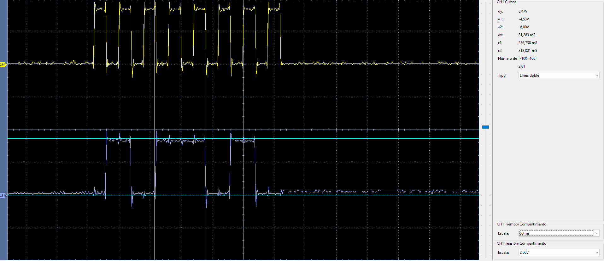
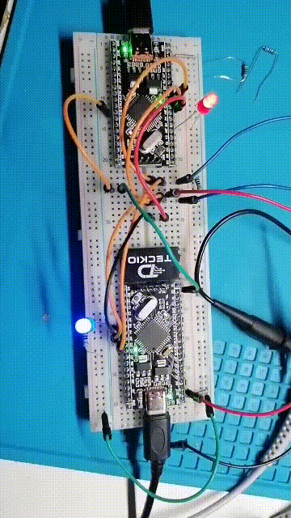

# SPI — dsPIC33FJ32MC204 ↔ dsPIC33EP32MC204

Prueba SPI full-duplex entre un dsPIC33FJ32MC204 como master y un dsPIC33EP32MC204 como slave, verificada físicamente.

## Configuración

| Señal | FJ master | EP slave |
| --- | --- | --- |
| SCK | RC5 / RP21 / pin 38 | RC3 / pin 36 |
| MOSI | RC4 / RP20 / pin 37 | RA9 / pin 35 |
| MISO | RC3 / RP19 / pin 36 | RA4 / pin 34 |
| CS / SS | RB13 / pin 11 | RB0 / pin 21 |
| LED | RB4 / pin 33 | RB4 / pin 33 |

Parámetros de la prueba:

- 8 bits.
- `CKP = 0`.
- `CKE = 1`.
- `FCY = 40 MHz`.
- Primary prescaler: 16:1.
- Secondary prescaler: 4:1.
- SCK medido: **625 kHz**.
- Periodo medido: **1.600 µs**.

## Conexiones

```text
dsPIC33FJ32MC204                    dsPIC33EP32MC204
MASTER                              SLAVE

RC5 / RP21 / SCK   --------------> RC3 / SCK1
RC4 / RP20 / SDO   --------------> RA9 / SDI1      MOSI
RC3 / RP19 / SDI   <-------------- RA4 / SDO1      MISO
RB13 / CS          --------------> RB0 / SS1
GND                --------------- GND
```

## Funcionamiento

SPI es full-duplex: los dos bytes se desplazan durante los mismos ocho pulsos de SCK.

```text
FJ -> EP por MOSI: 0xA5
EP -> FJ por MISO: 0x5A
```

SPI transmite en esta configuración el bit más significativo primero:

```text
0xA5 = 1010 0101
D7 D6 D5 D4 D3 D2 D1 D0
 1  0  1  0  0  1  0  1

0x5A = 0101 1010
D7 D6 D5 D4 D3 D2 D1 D0
 0  1  0  1  1  0  1  0
```

El EP mantiene `0x5A` precargado en `SPI1BUF`. Cuando el FJ selecciona al slave y envía `0xA5`, el EP recibe ese byte mientras el FJ recibe simultáneamente `0x5A`.

## Código

- [`fj/main.c`](fj/main.c): SPI1 master.
- [`ep/main.c`](ep/main.c): SPI1 slave.
- [`fj/dsPIC33FJ32MC204.hex`](fj/dsPIC33FJ32MC204.hex): firmware FJ verificado.
- [`ep/dsPIC33EP32MC204.hex`](ep/dsPIC33EP32MC204.hex): firmware EP verificado.

## Verificación con osciloscopio

### SCK + MOSI

CH1 amarillo corresponde a SCK y CH2 azul a MOSI. La captura muestra los ocho pulsos de reloj y el patrón `0xA5`.

<p align="center">
  
</p>

### SCK + MISO

CH1 amarillo corresponde a SCK y CH2 azul a MISO. La señal de retorno corresponde a `0x5A`.

<p align="center">
  
</p>

## Prueba visual

<p align="center">
  
</p>

## Resultado

**Verificado en hardware.** Se comprobó comunicación SPI full-duplex, ocho clocks por transferencia, SCK de 625 kHz y recepción correcta de `0xA5` / `0x5A` en ambas tarjetas.
