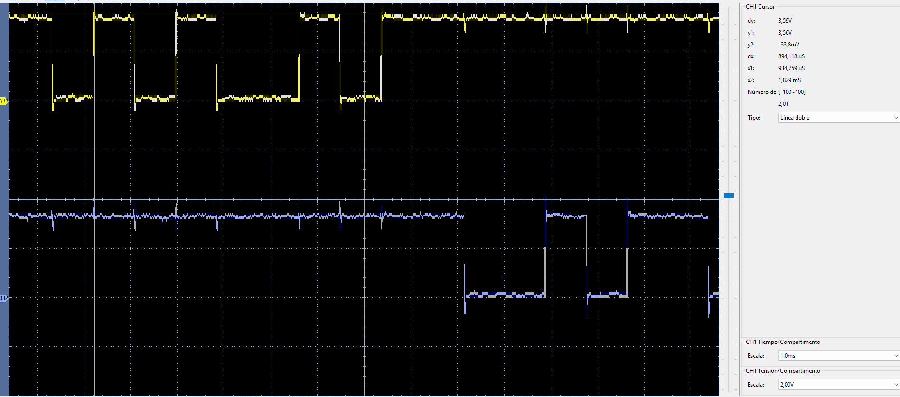
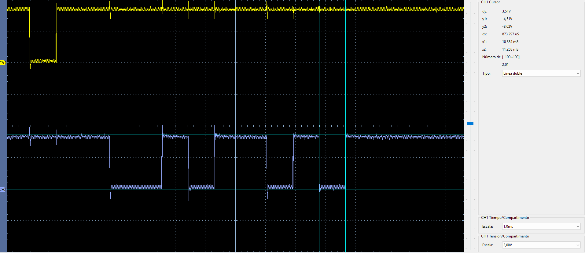
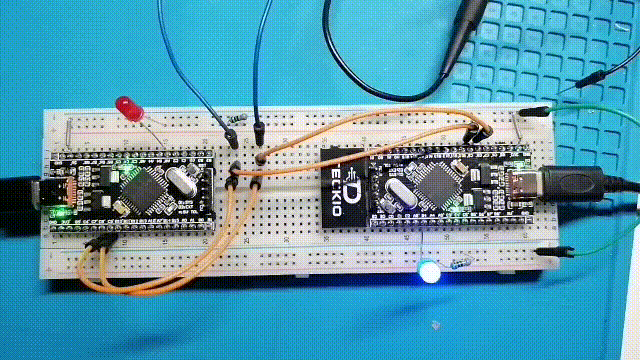

# UART — dsPIC33FJ32MC204 ↔ dsPIC33EP32MC204

Prueba de comunicación UART bidireccional entre ambas familias dsPIC33, verificada físicamente en la tarjeta TECKIO dsPIC33 V1I2.

## Configuración

| Parámetro | FJ | EP |
| --- | --- | --- |
| UART | UART1 | UART1 |
| TX | RC8 / RP24 / pin 4 | RC8 / RP56 / pin 4 |
| RX | RC9 / RP25 / pin 5 | RC9 / RP57 / pin 5 |
| LED | RB4 / pin 33 | RB4 / pin 33 |
| FCY | 40 MHz | 40 MHz |
| Formato | 115200 baud, 8N1 | 115200 baud, 8N1 |

## Conexiones

```text
dsPIC33FJ32MC204                  dsPIC33EP32MC204

RC8 / U1TX  -------------------> RC9 / U1RX
RC9 / U1RX  <------------------- RC8 / U1TX
GND          ------------------- GND
```

Las líneas TX y RX deben conectarse cruzadas.

## Funcionamiento

1. El FJ envía `0xA5`.
2. El EP recibe el byte, conmuta su LED y responde `0x5A`.
3. El FJ comprueba que recibió exactamente `0x5A` y genera un pulso de 100 ms en su LED.

UART transmite primero el bit menos significativo:

```text
FJ -> EP
0xA5 = 1010 0101
LSB first: 1 0 1 0 0 1 0 1

EP -> FJ
0x5A = 0101 1010
LSB first: 0 1 0 1 1 0 1 0
```

Con UART 8N1 cada trama ocupa 10 bits: START + 8 DATA + STOP. A ~115200 baud un bit dura aproximadamente 8.7 µs y una trama completa cerca de 87 µs.

## Código

- [`fj/main.c`](fj/main.c): iniciador de la prueba.
- [`ep/main.c`](ep/main.c): receptor y respuesta.
- [`fj/dsPIC33FJ32MC204.hex`](fj/dsPIC33FJ32MC204.hex): firmware FJ verificado.
- [`ep/dsPIC33EP32MC204.hex`](ep/dsPIC33EP32MC204.hex): firmware EP verificado.

## Verificación con osciloscopio

### FJ TX → EP RX

<p align="center">
  
</p>

### EP TX → FJ RX

<p align="center">
  
</p>

## Prueba visual

El GIF muestra los LEDs de ambas tarjetas respondiendo al intercambio `0xA5` / `0x5A`.

<p align="center">
  
</p>

## Resultado

**Verificado en hardware.** Se confirmó transmisión y recepción en ambos sentidos, PPS correcto y recepción exacta de los bytes de prueba.
