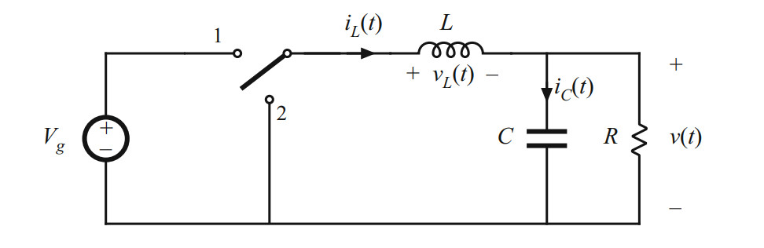

## Convertidores Buck

El convertidor buck es un sistema reductor de tensión basado en conmutación de alta frecuencia. Su operación se fundamenta en el almacenamiento y transferencia de energía en un inductor, regulando la tensión de salida mediante el ciclo de trabajo (duty cycle) del interruptor.

