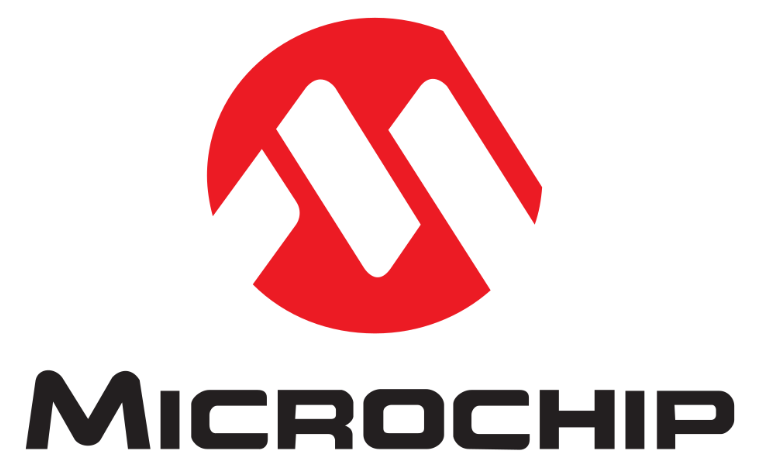
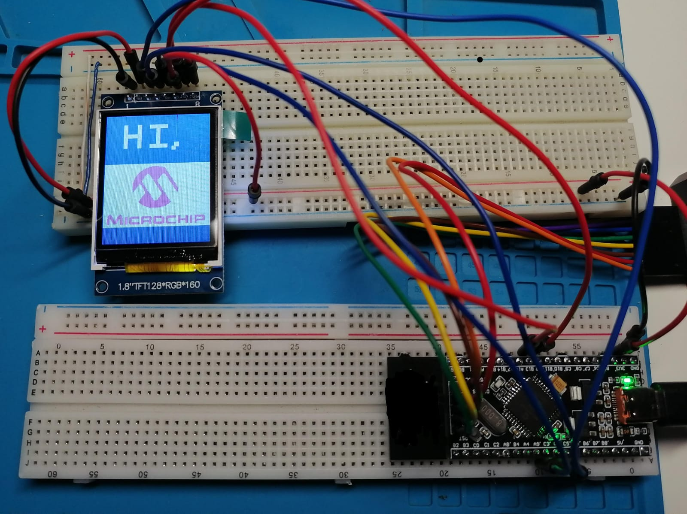

# TFT ST7735 — Mostrar imágenes y logos con dsPIC33FJ32MC204

Ejemplo para mostrar **imágenes y logos personalizados** en una pantalla TFT de **1.8" 128x160** con controlador **ST7735/ST7735S**, utilizando un **dsPIC33FJ32MC204** y SPI1.

El proyecto incluye un conversor gráfico en Python que permite tomar una imagen PNG, JPG, BMP, GIF o WEBP y generar directamente el archivo `microchip.h` utilizado por el firmware.

La imagen se reduce a una paleta adaptativa de **4 colores**, se convierte a **RGB565** y se almacena con **2 bits por píxel**, permitiendo conservar los gráficos en Flash/PSV sin ocupar la limitada RAM del dsPIC.

---

## Resultado de la prueba

### Imagen original

<p align="center">
  
</p>

### Resultado en la TFT ST7735

<p align="center">
  
</p>

La imagen de demostración es un logo de Microchip, pero el conversor puede utilizarse con **cualquier imagen compatible**. El nombre interno `microchip` se mantiene fijo en esta versión para poder reemplazar la imagen sin modificar `main.c`.

---

## Hardware utilizado

- **MCU:** dsPIC33FJ32MC204
- **Pantalla:** TFT 1.8" 128x160
- **Controlador:** ST7735 / ST7735S
- **Interfaz:** SPI1
- **Cristal externo:** 8 MHz
- **FOSC:** 80 MHz
- **FCY:** 40 MHz
- **SPI:** 10 MHz
- **Compilador:** XC16
- **IDE:** MPLAB X IDE

---

## Conexiones

| TFT | Señal | dsPIC33FJ32MC204 | Pin físico | Función |
| --- | --- | --- | ---: | --- |
| 1 | GND | GND | — | Tierra |
| 2 | VCC | 3.3 V | — | Alimentación |
| 3 | SCL | RC5 / RP21 | 38 | SCK1 |
| 4 | SDA | RC4 / RP20 | 37 | SDO1 / MOSI |
| 5 | RES | RC3 / RP19 | 36 | Reset TFT |
| 6 | DC | RB12 / RP12 | 10 | Data / Command |
| 7 | CS | RB13 / RP13 | 11 | Chip Select |
| 8 | BL | 3.3 V | — | Backlight |

> En esta prueba el pin **BL** se conecta directamente a 3.3 V.

SPI1 se configura mediante **Peripheral Pin Select (PPS)**:

```c
RPOR10bits.RP20R = 7U;  // SDO1 -> RP20 / RC4
RPOR10bits.RP21R = 8U;  // SCK1 -> RP21 / RC5
```

---

## Estructura del ejemplo

```text
mostrar-logo/
├── README.md
├── config_bits.c
├── main.c
├── st7735.c
├── st7735.h
├── microchip.h
├── dspic_image_converter.py
├── generar_logo.bat
├── requirements.txt
└── images/
    ├── logo_original.png
    └── prueba_tft.jpeg
```

### Archivos principales

| Archivo | Descripción |
| --- | --- |
| `main.c` | Inicializa el dsPIC, la TFT y dibuja la imagen generada. |
| `config_bits.c` | Configuration Bits para cristal de 8 MHz, PLL y programación por PGD1/PGC1. |
| `st7735.c` | Driver SPI y funciones de inicialización/dibujo del ST7735. |
| `st7735.h` | Definiciones, colores y API del driver. |
| `microchip.h` | Imagen convertida a 2 bpp y su paleta RGB565. |
| `dspic_image_converter.py` | Conversor gráfico de imágenes para generar `microchip.h`. |
| `generar_logo.bat` | Ejecuta el conversor en Windows. |
| `requirements.txt` | Dependencia Python utilizada por el conversor. |

---

## Conversor de imágenes

`dspic_image_converter.py` proporciona una interfaz gráfica basada en **Tkinter + Pillow**.

Permite:

- Abrir PNG, JPG/JPEG, BMP, GIF y WEBP.
- Mantener o modificar la proporción de la imagen.
- Ajustar el tamaño máximo.
- Activar o desactivar dithering.
- Elegir el color de fondo para transparencias.
- Visualizar una vista previa de la imagen convertida.
- Cuantizar automáticamente la imagen a 4 colores.
- Convertir la paleta a RGB565.
- Empaquetar 4 píxeles por byte usando 2 bits/píxel.
- Copiar el header C al portapapeles.
- Guardar directamente `microchip.h`.
- Copiar la llamada de ejemplo para `main.c`.

### Área disponible en este ejemplo

La TFT completa es de **128x160 píxeles**, pero este ejemplo reserva la parte superior para el texto `HI,` y coloca el logo desde `Y = 62`.

Por eso el conversor utiliza actualmente un área máxima de:

```text
128 x 98 px
```

El tamaño puede reducirse manteniendo la proporción de la imagen.

---

## Instalar el conversor

Se requiere Python 3.

Desde esta carpeta instala Pillow con:

```bash
python -m pip install -r requirements.txt
```

El archivo `requirements.txt` contiene:

```text
Pillow>=10.0
```

En Windows, Tkinter normalmente está incluido con la instalación estándar de Python.

---

## Ejecutar el conversor

### Opción 1 — Windows

Haz doble clic en:

```text
generar_logo.bat
```

El `.bat` ejecuta:

```bat
py dspic_image_converter.py
```

### Opción 2 — Terminal

```bash
python dspic_image_converter.py
```

---

## Generar un logo nuevo

1. Ejecuta `generar_logo.bat` o `dspic_image_converter.py`.
2. Pulsa **Seleccionar…** y abre la imagen deseada.
3. Ajusta ancho, alto, proporción, dithering y fondo si es necesario.
4. Revisa la vista previa y la paleta generada.
5. Pulsa **Guardar como microchip.h…**.
6. Reemplaza el `microchip.h` existente en el proyecto.
7. Compila nuevamente el firmware en MPLAB X.
8. Programa el dsPIC.

No es necesario modificar `main.c` mientras se conserve el header generado con los identificadores:

```c
MICROCHIP_WIDTH
MICROCHIP_HEIGHT
microchip_2bpp
microchip_palette_rgb565
```

---

## Formato generado

El conversor crea un header con una estructura similar a:

```c
#define MICROCHIP_WIDTH   ...
#define MICROCHIP_HEIGHT  ...
#define MICROCHIP_BYTES   ...

static const uint16_t microchip_palette_rgb565[4]
    __attribute__((space(auto_psv))) =
{
    ...
};

static const uint8_t microchip_2bpp[MICROCHIP_BYTES]
    __attribute__((space(auto_psv))) =
{
    ...
};
```

Los datos se guardan en **Flash/PSV** mediante `space(auto_psv)`.

Cada byte almacena cuatro píxeles:

```text
Pixel 0 -> bits 7:6
Pixel 1 -> bits 5:4
Pixel 2 -> bits 3:2
Pixel 3 -> bits 1:0
```

Cada valor de 2 bits selecciona uno de los cuatro colores de la paleta RGB565.

---

## Dibujar la imagen desde el dsPIC

El driver incluye la función genérica:

```c
void st7735_draw_image_2bpp(
    uint16_t x,
    uint16_t y,
    uint16_t width,
    uint16_t height,
    const uint8_t *data,
    const uint16_t *palette
);
```

El ejemplo centra automáticamente la imagen en el eje X:

```c
logo_x =
    (uint16_t)((ST7735_WIDTH - MICROCHIP_WIDTH) / 2U);

st7735_draw_image_2bpp(
    logo_x,
    62U,
    MICROCHIP_WIDTH,
    MICROCHIP_HEIGHT,
    microchip_2bpp,
    microchip_palette_rgb565
);
```

Por ejemplo:

```text
Imagen 128 px -> X = 0
Imagen 120 px -> X = 4
Imagen 100 px -> X = 14
```

---

## Uso de memoria

Guardar una imagen completa de 128x160 directamente en RGB565 requeriría:

```text
128 x 160 x 2 = 40960 bytes
```

Con el formato de **2 bits/píxel**:

```text
128 x 160 / 4 = 5120 bytes
```

más únicamente **8 bytes de paleta**.

En el área máxima utilizada por este ejemplo, 128x98:

```text
128 x 98 / 4 = 3136 bytes
```

más 8 bytes de paleta.

Esto es especialmente útil en el dsPIC33FJ32MC204 porque los gráficos permanecen en Flash/PSV y no necesitan copiarse completos a RAM.

---

## Notas sobre variantes ST7735

El driver está configurado actualmente con:

```c
#define ST7735_XSTART        0U
#define ST7735_YSTART        0U
#define ST7735_MADCTL_VALUE  0xC0U
```

Algunos módulos ST7735 pueden necesitar pequeños offsets de X/Y. Si la imagen aparece desplazada unos píxeles, ajusta `ST7735_XSTART` y `ST7735_YSTART` en `st7735.c`.

El valor `0xC0` utiliza el orden de color que funcionó con el panel probado. Algunas variantes pueden requerir `0xC8` para utilizar BGR.

---

## Cómo probar

1. Realiza las conexiones indicadas en la tabla.
2. Alimenta la TFT a **3.3 V**.
3. Añade al proyecto MPLAB X:
   - `main.c`
   - `config_bits.c`
   - `st7735.c`
   - `st7735.h`
   - `microchip.h`
4. Selecciona **dsPIC33FJ32MC204** y el compilador XC16.
5. Compila el proyecto.
6. Programa el dsPIC mediante ICSP.
7. La pantalla debe mostrar el texto `HI,` y debajo el logo convertido.

---

## Objetivo del ejemplo

Este ejemplo sirve como base para utilizar imágenes compactas en interfaces gráficas con dsPIC, por ejemplo:

- Logos de inicio.
- Pantallas de presentación.
- Iconos.
- Indicadores gráficos.
- Menús simples.
- Imágenes de estado.

El mismo driver y el mismo formato 2 bpp pueden reutilizarse en otros proyectos sin almacenar framebuffers completos en RAM.
